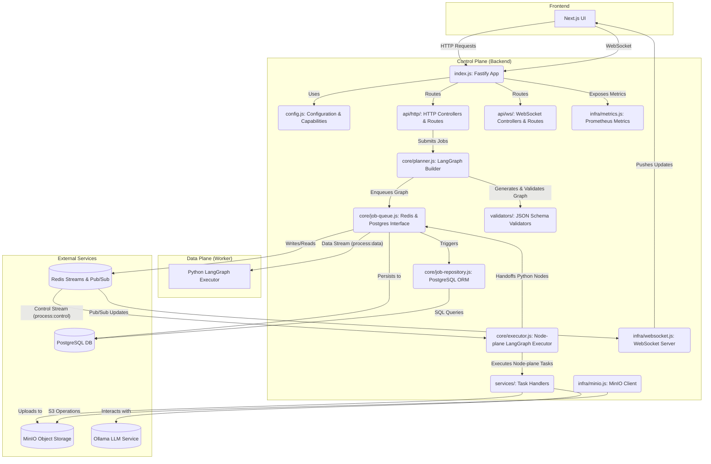

# MySpinBot Backend Component: Architecture & Implementation

## 1. High-Level Overview

The `backend/` component functions as the **Control Plane** within the MySpinBot's dual-plane LangGraph orchestration architecture. It is built on Node.js using the Fastify framework and serves as the primary API endpoint for the frontend. Its core responsibilities include:
- Exposing RESTful API endpoints for job submission, status queries, and capabilities retrieval.
- Providing a WebSocket hub for real-time job progress and status updates to connected clients.
- Orchestrating LangGraph workflows by generating and validating job graphs.
- Executing Node-plane (`plane: "node"`) nodes within these graphs.
- Managing communication with the Data Plane (Python worker) via Redis Streams and Pub/Sub.
- Persisting job metadata, graph snapshots, and events to a PostgreSQL database.
- Interacting with LLM services (e.g., Ollama) for script generation.
- Collecting and exposing Prometheus metrics for application and WebSocket activity.

## 2. Architectural Design

The backend's architecture is centered around handling client requests, transforming them into executable LangGraph workflows, managing their lifecycle across both control and data planes, and persisting their state.

### 2.1 Component Diagram

### 2.2 Execution Flow

1.  **Incoming Request:** A user action in the frontend (UI) sends an HTTP request (e.g., `POST /api/train`) or establishes a WebSocket connection to the Fastify application (`index.js`).
2.  **Job Submission (HTTP):**
    *   `api/http/workflows-controller.js` receives the request, potentially uploads files to MinIO (`services/storage.js`), and constructs initial parameters.
    *   It calls `job-controller.js::submitJob` which triggers the `Planner` (`core/planner.js`).
    *   The `Planner` generates a LangGraph workflow (potentially a fixed template from `config/pipelines.json`) based on the input and validates its structure (`#validateDAG`) and schema (`graph.schema-validator.cjs`).
    *   The generated graph, along with job metadata, is then enqueued into the `process:control` Redis Stream via `job-queue.js::enqueueControlJob`.
    *   `job-queue.js` also initiates persistence to PostgreSQL via `job-repository.js`, recording the job's initial state.
3.  **Control Plane LangGraph Execution:**
    *   The `Executor` (`core/executor.js`) continuously polls the `process:control` Redis Stream.
    *   Upon receiving a job entry, it deserializes and validates the LangGraph.
    *   It identifies `plane: "node"` nodes whose dependencies are met and executes their corresponding handlers registered in `services/registry.js`.
    *   Node execution can involve tasks like `services/script.js::generateScript` (calling Ollama) or `services/artifacts.js` (preparing assets).
    *   During and after node execution, the `Executor` updates the graph state in Redis (`job-queue.js::setJobPayload`) and persists changes to PostgreSQL (`job-repository.js`).
    *   If a node emits progress or data, `job-queue.js` publishes these updates to Redis Pub/Sub channels.
4.  **Handoff to Data Plane:** If the executed LangGraph still contains `plane: "python"` nodes that are ready for execution, the `Executor` enqueues the updated graph into the `process:data` Redis Stream via `job-queue.js::enqueueDataJob`. This signals the Python worker to take over.
5.  **Job Status & Progress (WebSocket):**
    *   The `infra/websocket.js` server listens to Redis Pub/Sub channels (`channel:status:*`, `channel:progress:*`, `channel:data:*`).
    *   When the backend receives a Pub/Sub message (either from its own `Executor` or the Python worker), it updates the job's state in Redis and persists it to PostgreSQL.
    *   Connected frontend WebSocket clients, subscribed to specific `jobId`s, receive periodic updates pushed by the `WsServer` (`infra/websocket.js`).
6.  **Job Completion/Failure:** Once all nodes in a LangGraph workflow are processed (either `completed` or `failed`), the `Executor` marks the overall job status and publishes it.

## 3. Technical Deep Dive

### 3.1 Core Components and Their Roles

*   **`index.js`**:
    *   Main entry point for the Fastify application.
    *   Registers core Fastify plugins (`@fastify/cors`, `@fastify/multipart`, `@fastify/websocket`).
    *   Registers HTTP and WebSocket routes.
    *   Initializes the `executor` and `db` singletons, ensuring they are ready before the server starts listening.
*   **`config.js`**:
    *   Centralized configuration manager.
    *   Loads `capabilities.json`, `redis.bridge.json`, `config.json`, and `pipelines.json` from the `config/` directory.
    *   Validates loaded configurations against their respective JSON schemas using generated AJV validators.
    *   Augments configuration with environment variables (e.g., PostgreSQL URL, MinIO credentials).
    *   Provides `getCapabilities()` (control plane capabilities) and `getConfiguration()` (application settings).
    *   `getFixedPipelines()` exposes the predefined LangGraph templates from `pipelines.json`.
*   **`api/` (`http/` & `ws/`)**:
    *   **`http/routes.js`**: Registers all HTTP API endpoints (`/health`, `/metrics`, `/api/capabilities`, `/api/status/:jobId`, `/api/infinitetalk`, `/api/jobs`, `/api/jobs/:jobId`).
    *   **`http/capabilities-controller.js`**: Handles `GET /api/capabilities`. It constructs a small hybrid LangGraph to fetch worker capabilities (via `get_capabilities` Python node) and then combines them with control plane capabilities to return a unified manifest.
    *   **`http/job-controller.js`**: Handles `POST /api/train` (via `submitJob`) and `GET /api/status/:jobId`. It uses the `Planner` to construct job graphs and `jobQueue` to enqueue jobs and retrieve status.
    *   **`http/history-controller.js`**: Provides endpoints for retrieving job history (`GET /api/jobs`) and detailed job information (`GET /api/jobs/:jobId`) directly from the PostgreSQL database via `JobRepository`.
    *   **`http/workflows-controller.js`**: Handles `POST /api/infinitetalk` requests, processing multipart form data (image/audio uploads), parsing request parameters, and initiating a fixed graph workflow via `submitJob`. It uses `services/storage.js` to upload incoming files to MinIO.
    *   **`ws/routes.js`**: Registers the WebSocket endpoint (`/ws`).
    *   **`ws/ws-controller.js`**: Integrates with `infra/websocket.js` to handle WebSocket connections, subscriptions, and message passing for real-time updates.
*   **`core/job-queue.js` (JobQueue)**:
    *   Manages all Redis interactions: Streams (`xadd`, `xreadgroup`, `xack`) and Pub/Sub (`publish`, `psubscribe`).
    *   Uses two `ioredis` clients: one for database operations/streams and one dedicated for Pub/Sub.
    *   Acts as a bridge to PostgreSQL (`JobRepository`) to persist job states and events, ensuring durability.
    *   Handles `enqueueControlJob` (to Node.js executor) and `enqueueDataJob` (to Python worker) for LangGraph workflows.
    *   Provides `getJobState` and `getJobResult` for querying job status and waiting for completion.
    *   Crucially, it listens to Pub/Sub channels (`channel:status:*`, `channel:progress:*`, `channel:data:*`) from both control and data planes to update job records in Redis and PostgreSQL.
*   **`core/job-repository.js` (JobRepository)**:
    *   Provides an abstraction layer for PostgreSQL database operations related to jobs and job events.
    *   Uses the `pg` client library to interact with the database.
    *   Methods for `upsertJob`, `appendJobEvent`, `updateJobStatus`, `updateJobProgress`, `updateJobGraph`, `listJobs`, and `getJobWithDetails`.
    *   Includes basic JSON parsing for graph data.
*   **`core/planner.js` (Planner)**:
    *   Responsible for constructing and validating LangGraph workflows.
    *   Uses predefined pipeline templates from `config/pipelines.json` (via `generateGraph` from `core/pipelines.js`).
    *   Performs DAG validation (`#validateDAG`) to ensure the generated graph is acyclic, connected, and has valid node IDs.
    *   Validates the final LangGraph structure against `graph.schema-validator.cjs` (AJV).
    *   Embeds `workflowId` and `pipelineMeta` into the graph's context and metadata.
*   **`core/executor.js` (Control Executor)**:
    *   Executes `plane: "node"` nodes within LangGraph workflows.
    *   Continuously polls the `process:control` Redis Stream for jobs.
    *   Dispatches node tasks to handlers registered in `services/registry.js`.
    *   Handles status updates and determines job flow (completion, failure, or handoff to data plane).
*   **`services/`**:
    *   **`registry.js`**: Dynamically loads and registers all task handlers (functions) exported from other modules in the `services/` directory. This creates a lookup map for the `Executor`.
    *   **`artifacts.js`**: Placeholder/stub for MinIO artifact upload and asset preparation.
    *   **`capabilities.js`**: Merges control plane capabilities (from `config/capabilities.json`) with worker capabilities (received from the Python worker) to produce a combined manifest.
    *   **`script.js`**: Implements `generateScript`, which calls an external Ollama LLM endpoint to generate a stage prompt and narration from a user prompt. It handles API calls, timeout, progress reporting, and JSON parsing of the LLM response.
    *   **`storage.js`**: Provides the `uploadBuffer` utility to upload files (e.g., from multipart requests) to MinIO.
*   **`infra/`**:
    *   **`database.js`**: Initializes and manages the PostgreSQL connection pool (`pg` client). Applies schema migrations (`MIGRATIONS` array) on startup to ensure tables (`jobs`, `job_events`) exist.
    *   **`metrics.js`**: Sets up Prometheus metrics collection (`prom-client`). Registers default metrics and provides `getOrCreateMetric` for custom metrics.
    *   **`minio.js`**: Provides a singleton MinIO client (`minio` client library) and utility for bucket validation.
    *   **`websocket.js`**: Implements the core WebSocket server logic. It manages connected clients, handles `SUBSCRIBE`/`UNSUBSCRIBE` messages, and periodically polls subscribed job states (via registered handlers) to push real-time updates to clients. It also exposes Prometheus metrics for WebSocket activity.
*   **`model/defs.js`**: Defines constants and enums (e.g., `JobStatus`, `WsAction`) derived from shared JSON schemas, ensuring consistency.
*   **`validators/`**:
    *   Contains generated AJV validators (e.g., `graph.schema-validator.cjs`, `plane-manifest.schema-validator.cjs`). These are used throughout the backend (`config.js`, `planner.js`, `executor.js`) to enforce data contracts and ensure incoming payloads and internal graph structures adhere to predefined schemas.

### 3.2 LangGraph.js Orchestration

The backend employs LangGraph.js for its control-plane logic.
- **Graph Construction:** The `Planner` uses predefined templates (`config/pipelines.json`) to create initial LangGraph DAGs, which are then enriched with `workflowId`, `context`, and `metadata`.
- **DAG Validation:** The `Planner` includes robust validation (`#validateDAG`) to check for cycles, reachability, and valid node IDs, ensuring the structural integrity of the workflow before execution.
- **Node Execution:** The `Executor` steps through the graph, identifying and running `plane: "node"` tasks. It manages node status and passes outputs between dependent nodes.
- **Cross-Plane Handoff:** When a `plane: "python"` node is encountered, the `Executor` hands off the entire (updated) graph to the Python worker via Redis Streams.

### 3.3 Redis Streams and Pub/Sub

The `job-queue.js` module is critical for enabling the dual-plane communication pattern:
- **Control Stream (`process:control`):** Used by the backend `Planner` to enqueue new LangGraph jobs for the control plane `Executor` to pick up. The `Executor` also sends updated graphs back to this stream if more `node` plane work remains after a Python handoff.
- **Data Stream (`process:data`):** Used by the backend `Executor` to hand off graphs containing `python` plane nodes to the Python worker.
- **Pub/Sub Channels:** (`channel:status:*`, `channel:progress:*`, `channel:data:*`) form the real-time communication backbone. Both the Node.js `Executor` and the Python worker publish events to these channels. The `job-queue.js` subscribes to these patterns to update the central job state in Redis and PostgreSQL, which then feeds the WebSocket server.

### 3.4 Persistence with PostgreSQL

The integration of PostgreSQL (`infra/database.js`, `core/job-repository.js`) provides durability:
- **Schema Management:** `infra/database.js` applies necessary table migrations (`jobs`, `job_events`) on startup, creating a robust schema for tracking job history.
- **Job Record:** The `jobs` table stores the core job metadata, including its current status, progress, and a JSONB snapshot of the `last_graph`.
- **Event Log:** The `job_events` table captures a chronological sequence of status, progress, and data events for each job, creating an audit trail.
- **Mirroring Redis:** `job-queue.js` actively mirrors critical updates (status, progress, graph changes) from Redis into PostgreSQL, ensuring that the database remains the single source of truth for historical and auditable job data.

### 3.5 LLM Integration

The `services/script.js` module demonstrates direct LLM integration:
- **Ollama API Calls:** It makes `fetch` requests to a configurable Ollama endpoint (e.g., `http://ollama:11434/api/generate`) to generate text (stage prompts and narrations).
- **Prompt Engineering:** It constructs a detailed prompt using parameters like `tone`, `length`, `persona`, and the user's `prompt`.
- **Robustness:** Includes timeout handling and parsing of the LLM's JSON response, with fallbacks for malformed outputs.
- **Progress Reporting:** Emits progress events during the LLM call using `publishProgressCb`.

This comprehensive analysis illustrates the Backend's critical role in orchestrating, managing, and observing complex AI workflows across the entire MySpinBot platform.
