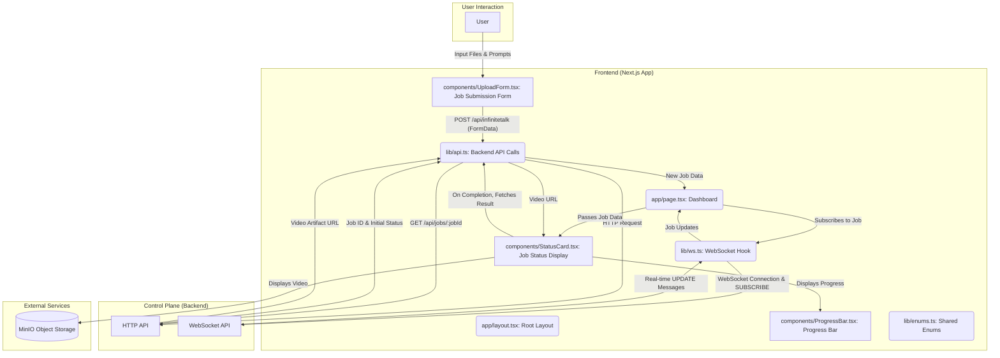

# MySpinBot Frontend Component: Architecture & Implementation

## 1. High-Level Overview

The `frontend/` component serves as the **Experience Layer** of the MySpinBot platform, built with Next.js (App Router), React, and TypeScript. Its primary role is to provide a user-friendly interface for:
- Initiating video generation workflows by uploading images and audio, along with textual prompts.
- Displaying real-time progress and status updates for ongoing jobs.
- Visualizing completed job results, specifically the generated video artifacts.

It interacts with the `backend/` (Control Plane) via both HTTP requests (for job submission and fetching detailed results) and WebSockets (for receiving live job updates). The design emphasizes a clean, responsive UI powered by Tailwind CSS.

## 2. Architectural Design

The frontend's architecture follows a standard Next.js application structure, leveraging client-side interactivity where needed for dynamic updates and form submissions.

### 2.1 Component Diagram

### 2.2 Execution Flow

1.  **Page Load & Initial Display:** When the user navigates to the application, `app/layout.tsx` provides the basic HTML structure, global CSS (`app/globals.css`), and branding. `app/page.tsx` is rendered as the main dashboard.
2.  **Job Submission:**
    *   The `UploadForm` component (`components/UploadForm.tsx`) collects user inputs: image file, audio file, a prompt, and reference text.
    *   Upon submission, `UploadForm` calls `lib/api.ts::postGenerate`, which constructs a `FormData` object and sends a `POST` request to the backend's `/api/infinitetalk` endpoint.
    *   The backend responds with the `jobId` and initial status.
    *   `UploadForm` then passes this new job information to the `onJob` callback in `app/page.tsx`.
3.  **Real-time Job Monitoring:**
    *   `app/page.tsx` maintains a local state (`jobs`) for all active and completed jobs.
    *   When a new job is received via `onJob`, `app/page.tsx` calls `WsLib::subscribe(jobId)` to open/reuse a WebSocket connection and subscribe to updates for that specific job.
    *   The `useWebSocket` hook (`lib/ws.ts`) manages the WebSocket connection, sends `SUBSCRIBE` messages, and listens for incoming `update` messages from the backend's WebSocket API.
    *   These `update` messages contain granular changes to a job's status and progress.
    *   The `onUpdate` callback in `app/page.tsx` merges these updates into its local `jobs` state.
4.  **Status Display:**
    *   `app/page.tsx` maps over its `sorted` list of jobs, rendering a `StatusCard` (`components/StatusCard.tsx`) for each job.
    *   Each `StatusCard` receives the current `job` object as props and displays its ID, type, current status, and prompt.
    *   A `ProgressBar` component (`components/ProgressBar.tsx`) inside the `StatusCard` visually represents the `progress` value.
5.  **Result Visualization:**
    *   When a `job.status` becomes `COMPLETED`, the `StatusCard` triggers a call to `lib/api.ts::getJobResult` to fetch the detailed job output from the backend's `GET /api/jobs/:jobId` endpoint.
    *   The `getJobResult` function parses the LangGraph output to extract the video artifact's MinIO location.
    *   The `StatusCard` then renders an HTML5 `<video>` element, using a direct URL to the video stored in MinIO, allowing the user to view the generated content.
6.  **Unsubscription:** When a job reaches a terminal state (e.g., `COMPLETED` or `FAILED`), `app/page.tsx` calls `WsLib::unsubscribe(jobId)` to stop receiving further updates for that job.

## 3. Technical Deep Dive

### 3.1 Next.js and React Structure

*   **App Router:** The project utilizes the Next.js App Router (`app/` directory).
*   **Root Layout (`app/layout.tsx`):** Defines the base HTML structure, global styles, metadata, and common UI elements like the header with the MySpinBot logo and title. It serves as the shell for the entire application.
*   **Main Page (`app/page.tsx`):** This is a client-side component (due to `"use client"`) that orchestrates the main dashboard functionality. It manages the `jobs` state, handles new job submissions, and integrates with the WebSocket hook for real-time updates.
*   **Components (`components/`)**: Reusable UI elements (`UploadForm`, `StatusCard`, `ProgressBar`) are encapsulated here, promoting modularity and reusability.
*   **Client Components:** Most interactive parts of the frontend are client components, using React Hooks like `useState`, `useEffect`, `useCallback`, `useMemo` for state management, lifecycle events, and performance optimization.

### 3.2 Styling and Design

*   **Tailwind CSS:** Used for utility-first styling, configured via `tailwind.config.ts` and integrated via PostCSS (`postcss.config.js`). It allows for rapid UI development and ensures consistent design.
*   **Global Styles (`app/globals.css`):** Defines base styles, font-family, and some custom component-level styles (e.g., `card`, `progress-bar`) using `@apply` or direct CSS, leveraging Tailwind's custom properties for colors. It also includes basic dark mode support.

### 3.3 Backend Communication

*   **HTTP API (`lib/api.ts`):**
    *   `API_BASE`: Dynamically determined from `NEXT_PUBLIC_API_URL` environment variable, defaulting to `https://api.myspinbot.local`.
    *   `postGenerate`: Sends `FormData` (containing image, audio, and JSON parameters) to the backend's `/api/infinitetalk` endpoint. This is a critical function for initiating new workflows.
    *   `getJobResult`: Fetches detailed job information, including the last LangGraph state, from `/api/jobs/:jobId`. It specifically parses the graph to extract the `videoArtifact` output from the `upscale_video` node.
*   **WebSocket API (`lib/ws.ts`):**
    *   `useWebSocket` hook: A custom React hook that encapsulates the WebSocket logic.
    *   Manages connection lifecycle: `onopen`, `onmessage`, `onclose`, `onerror`.
    *   Implements `SUBSCRIBE` and `UNSUBSCRIBE` actions for specific `jobId`s, sending JSON messages over the WebSocket.
    *   Handles incoming `update` messages by calling the `onUpdate` callback provided by `app/page.tsx`.
    *   Includes an exponential backoff mechanism for reconnecting after disconnections, enhancing resilience.

### 3.4 Data Models and Enums

*   **`lib/api.ts` (Interfaces):** Defines TypeScript interfaces (`Job`, `GenerateResponse`) to ensure type safety for data exchanged with the backend and managed within the frontend.
*   **`lib/enums.ts` (Enums):** Centralizes `JobStatus`, `JobType`, `WsAction`, and `WsResponse` enums, providing clear, consistent, and type-safe definitions for job states and WebSocket commands across the application.

### 3.5 User Experience Components

*   **`UploadForm.tsx`:**
    *   Uses `useRef` for file inputs and `useState` for prompt, reference text, busy state, and error messages.
    *   Performs client-side validation for required fields.
    *   Displays a "Generate" button that shows "Submitting…" when busy.
    *   Clears form fields after successful submission.
*   **`StatusCard.tsx`:**
    *   Receives `Job` data as props.
    *   `pillColor` function dynamically styles the job status indicator.
    *   Conditionally renders a `<video>` player when `job.status` is `COMPLETED` and `jobResult` (containing the video artifact URL) is available. The video URL is constructed to directly access MinIO through Traefik.
*   **`ProgressBar.tsx`:**
    *   A simple, visually appealing progress bar.
    *   Calculates percentage (`pct`) from `value` (0-1 range) and applies `transition-[width]` for smooth animation.

### 3.6 Development and Build Process

*   **`Dockerfile`:** Defines multi-stage Docker builds for `build`, `runtime`, and `development` stages.
    *   `build` stage: Builds the Next.js application.
    *   `runtime` stage: Creates a lean production image with only necessary build artifacts.
    *   `development` stage: Sets up a container for development with `npm ci` and `next dev --turbopack`.
*   **`package.json`:** Defines scripts for development (`dev`), building (`build`), testing (`test`), linting (`lint`), and formatting (`format`).
*   **Testing (Vitest, React Testing Library):** `vitest.config.ts` configures Vitest with `jsdom` environment and `React Testing Library` for component testing. Test files (`tests/`) demonstrate unit and integration tests for UI components and API interactions.

This detailed analysis highlights the Frontend's role in providing an intuitive user experience, its robust communication with the backend, and its adherence to modern web development practices.
