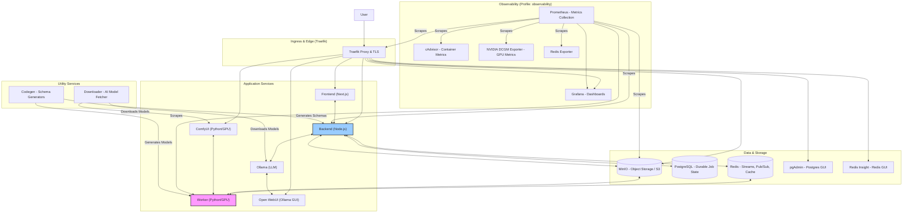
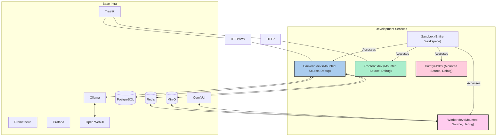

# MySpinBot Platform Architecture Overview

## 1. High-Level Overview

The MySpinBot platform is a comprehensive, local-first AI infrastructure deployed and managed using Docker Compose. It is designed around a **dual-plane LangGraph orchestration architecture**, integrating a Node.js-based Control Plane (backend) with a Python/GPU-powered Data Plane (worker). The platform emphasizes modularity, observability, and reproducibility, running entirely on a local machine (typically with a single NVIDIA GPU).

The entire system is containerized, facilitating consistent environments across development and production. It includes core application services, a robust set of data stores, a full observability stack, and integrated AI inference engines (LLMs, diffusion models). A key aspect is the clear separation between a production-like deployment (`docker-compose.yml`) and a development overlay (`docker-compose.dev.yml`), allowing for efficient local development with live code reloading and debugging.

## 2. Architectural Design

The platform's architecture is a microservices-oriented approach, where specialized services communicate over a shared internal network. Traefik acts as the ingress controller, routing external traffic to the appropriate services and handling TLS.

### 2.1 Overall System Map (Production)

The `docker-compose.yml` defines the core production-ready services.

### 2.2 Development Environment (Overlay)

The `docker-compose.dev.yml` overlays `docker-compose.yml` to enable a developer-friendly environment. It replaces production application images with development-specific images that mount local source code, expose debugging ports, and provide interactive shells.

### 2.3 Docker Profiles

Docker Compose profiles are used to conditionally start groups of services, optimizing resource usage and allowing for flexible deployments.

*   **Default (no profile specified):** Starts core application services (Traefik, Redis, Postgres, MinIO, `api`, `ui`, `worker`), ensuring a functional minimal stack.
*   **`observability`:** Includes Prometheus, Grafana, cAdvisor, DCGM Exporter, and Redis Exporter for comprehensive monitoring.
*   **`ai`:** (Aliased as `chatbot` for Open WebUI) Includes Ollama, Open WebUI, and ComfyUI for AI inference capabilities.
*   **`schemas`:** Activates the `codegen` service for generating validation schemas and data models.
*   **`monorepo`:** Activates the `sandbox` container in development mode, providing a general-purpose environment with the entire monorepo mounted.

## 3. Technical Deep Dive

### 3.1 Docker Compose Configuration

*   **`docker-compose.yml`**:
    *   **Services:** Each service defines its image, container name, restart policy, volumes, networks, environment variables, and Traefik labels for routing.
    *   **GPU Integration:** Services requiring GPU access (e.g., `ollama`, `comfyui`, `worker`) use `deploy.resources.reservations.devices` with `driver: nvidia` and `count: all`, or `gpus: all` for older Docker versions, ensuring they can utilize the host GPU.
    *   **Healthchecks:** Critical services like Redis, PostgreSQL, and the backend `api` include healthchecks to ensure proper startup and dependency management.
    *   **Volumes:** Named volumes (e.g., `redis-data`, `postgres-data`, `minio-data`, `ollama-data`, `comfyui-data`) are extensively used for persistent data storage across container restarts.
    *   **Networking:** A single `internal-network` bridge ensures all services can communicate securely and efficiently without exposing internal ports externally.
*   **`docker-compose.dev.yml`**:
    *   **Image Overrides:** `api`, `ui`, `worker`, and `comfyui` services are overridden to use `dev` images, often built with different Dockerfile targets (e.g., `frontend:development`).
    *   **Volume Mounts:** Local source code directories (`./backend`, `./frontend`, `./worker`) are mounted into the respective development containers, enabling live code changes and hot-reloading.
    *   **Debug Ports:** Debugging ports (e.g., `9229` for Node.js, `5678` for Python) are exposed for seamless IDE integration.
    *   **Interactive Shells:** `stdin_open: true` and `tty: true` allow for interactive development.
    *   **Sandbox Service:** A `sandbox` container (from `infra/sandbox/Dockerfile`) is included, mounting the entire `/workspace` to provide a flexible environment for running scripts or ad-hoc commands.

### 3.2 Ingress with Traefik

*   **`infra/traefik/traefik.yml`**: Defines entry points (HTTP `web`, HTTPS `websecure`, `metrics`), Docker provider for dynamic configuration, API dashboard, and ACME (Let's Encrypt) configuration for TLS certificates.
*   **`infra/traefik/traefik_dynamic.yml`**: Contains dynamic configurations such as `dashboard-auth` middleware (using `htpasswd` for basic authentication) and TLS store for local wildcard certificates (`wildcard-myspinbot.local.crt/.key`).
*   **Docker Labels:** Services dynamically register themselves with Traefik using Docker labels (e.g., `traefik.http.routers.api.rule=Host(...)`), defining their hostnames, entry points, TLS settings, and associated middlewares.

### 3.3 Observability Stack

The platform integrates a comprehensive monitoring solution:
*   **Prometheus (`prometheus` service)**: Configured via `infra/prometheus/prometheus.yml` to scrape metrics from all active services, including:
    *   **Self-monitoring:** `prometheus:9090`
    *   **Container Metrics:** `cadvisor:8080`
    *   **GPU Metrics:** `dcgm-exporter:9400`
    *   **Ingress Metrics:** `traefik:8080`
    *   **Backend Metrics:** `api:3000`
    *   **Redis Metrics:** `redis-exporter:9121`
    *   **MinIO Metrics:** `minio:9000`
    *   **Worker Metrics:** `worker:8000`
*   **Grafana (`grafana` service)**: Used for visualizing metrics with pre-provisioned dashboards (`infra/grafana/dashboards/`). Dashboards exist for:
    *   `backend.json`: Node.js runtime metrics (CPU, memory, event loop, GC).
    *   `cadvisor.json`: Container-level resource usage (CPU, memory, network, disk I/O).
    *   `dcgm.json`: Detailed NVIDIA GPU metrics (utilization, memory usage, temperature, power draw).
    *   `minio.json`: MinIO object storage metrics (capacity, S3 traffic, object counts).
    *   `redis.json`: Redis performance and usage (uptime, clients, memory, hits/misses, keys).
    *   `system.json`: Overall system health and resource consumption.
    *   `traefik.json`: Traefik ingress controller metrics (request rates, error rates, latency, connections).
    *   `websocket.json`: WebSocket server metrics (connected clients, message rates, errors, client lifetime).
*   **Exporters:**
    *   `cadvisor`: Collects container resource usage data.
    *   `dcgm-exporter`: Collects NVIDIA GPU telemetry.
    *   `redis-exporter`: Provides Redis-specific metrics.

### 3.4 Data Services

*   **Redis (`redis` service)**: A high-performance in-memory data store used for:
    *   LangGraph inter-plane communication (Streams for job orchestration).
    *   Real-time job status and progress updates (Pub/Sub).
    *   Caching.
    *   `redis-insight` provides a GUI for inspection.
*   **PostgreSQL (`postgres` service)**: A robust relational database used for durable storage of:
    *   Job metadata and history.
    *   LangGraph snapshots.
    *   Artifact records.
    *   `pgadmin` provides a web-based administration tool.
*   **MinIO (`minio` service)**: An S3-compatible object storage server used for:
    *   Storing input files (images, audio).
    *   Persisting generated artifacts (LoRAs, voice models, videos).
    *   Its `init.sh` script automatically creates necessary buckets and sets anonymous download policies.

### 3.5 AI Services

*   **Ollama (`ollama` service)**: Local LLM runtime. Deploys with GPU access and a dedicated volume for models (`ollama-data`). Used by the backend for script generation.
*   **Open WebUI (`openwebui` service)**: A user interface for managing and interacting with Ollama models, exposed via Traefik.
*   **ComfyUI (`comfyui` service)**: A programmatic node-based workflow engine for image/video generation. Its image is built from `infra/worker/Dockerfile` with `WORKER_MODE=comfyui`. It runs headless but is exposed via Traefik for direct access if needed.
*   **Downloader (`downloader` service)**: A utility container responsible for pre-fetching large AI models (e.g., Mistral for Ollama, F5-TTS, WanVideo models for ComfyUI) on startup, ensuring that core AI services have their required assets available.

### 3.6 Code Generation

*   **`codegen` service**: A separate container (built from `infra/codegen/Dockerfile`) that runs scripts (`gen-all.sh`, `gen-backend-validators.sh`, `gen-worker-datamodel.sh`) to:
    *   Generate Node.js AJV validators from shared JSON schemas (located in `common/config/schemas/`).
    *   Generate Python Pydantic models from the same shared JSON schemas.
    *   This ensures strict type consistency and data contract adherence between the Node.js backend and the Python worker.

### 3.7 Worker Dockerfile (`infra/worker/Dockerfile`)

This multi-stage Dockerfile is central to building the Python worker and ComfyUI images.
*   **`base-system`**: Starts with a CUDA-enabled NVIDIA base image, installs essential system dependencies (ffmpeg, git-lfs, build-essentials, etc.), sets up Python environment with `uv` (a fast Python package installer), and includes CUDA/PyCUDA compatibility patches.
*   **`dependencies`**: Installs core Python dependencies including PyTorch, torchvision, torchaudio (CUDA-specific versions), and a wide array of AI/ML libraries, some of which are specific to ComfyUI custom nodes. It also builds `flash-attention` and `SageAttention` from source.
*   **`comfyui-system`**: Conditional stage (`WORKER_MODE=comfyui`) that clones the ComfyUI repository and its required custom nodes (e.g., ComfyUI-Manager, TTS-Audio-Suite, ComfyUI-WanVideoWrapper, comfyui-videohelpersuite, etc.). It then installs the Python requirements for ComfyUI and its custom nodes.
*   **`worker`**: Final stage, copies the MySpinBot worker source code, configuration, and entrypoint script. It conditionally installs worker-specific Python dependencies and sets the `docker-entrypoint.sh` as the container's entrypoint.

This robust Docker Compose setup, combined with clear separation of concerns and extensive observability, forms the backbone of the MySpinBot platform, enabling both efficient development and a production-ready deployment.
