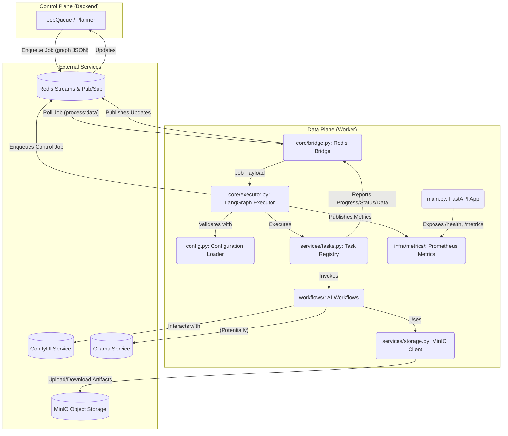

# MySpinBot Worker Component: Architecture & Implementation

## 1. High-Level Overview

The `worker/` component serves as the **Data Plane** in the MySpinBot's dual-plane LangGraph orchestration architecture. Its primary responsibility is to execute GPU-intensive AI tasks, such as model training (LoRA, voice), video rendering, and upscaling. It operates asynchronously, consuming job requests from Redis Streams, processing them, and publishing status, progress, and data updates back to the Control Plane (Node.js backend) via Redis Pub/Sub. The worker leverages FastAPI for basic health and metrics endpoints, and dynamically loads AI workflows, some of which integrate with external services like ComfyUI.

Key responsibilities:
- Consume LangGraph job definitions from Redis Streams (`process:data`).
- Validate incoming job payloads using Pydantic models.
- Execute Python-plane (`plane: "python"`) nodes within LangGraph workflows.
- Manage execution of GPU-accelerated tasks, potentially using in-process task queues (e.g., Dramatiq).
- Interact with object storage (MinIO) for input data and output artifacts.
- Publish real-time job status, progress, and intermediate data back to Redis Pub/Sub channels.
- Expose Prometheus metrics for monitoring worker performance and job execution.
- Dynamically load and manage AI workflows, including integration with ComfyUI.

## 2. Architectural Design

The worker is structured around an asynchronous event loop that continuously polls Redis Streams for new jobs. Upon receiving a job, it deserializes the LangGraph workflow, identifies executable Python nodes, and executes them through a registry of worker tasks.

### 2.1 Component Diagram

### 2.2 Execution Flow

1.  **Job Ingestion:** The `RedisBridge` (`core/bridge.py`) continuously polls the `process:data` Redis Stream for new job entries (`poll_job`).
2.  **Job Deserialization & Validation:** Upon receiving an entry, the `Executor` (`core/executor.py`) extracts the job payload (a LangGraph JSON), deserializes it, and validates it against `LanggraphWorkflow` Pydantic models.
3.  **Node Execution:** The `Executor` identifies `plane: "python"` nodes that are ready to run (i.e., all their dependencies are completed). For each ready node, it fetches the corresponding handler from the `TaskRegistry` (`services/tasks.py`).
4.  **Task Invocation:** A worker task (from `services/tasks.py` or defined within `workflows/`) is invoked. These tasks abstract the actual AI computations (e.g., `train_lora`, `render_video`).
    *   Tasks receive `params` (node-specific parameters) and `node_input` (outputs from preceding nodes).
    *   They are provided with callbacks (`publish_progress_cb`, `publish_data_cb`) to report real-time updates.
    *   Many tasks utilize `asyncio.to_thread` to run potentially blocking CPU-bound or external calls without blocking the main async loop.
    *   Workflows under `workflows/` dynamically load ComfyUI components and other AI models.
    *   `services/storage.py` is used for interaction with MinIO (uploading/downloading artifacts).
5.  **Progress & Status Reporting:** Worker tasks use the `RedisBridge` to publish `ProgressUpdate`, `DataUpdate`, and `StatusUpdate` messages to Redis Pub/Sub channels, allowing the Control Plane and frontend to monitor job execution.
6.  **Graph Update & Handoff:** After a node completes, its output is stored in the LangGraph. The `Executor` then re-evaluates the graph for new ready nodes.
    *   If more Python nodes remain, the updated graph continues processing within the worker.
    *   If no more Python nodes remain (and the graph is not yet completed), the updated graph is enqueued back to the `process:control` Redis Stream (`enqueue_control_job`), handing it back to the Node.js Control Plane.
    *   If the graph is fully completed or fails, the final status is published, and the job is acknowledged (`ack_job`) on the `process:data` stream.
7.  **Metrics:** The `Executor` and individual tasks emit Prometheus metrics (`infra/metrics/`) for active tasks, total jobs, job duration, and loop iterations, providing observability into the worker's performance.

## 3. Technical Deep Dive

### 3.1 Core Components and Their Roles

*   **`main.py`**:
    *   Entry point for the FastAPI application (`uvicorn.run`).
    *   Defines the application `lifespan` context manager which handles the initialization and shutdown of `RedisBridge` and `Executor`.
    *   Registers API routes (`/health`, `/metrics`).
*   **`config.py`**:
    *   Manages worker configuration by loading `config.json`, `redis.bridge.json`, and environment variables.
    *   Uses Pydantic models (`WorkerConfiguration`) for type-safe and validated configuration.
    *   Loads `capabilities.json` into a `PlaneCapabilityManifest` to advertise worker's capabilities.
*   **`core/bridge.py` (RedisBridge)**:
    *   Asynchronous Redis client (`redis.asyncio`) for interacting with Redis Streams and Pub/Sub.
    *   Manages consumer groups, connects/closes Redis, and handles stream polling (`poll_job`) and acknowledgment (`ack_job`).
    *   Provides methods for persisting job payloads (`set_job_payload`), enqueuing control-plane jobs (`enqueue_control_job`), and publishing progress, data, and status updates via Pub/Sub.
*   **`core/executor.py` (Executor)**:
    *   The orchestrator for Python-plane LangGraph nodes.
    *   Implements the main polling loop (`_run_loop`) to fetch jobs from `RedisBridge`.
    *   Validates incoming LangGraph payloads against `LanggraphWorkflow` Pydantic schema.
    *   Manages node execution (`_execute_node`) by dispatching to registered worker tasks.
    *   Handles node status transitions (pending, running, completed, failed).
    *   Updates job state in Redis via `bridge.set_job_payload`.
    *   Emits various Prometheus metrics.
*   **`services/tasks.py` (Task Registry)**:
    *   Uses a `@task` decorator to register asynchronous functions that implement specific AI operations (e.g., `train_lora`, `render_video`).
    *   Provides a `StreamAdapter` to capture stdout/stderr from subprocesses or libraries and convert it into progress updates, allowing for fine-grained progress reporting during task execution.
    *   Includes implementations for `get_capabilities`, `f5_to_tts`, `infinite_talk`, `upscale_video`.
*   **`services/storage.py`**:
    *   Provides utilities for interacting with MinIO object storage.
    *   `_connect_minio()`: Creates a configured MinIO client.
    *   Functions for uploading raw bytes (`upload_bytes`), downloading to local paths (`download_to_local_path`), and specialized functions for fetching data as PyTorch tensors (`fetch_torch_image`, `fetch_torch_audio`).
*   **`workflows/`**:
    *   Contains Python modules for specific AI workflows, such as `infinitetalk.py`, `tts.py`, and `upscaler.py`.
    *   `workflows/__init__.py`: Handles the dynamic initialization and loading of ComfyUI's custom nodes and environment, effectively "embedding" ComfyUI within the worker for headless execution. This involves manipulating `sys.path` and mocking ComfyUI's `PromptServer` for standalone operation.
    *   **`infinitetalk.py`**: Implements the `InfiniteTalk` class, which orchestrates a complex sequence of ComfyUI nodes (loaded via `_DEPS`) to perform multi-talk image-to-video generation. It takes parameters defined by `InfiniteTalkParams` (from `workflows_schema.py`) and uses `torch.inference_mode()` for execution.
    *   **`tts.py`**: Implements the `TextToSpeech` class, which uses a dynamically loaded F5TTSNode (from a custom ComfyUI node) to generate speech from text and a reference audio. It handles audio processing (resampling, normalization) and uploads the resulting WAV artifact to MinIO.
    *   **`upscaler.py`**: Implements the `AIUpscaler` class, orchestrating a sequence of ComfyUI nodes (UpscaleModelLoader, ImageUpscaleWithModel, FaceRestoreModelLoader, FaceRestoreCFWithModel) to perform video upscaling and face restoration. It handles video chunking, audio muxing using `ffmpeg`, and uploads the final video to MinIO.
*   **`infra/metrics/`**:
    *   Manages Prometheus metrics (`get_or_create_metric`) using `prometheus_client`.
    *   Registers default collectors (process, platform, GC).
    *   Provides a central `registry` for all worker-specific metrics.
*   **`models/`**:
    *   Contains Pydantic models (generated from shared JSON schemas by `datamodel-codegen`). These models define the strict data contracts for capabilities, job messaging, LangGraph structures, Redis configuration, storage artifacts, and worker-specific configurations. This ensures type safety and data integrity across the dual-plane architecture.

### 3.2 LangGraph.py Integration

The `Executor` is the core of LangGraph.py integration. It parses the `LanggraphWorkflow` (defined by Pydantic) and intelligently executes nodes.
- **Node Selection:** It uses `_get_ready_nodes` to identify Python-plane nodes whose dependencies are met.
- **Input/Output Mapping:** Node inputs are dynamically resolved from outputs of preceding nodes in the graph, facilitating data flow.
- **Status Management:** Each node's `status` is updated (pending, running, completed, failed) throughout its lifecycle, and errors are captured.
- **Graph State Persistence:** After each node's execution, the entire graph state is persisted to Redis via `set_job_payload`, ensuring recoverability and observability.

### 3.3 Redis Streams and Pub/Sub Usage

The `RedisBridge` is crucial for cross-plane communication:
- **Streams for Job Orchestration:** `process:data` (worker consumes from) and `process:control` (worker enqueues to) are used as reliable message queues for LangGraph workflows. `XADD` adds entries, `XREADGROUP` consumes them, and `XACK` acknowledges processing.
- **Pub/Sub for Real-time Updates:** Channels like `channel:progress:{jobId}`, `channel:status:{jobId}`, and `channel:data:{jobId}` are used for broadcasting granular updates, allowing the backend (and thus the frontend) to provide real-time feedback without directly polling worker state.

### 3.4 Configuration Management

`config.py` and Pydantic models (`WorkerConfiguration`) ensure robust configuration:
- **Layered Configuration:** Combines static `config.json`, `redis.bridge.json`, and dynamic environment variables.
- **Type Safety:** Pydantic strictly validates all configuration parameters, preventing runtime errors due to malformed settings.
- **Capabilities Manifest:** The `capabilities.json` file explicitly declares the worker's tasks, their I/O schemas, runtimes, and other metadata, which is crucial for the Agentic Planner in the control plane.

### 3.5 AI Workflow Execution (ComfyUI, TTS, Upscaling)

The `workflows/` directory centralizes the AI execution logic.
- **ComfyUI Embedding:** `workflows/__init__.py` sets up a mock ComfyUI environment and adds its custom nodes to the Python path. This allows the worker to import and directly use ComfyUI nodes as Python objects, orchestrating complex visual workflows programmatically without needing to interact with a separate ComfyUI API server (though `render_video` does show attempts to poll a ComfyUI endpoint).
- **InfiniteTalk (`infinitetalk.py`)**: A complex workflow that orchestrates numerous ComfyUI nodes (`MultiTalkModelLoader`, `WanVideoImageToVideoMultiTalk`, `WanVideoSampler`, etc.) to generate video from image and audio. It handles model loading, various encoding/decoding steps, and sampling, ultimately uploading the generated video to MinIO.
- **TextToSpeech (`tts.py`)**: Utilizes a specific ComfyUI custom node (`F5TTSNode`) to perform text-to-speech conversion using a reference audio. It includes audio processing and uploads the resulting WAV file.
- **AI Upscaler (`upscaler.py`)**: A workflow that processes video in chunks, performing upscaling (`ImageUpscaleWithModel`) and face restoration (`FaceRestoreCFWithModel`) using ComfyUI nodes. It uses FFmpeg for audio muxing and video concatenation, uploading the final high-resolution video to MinIO.

### 3.6 Prometheus Metrics

The worker exposes a `/metrics` endpoint via FastAPI (`api/router.py`) and uses `prometheus_client` (`infra/metrics/`) to provide detailed insights:
- **Standard Metrics:** Default process, platform, and garbage collection metrics are registered.
- **Custom Metrics:** Counters (`worker_jobs_total`, `worker_loop_iterations_total`), gauges (`worker_active_tasks`), and histograms (`worker_job_duration_seconds`) track worker activity, job execution times, and resource usage. These are labeled by task type for granular analysis in Grafana.

This detailed overview provides a comprehensive understanding of the worker's architecture, its operational mechanisms, and its integration within the broader MySpinBot ecosystem.
