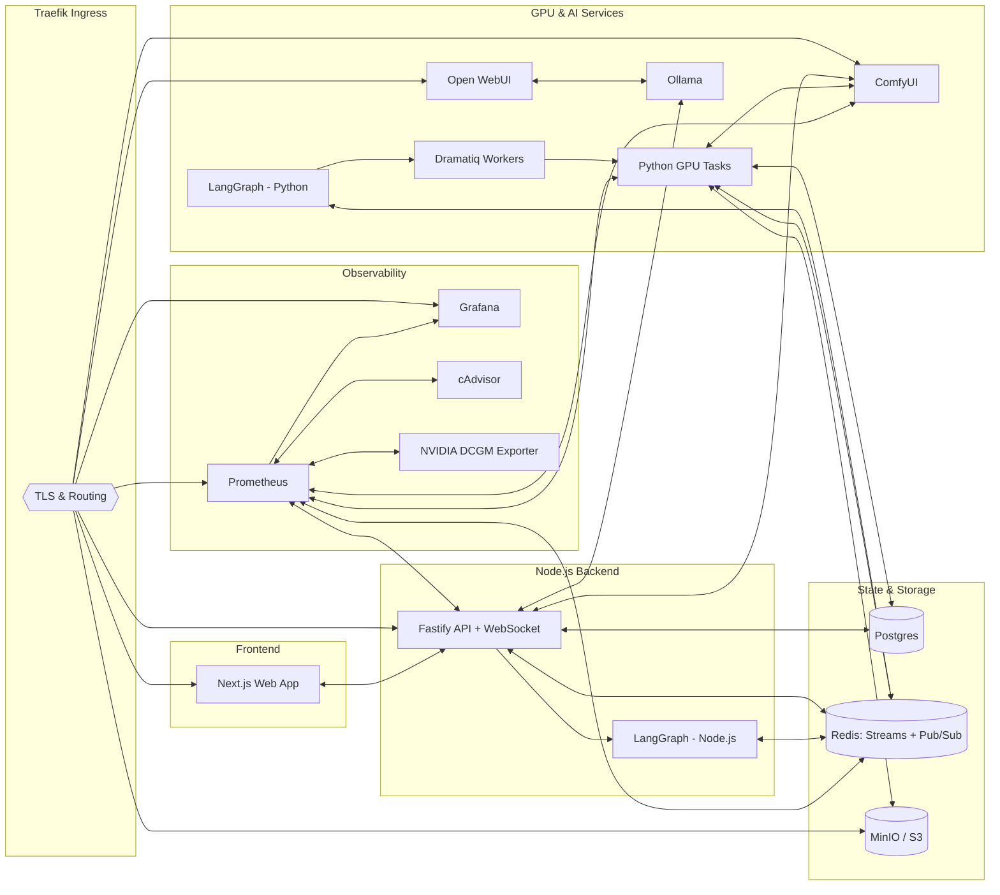
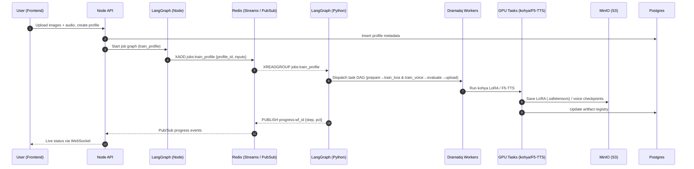
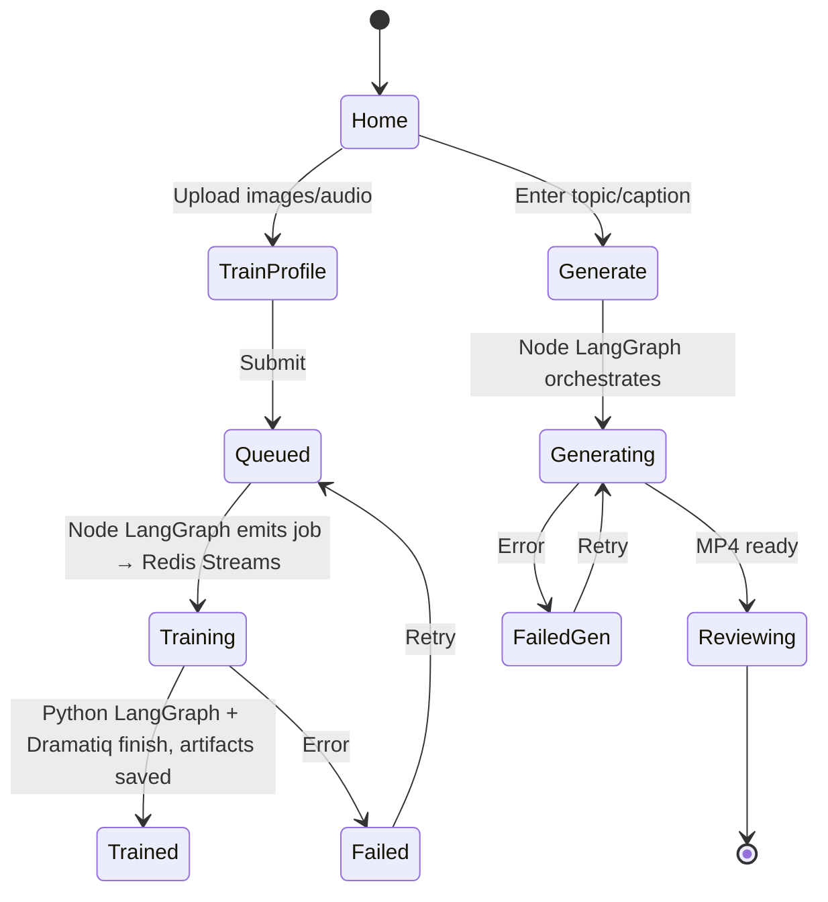

# Architecture Overview

This document describes the system’s architecture at multiple levels: a high-level component map, detailed training and generation workflows, and user interaction flows. For each section, an informative diagram is provided.

## 1) High‑Level System Architecture

**Description:**
The platform is a local, multi-service stack organized around a Node.js backend (TypeScript) that orchestrates AI workflows, a Python GPU worker stack that executes heavy jobs, and specialized services for LLMs (Ollama + Open WebUI), diffusion pipelines (ComfyUI), storage (MinIO), state (Postgres/Redis), ingress (Traefik), and observability (Prometheus/Grafana with cAdvisor and NVIDIA DCGM exporter). All services live on a shared Docker network and expose metrics for unified monitoring.

**System Map**

## 2) Training Workflow (LoRA + Voice)

**Description:**
The training workflow runs as orchestrated graphs across two planes. The user uploads images and a short audio sample. The Node API validates inputs and **Node LangGraph** emits a _job message_ into Redis **Streams**. The Python side consumes the stream, expands it into a **Python LangGraph** of GPU tasks executed by **Dramatiq**. Artifacts are versioned in MinIO; status and metrics stream back via Redis **Pub/Sub** to the backend and onward to the frontend.

**Training Pipeline**

## 3) Generation Workflow (Two alternatives)

The generation stage transforms a **prompt or narration** into a complete short video, synchronizing visuals and speech using local, open-source models. Two main workflows exist:

1. **SVD + Wav2Lip** — animate a static scene using Stable Video Diffusion, then synchronize lips.
2. **SadTalker** — direct talking-head animation driven by synthesized speech.

### SVD + Wav2Lip

_(“Scene → Video → Speech → Lip Sync”)_

**Description:** The user provides a topic or narration prompt. The Node backend (via **LangGraph**) queries the local LLM (Ollama) to generate two components:

- **Stage description:** guides ComfyUI’s text-to-image node to render a static scene.
- **Narrative:** the spoken script for TTS synthesis.

ComfyUI first creates an image from the stage description, which the **Stable Video Diffusion (SVD)** node animates into a short clip. In parallel, the **Python execution plane** synthesizes audio using the profile’s **F5‑TTS/GPT‑SoVITS** voice. Once both assets are ready, **Wav2Lip** aligns lip motion to speech, **ffmpeg** merges tracks, and **ESRGAN** upscales the final video before remuxing and uploading to MinIO.

**Pipeline Diagram**

### Using SadTalker

_(“Portrait → Talking Head → Speech Sync”)_

**Description:** This path uses **SadTalker** to drive a portrait directly with synthesized speech, bypassing SVD and Wav2Lip. The LLM output is used similarly; SadTalker then animates the portrait using facial-motion cues extracted from the audio. After generation, **ESRGAN** upscales the frames and **ffmpeg** finalizes the video for storage and playback.

**Pipeline Diagram**

**Summary:**
Both alternatives share the same upstream logic (**Node LangGraph → LLM → ComfyUI → TTS**) and differ only in how visual motion and synchronization are achieved:

- **SVD + Wav2Lip:** general animated scenes or stylized avatars.
- **SadTalker:** direct talking-head generation with natural facial motion.

## 4) User Interaction & States (Happy Path + Retries)

**Description:**
Users follow two primary flows, **Profile Training** and **Video Generation**. We represent UI states, backend events, and error‑retry loops (via **LangGraph** orchestration and Redis eventing). The frontend uses WebSockets to reflect job progress in real time; failed stages can be retried idempotently.

**UI / State Flow**

## Notes on Extensibility

- **Model swaps**: The ComfyUI and TTS blocks are parameterized to allow switching base models (e.g., SD1.5 ↔ SDXL) and voice backends without touching the rest of the graph.
- **Scalability**: Replace the single Python worker with multiple replicas. Python side scales by running more **Dramatiq** workers (per‑GPU queues); Node side scales workflow throughput independently. Backpressure can be applied via Redis Stream length/policies.
- **Security**: Place Traefik basic‑auth or SSO in front of management UIs (Open WebUI, Grafana, Prometheus) and restrict them accordingly.
- **Observability**: Each service exposes `/metrics` for Prometheus; higher‑level counters/gauges are added in Node and Python LangGraphs (per‑node timing, retries, failures) and Dramatiq middleware for task execution metrics.
