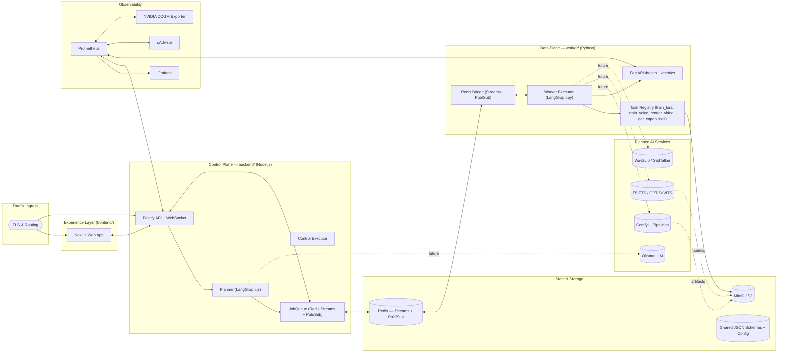
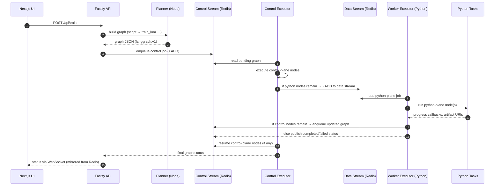
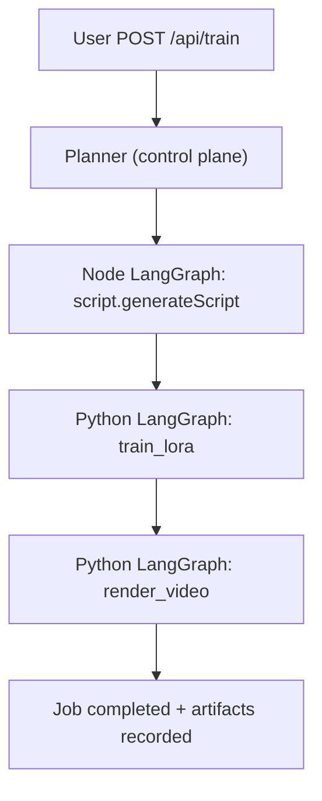
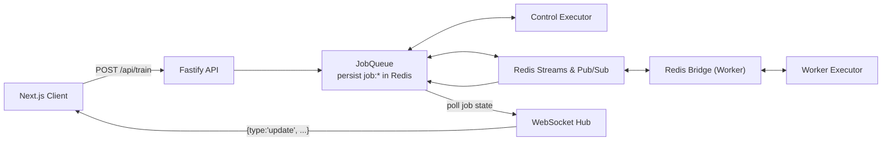
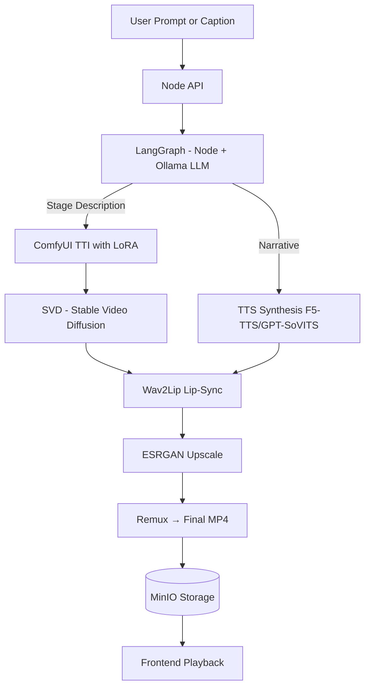
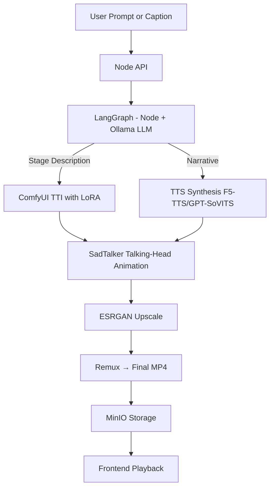
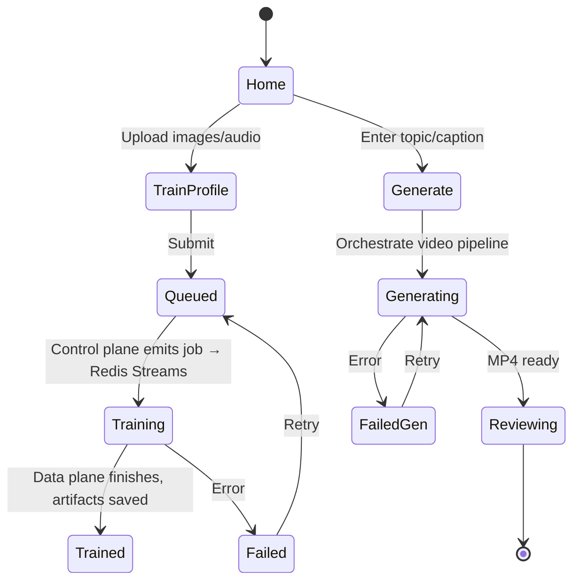

# Architecture Overview

This document describes the current MySpinBot architecture at multiple levels: a high-level component map, the dual-plane execution model, concrete training and capabilities workflows, and user interaction flows. The design has evolved through multiple planned development cycles; see `06_history.md` for a summary of that evolution.

## 1) High‑Level System Architecture

**Description:**  
The platform is a local, multi-service stack organized around a **control plane** (Node.js backend) that orchestrates LangGraph workflows, a **data plane** (Python worker) that executes heavy GPU-powered tasks, a Next.js frontend, and shared infrastructure for storage, routing, and observability. All services run on a shared Docker network and expose metrics for unified monitoring.

**System Map**

**Current implementation status:**

- Fully implemented:
  - Fastify HTTP API and WebSocket hub.
  - Planner and control-plane executor.
  - Redis-backed JobQueue and worker Redis Bridge.
  - Python worker executor and task registry.
  - MinIO integration for dummy artifacts.
  - Shared JSON schemas and codegen for validators/models.
  - Metrics endpoints for backend and worker.
- Partially implemented / stubbed:
  - Script generation via LLM (`script.generateScript`).
  - GPU-specific workloads (`train_lora`, `train_voice`, `render_video`) — simulated but wired.
  - Artifact handling, beyond dummy uploads.
- Planned:
  - Real LLM integration via Ollama.
  - ComfyUI workflows for diffusion/video pipelines.
  - TTS + lip-sync models and end-to-end video generation graphs.
  - Richer agentic planner based on capabilities.

## 2) Dual‑Plane LangGraph Execution

**Description:**  
MySpinBot uses a dual-plane LangGraph orchestration model:

- A **LangGraph graph JSON** represents each job, including both control-plane and data-plane nodes.
- The **control plane** executes `plane: "node"` nodes (e.g. script generation, manifest merging).
- The **data plane** executes `plane: "python"` nodes (e.g. `train_lora`, `train_voice`, `render_video`) and hands updated graphs back to the control plane.

**Execution Loop (Control ↔ Data)**

Key properties:

- **Graphs as contract** – nodes, plane assignments, and outputs all live in the graph.
- **Redis Streams + Pub/Sub** – form the control/data bridge and carry status/progress.
- **Idempotent executors** – both planes can resume partially completed graphs.

## 3) Training & Capabilities Workflows

### 3.1 Default Training Workflow

The primary entrypoint is `POST /api/train`, which builds a default LangGraph via the Planner:

- **Control-plane nodes** (Node.js):
  - `script.generateScript` — stubbed script generator (future Ollama call).
  - `script.postProcess` (conceptual) — space for post-script transformations.
- **Data-plane nodes** (Python):
  - `train_lora` — simulates LoRA training and uploads a dummy artifact to MinIO.
  - `train_voice` — placeholder for voice fine-tuning.
  - `render_video` — simulates a render and uploads a dummy video artifact.

Conceptually:

The graph shape is intentionally generic so a future agentic planner can synthesize richer graphs from prompts and capability manifests.

### 3.2 Capabilities Workflow

`GET /api/capabilities` runs as a small hybrid graph:

1. Python node `get_capabilities` — returns the worker capability manifest.
2. Node node `capabilities.getManifest` — merges worker and control-plane capabilities into a single JSON object.

This is the first concrete dual-plane workflow; additional features are expected to follow the same pattern.

## 4) Shared Schemas, Job State & WebSockets

The system is **schema-driven**:

- Canonical JSON Schemas under `common/config/schemas/**` define:
  - LangGraph graph format.
  - Job messaging and status.
  - Redis bridge configuration.
  - Capability manifests.
- Backend: generated **AJV validators** enforce graph and config correctness.
- Worker: generated **Pydantic models** enforce the same contracts.

**Job State & WebSocket Flow**

- The JobQueue mirrors worker Pub/Sub events into `job:<id>` keys.
- The WebSocket hub polls the JobQueue at `configuration.websocket.updateInterval` and pushes consolidated state to subscribers.
- Clients subscribe/unsubscribe per `jobId` and stop listening when the job reaches a terminal state.

## 5) Planned Video Generation Pipelines

The long-term goal is an end-to-end, local video generation pipeline that combines LLM planning, diffusion/video models, TTS, and lip-sync. Two main variants are planned.

### 5.1 SVD + Wav2Lip

_(“Scene → Video → Speech → Lip Sync”)_

**Idea:** A local LLM (via Ollama) generates a stage description and narrative; ComfyUI and Stable Video Diffusion create the video; TTS and Wav2Lip synchronize speech and lip motion; ESRGAN and ffmpeg polish the final MP4.

### 5.2 SadTalker Path

_(“Portrait → Talking Head → Speech Sync”)_

**Idea:** SadTalker animates a portrait directly from synthesized speech, bypassing SVD + Wav2Lip. The LLM still produces a narrative; ComfyUI prepares imagery where needed.

These pipelines are intentionally modular so components can be swapped (e.g., different diffusion or TTS models) without changing the overall orchestration.

## 6) User Interaction & States

Users primarily:

- Trigger training jobs.
- (In the future) generate videos from prompts or captions.
- Monitor job progress via the Web UI.

**UI / State Flow**

**Notes on Extensibility**

- Model swaps: ComfyUI and TTS blocks are parameterized to allow model changes without altering orchestration.
- Scalability: Multiple worker replicas can consume from the same Redis Streams, scaling the data plane independently.
- Security: Traefik and optional auth layers can front management UIs (Open WebUI, Grafana, etc.).
- Observability: Both planes expose `/metrics`; higher-level job and node metrics can be added incrementally.

