# 🧱 Architecture Overview

The project's main goal is **educational**. The intention is for this to provide a blueprint for putting together complete and functional AI infrastructures in which one can research/prototype/optimize AI workflows. 

### 🥜 In a nutshell

---

> _“The architecture features a **React UI** and a **Node.js orchestration layer**, which manages **LangGraph distributed workflows** across both **Node.js and Python runtimes**. The backend integrates **specialized AI facilities**, including **ComfyUI diffusion pipelines** and **Ollama-hosted local LLMs**. High-intensity machine learning tasks—such as LoRA training, Text-to-Speech (TTS), and lip-syncing—are handled by **Python-based workers managed via Dramatiq**. To ensure production-grade reliability, the entire ecosystem is supported by a full observability suite using **Prometheus and Grafana**. To ensure robustness the orchestration layer is build on-top of **Redis** and is backed by a **PostGreSQL persistence layer**. The latter can act also as a **vector database** for facilitating components like **RAG** in the future. Furthermore, to facilitate input/output and staged data management the system contains its own **MinIO object storage**. Finally it all comes together via a **Traefix proxy** which manages routing to infastructure's services.”_

---

The rest of the document describes the current MySpinBot architecture at multiple levels: a high-level component map, overview of the dual-plane execution model, description of custom ai workflows, and user interaction flow. The design has evolved through multiple planned development cycles, see [history document](./06_history.md) for a summary of that evolution.

## 1. High‑Level System Architecture

### 📝 Description

The platform is a comprehensive, local-first AI infrastructure deployed and managed using Docker Compose. It is designed around a [**dual-plane LangGraph orchestration architecture**](./phase2/dual_orchestration.md), integrating a Node.js-based **Control Plane** (backend) with a Python/GPU-powered **Data Plane** (worker). It also includes a Next.js frontend, and shared infrastructure for prototyping, state persistence, storage/data management, routing, and observability. 

The entire system is containerized, facilitating consistent environments across development and production. It includes core application services, a robust set of data stores, a full observability stack, and integrated AI inference engines (LLMs, diffusion models). A key aspect is the clear separation between a production-like deployment (`docker-compose.yml`) and a development overlay (`docker-compose.dev.yml`), allowing for efficient local development with live code reloading and debugging.

The platform's architecture is a microservices-oriented approach, where specialized services communicate over a shared internal network. Traefik acts as the ingress controller, routing external traffic to the appropriate services and handling TLS.

### 🗺️ Overall System Map 

**Production Environment**

The `docker-compose.yml` defines the core production-ready services.

**Development Environment (Overlay)**

The `docker-compose.dev.yml` overlays `docker-compose.yml` to enable a developer-friendly environment. It replaces production application images with development-specific images that mount local source code, expose debugging ports, and provide interactive shells.

More information on this can be found [here](./phase2/development_workflow_revisited.md).

### 🧩 Docker Profiles

Docker Compose profiles are used to conditionally start groups of services, optimizing resource usage and allowing for flexible deployments.

*   **Default (no profile specified):** Starts the core application services (Traefik, Redis, Postgres, MinIO, `api`, `ui`, `worker`) along with the AI services that provide inference capabilities (Ollama and ComfyUI), ensuring a functional and complete AI stack.
*   **`observability`:** Introduces Prometheus, Grafana, cAdvisor, DCGM Exporter, and Redis Exporter for comprehensive monitoring.
*   **`chatbot`:** Activates Open WebUI facility for managing llm models and providing prompting facilities.
*   **`schemas`:** Activates the `codegen` service for re-generating validation schemas and data models.
*   **`monorepo`:** Activates the `sandbox` container in development mode, providing a general-purpose environment with the entire monorepo mounted at its root workspace level.

## 2. Dual‑Plane LangGraph Execution

### 📝Description  
MySpinBot uses a dual-plane LangGraph orchestration model:

- A **LangGraph graph JSON** represents hybrid jobs for distributed execution across planes.
- The **control plane** processes **job sub-tasks** that described by `plane: "node"` node types (e.g. script generation, manifest merging, etc.).
- The **data plane** processes sub-tasks described by `plane: "python"` nodes (e.g. `train_lora`, `train_voice`, `render_video` etc.) and hands updated graphs back to the control plane.

**Execution Loop (Control ↔ Data)**

```mermaid
sequenceDiagram
    autonumber
    participant UI as Next.js UI
    participant API as Fastify API
    participant PL as Planner/Workflow Loader (Node)
    participant CQ as Control Stream (Redis)
    participant CE as Control Executor
    participant DQ as Data Stream (Redis)
    participant WE as Worker Executor (Python)
    participant TK as Python Tasks

    UI->>API: POST /api/train
    API->>PL: load/build graph (script → train_lora …)
    PL-->>API: graph JSON (langgraph.v1)
    API->>CQ: enqueue control job (XADD)

    CE->>CQ: read pending graph
    CE->>CE: execute control-plane nodes
    CE->>DQ: if python nodes remain → XADD to data stream

    WE->>DQ: read python-plane job
    WE->>TK: run python-plane node(s)
    TK-->>WE: progress callbacks, artifact URIs
    WE->>CQ: if control nodes remain → enqueue updated graph
    WE-->>CQ: else publish completed/failed status

    CE->>CQ: resume control-plane nodes (if any)
    CE-->>API: final graph status
    API-->>UI: status via WebSocket (mirrored from Redis)
```

Key properties:

- **Graphs as contract** – nodes, plane assignments, and outputs all live in the graph.
- **Redis Streams + Pub/Sub** – form the control/data bridge and carry status/progress.
- **Idempotent executors** – both planes can resume partially completed graphs.

A more detailed description of dual-plane orchestration is found [here](./phase2/dual_orchestration.md).

## 3. Shared Schemas, Job State & WebSockets

The system is **schema-driven**:

- Canonical JSON Schemas under `common/config/schemas/**` define:
  - LangGraph graph format.
  - Job messaging and status.
  - Redis bridge configuration.
  - Capability manifests.
- Backend: generated **AJV validators** enforce graph and config correctness.
- Worker: generated **Pydantic models** enforce the same contracts.

The shared schema layer underpins cross-plane correctness: both planes validate their configuration and job payloads against the same definitions, ensuring that graphs accepted/produced in control plane are also executable in data plane.

**Job State & WebSocket Flow**

- The JobQueue mirrors worker Pub/Sub events into `job:<id>` keys.
- The WebSocket hub polls the JobQueue at `configuration.websocket.updateInterval` and pushes consolidated state to subscribers.
- Clients subscribe/unsubscribe per `jobId` and stop listening when the job reaches a terminal state.

[This document](./phase2/shared_schemas.md) provides detailed explanations on these topics.

## 4. Custom Workflows

### 4.1 InfiniteTalk Workflow

The entrypoint is `POST /api/infinitetalk`, which builds a workflow LangGraph via the Planner:

- **Control-plane nodes** (Node.js):
  - `script.generateScript` — prompts appointend llm in ollama to generate narration structure.
- **Data-plane nodes** (Python):
  - `f5_to_tts` — converts the generated script text into a realistic speech audio file.
  - `infinite_talk` —takes a source image and the audio file from the previous step and creates an animated talking-head video.
  - `upscale_video` — processes the video to upscale it via AI upscaling and to restore and enhance facial details.

For more details please read [InfiniteTalk Deep Dive](phase3/infinite_talk.md) 

### 4.2 Capabilities Workflow

`GET /api/capabilities` runs as a small hybrid graph:

1. Python node `get_capabilities` — sub-task for querying the worker capability manifest.
2. Node node `capabilities.getManifest` — subt-taks that merges worker and control-plane [capabilities](./phase2/shared_schemas.md#8-capabilities-system-overview) into a single JSON object.

This is the first concrete dual-plane workflow; additional features are expected to follow the same pattern.

### 4.3 Future (Planned) Workflows 

The long-term goal is to provide more end-to-end, local video generation pipelines that combine LLM planning, diffusion/video models, TTS, lip-sync facilities and more. 

Other than the implemented InfiniteTalk pipeline there are two other variants planned. One of which (SVD+Wav2Lip) includes training a character-specific LoRA (given a set of images as an input) to apply ontop of the video generation diffusion model. While both planned pipelines introduce the generation of novel character portrait images (in contrast to the user providing one, like in InfiniteTalk workflow) with their surrounding environment out of the descriptions that the llm provides.  

#### SVD + Wav2Lip

_(“Scene → Video → Speech → Lip Sync”)_

**Idea:** A local LLM (via Ollama) generates a stage description and narrative; ComfyUI and Stable Video Diffusion create the video; TTS and Wav2Lip synchronize speech and lip motion; ESRGAN and ffmpeg polish the final MP4.

#### SadTalker Path

_(“Portrait → Talking Head → Speech Sync”)_

**Idea:** SadTalker animates a portrait directly from synthesized speech, bypassing SVD + Wav2Lip. The LLM still produces a narrative; ComfyUI prepares imagery where needed.

These pipelines are intentionally modular so components can be swapped (e.g., different diffusion or TTS models) without changing the overall orchestration.

## 5. User Interaction & States

Users primarily:

- Trigger generation pipelines.
- Monitor job progress via the Web UI.
- (In the future) manage generated artifacts and browser through jobs history.

**UI / State Flow**

**Notes on Extensibility**

- Model swaps: ComfyUI and TTS blocks are parameterized and support model changes without altering orchestration.
- Scalability: Multiple worker replicas can consume from the same Redis Streams, scaling the data plane independently.
- Security: Traefik and optional auth layers can front management UIs (Open WebUI, Grafana, etc.).
- Observability: Both planes expose `/metrics`; higher-level job and node metrics can be added incrementally.

## 🧭 Quick Navigation

➡️ [Go to Technologies Stack](./03_tech_stack.md)  
⬅️ [Back to Project Description](./01_project_description.md)