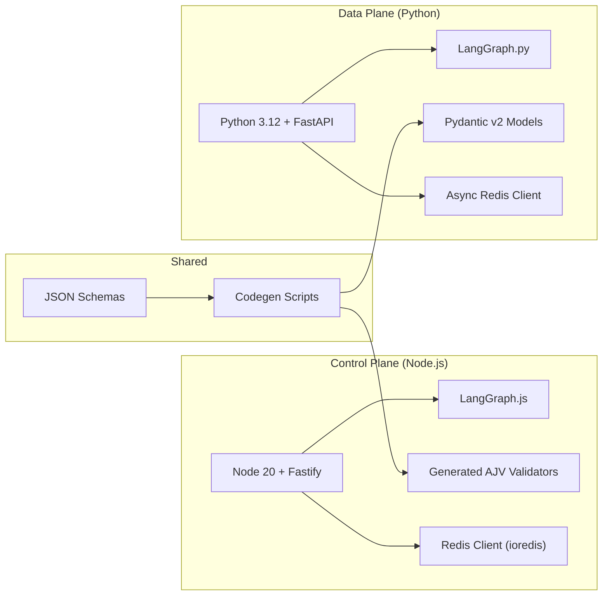

# Tech Stack Overview

This document lists the core technologies used in MySpinBot as implemented today design choices. The stack has evolved iteratively; see `06_history.md`.

## 1) Stack Snapshot

### Core Components

| Layer                    | Component / Library                   | Used In         | Role                                                                                           |
| ------------------------ | ------------------------------------- | --------------- | ---------------------------------------------------------------------------------------------- |
| **Frontend**             | Next.js 15 + React + TypeScript       | `frontend/`     | Single-page UI for training requests and job progress visualization.                          |
|                          | TailwindCSS + shadcn/ui               | `frontend/`     | Styling, layout, and basic UI components.                                                     |
| **Backend (Control)**    | Node.js 20                            | `backend/`      | Runtime for the control plane (Fastify, LangGraph.js, Redis clients).                         |
|                          | Fastify                               | `backend/`      | HTTP API, WebSocket endpoint, health & metrics.                                               |
|                          | LangGraph.js                          | `backend/`      | Graph creation and control-plane execution for `plane: "node"` nodes.                         |
|                          | `ioredis`                             | `backend/`      | Redis Streams and Pub/Sub client for the JobQueue.                                            |
|                          | AJV (generated validators)            | `backend/`      | Validates config, LangGraph graphs, and job messages against shared JSON Schemas.             |
|                          | `prom-client`                         | `backend/`      | Exposes `/metrics` endpoint for API, queue, and WebSocket metrics.                            |
| **Worker (Data Plane)**  | Python 3.12 + FastAPI                 | `worker/`       | Lightweight API for `/health` and `/metrics`, worker lifecycle, and executor bootstrap.       |
|                          | LangGraph.py                          | `worker/`       | Executes `plane: "python"` nodes in LangGraph graphs.                                         |
|                          | Async Redis client                    | `worker/`       | Implements Redis Streams bridge and Pub/Sub progress channels.                                |
|                          | Pydantic v2                           | `worker/`       | Generated data models for LangGraph graphs, job messages, and configuration.                  |
|                          | `prometheus_client`                   | `worker/`       | Exposes `/metrics` with worker and job metrics.                                               |
|                          | MinIO Python SDK / S3 client          | `worker/`       | Uploads dummy artifacts (LoRA weights, videos) to MinIO.                                      |
| **Shared / Tooling**     | JSON Schema                           | `common/`       | Canonical definitions for graphs, jobs, capabilities, and configuration.                      |
|                          | Codegen scripts (`codegen/`)          | `codegen/`      | Generate AJV validators (backend) and Pydantic models (worker) from shared schemas.           |
| **Infra & Observability**| Docker Compose                        | root + `infra/` | Orchestrates infra, backend, frontend, and worker services (dev + prod variants).             |
|                          | Traefik 2                             | `infra/`        | Reverse proxy, TLS termination, routing to backend/frontend/metrics endpoints.                |
|                          | Redis                                 | `infra/`        | Central coordination fabric (Streams + Pub/Sub) for both planes.                              |
|                          | MinIO                                 | `infra/`        | S3-compatible object storage for artifacts and uploads.                                       |
|                          | Prometheus                            | `infra/`        | Metrics collection from backend, worker, and exporters.                                       |
|                          | Grafana                               | `infra/`        | Metrics visualization and dashboards.                                                         |
|                          | cAdvisor                              | `infra/`        | Container CPU/memory metrics for Prometheus.                                                  |
|                          | NVIDIA DCGM Exporter                  | `infra/`        | GPU metrics exporter for Prometheus.                                                          |
|                          | Redis Insight                         | `infra/`        | Optional Redis introspection UI for development.                                              |

### Planned AI Services

These components are part of the target design but not yet fully wired into the codebase:

| Component                | Role                                                     | Integration Status                                |
| ------------------------ | -------------------------------------------------------- | ------------------------------------------------- |
| ComfyUI                  | Node-based image/video workflow engine.                  | Planned; to be driven by worker LangGraph nodes. |
| Stable Video Diffusion   | Image→video synthesis.                                  | Planned via ComfyUI workflows.                   |
| ESRGAN                   | Image/video upscaling.                                  | Planned post-processing step.                    |
| F5-TTS / GPT-SoVITS      | Text-to-speech / voice cloning.                         | Planned; currently simulated in worker tasks.    |
| Wav2Lip / SadTalker      | Lip-sync / talking-head animation.                      | Planned; `render_video` currently stubbed.       |
| Ollama + Open WebUI      | Local LLM runtime + management UI for script planning.  | Planned; `generateScript` currently stubbed.     |

These planned services appear in the architecture diagrams as future integrations and can be introduced incrementally.

## 2) Control vs Data Plane Split

MySpinBot leans heavily into a **control-plane / data-plane split**:

Key decisions:

- **Graphs as the primary abstraction** – orchestration is expressed as LangGraph graphs, not ad-hoc JSON or queue messages.
- **Redis Streams + Pub/Sub as the only coordination fabric** – there is no BullMQ, Celery, or external broker.
- **Generated validators/models** – JSON Schemas in `common/` feed codegen for AJV (backend) and Pydantic (worker), minimizing schema drift.

## 3) Shared Schemas & Codegen

The shared schema layer underpins cross-plane correctness:

- Canonical schemas live under `common/config/schemas/**` (graphs, jobs, capabilities, redis config, storage).
- Backend validators are generated into `backend/src/validators/**`.
- Worker models are generated into `worker/src/worker/models/**`.
- A small `codegen/` directory provides:
  - `gen-backend-validators.sh` – regenerate AJV validators.
  - `gen-worker-datamodel.sh` – regenerate Pydantic models.
  - `gen-all.sh` – convenience wrapper for both.

Both planes validate their configuration and job payloads against the same definitions, ensuring that graphs accepted by the backend are also executable by the worker.

## 4) Development Workflow & Versioning

- **Dev Containers per subsystem**  
  `backend/`, `frontend/`, and `worker/` each ship a VS Code Dev Container configuration and Dockerfile. Development (including tests) happens inside these containers for parity with production images.

- **Docker-based orchestration**  
  A small set of Compose files under the root and `infra/` directory bring up Traefik, Redis, MinIO, Prometheus, Grafana, Redis Insight, and the app services.

- **Versioning guidelines**  
  - Pin base images and core dependencies (Node.js, Python, Redis, MinIO, Prometheus) to specific major/minor versions for reproducibility.
  - Upgrade on a controlled cadence (e.g. quarterly) after integration testing.
  - Keep schema changes backward-compatible where possible; regenerate validators/models as part of the upgrade process.

## 5) Design Principles 

- **All-open-source, local-first** – no proprietary APIs or hosted dependencies are required; everything runs on a single GPU box.
- **Dual-LangGraph orchestration** – Node LangGraph handles user-facing workflows; Python LangGraph handles GPU-style DAGs.
- **Schema-driven contracts** – shared schemas are the single source of truth for graphs, jobs, and configuration.
- **Observability by default** – every service exposes metrics; Prometheus + Grafana provide a unified view of system health.
- **Composable AI services** – planned diffusion, TTS, lip-sync, and LLM components are decoupled so they can be swapped or extended without rewriting the core orchestration.

