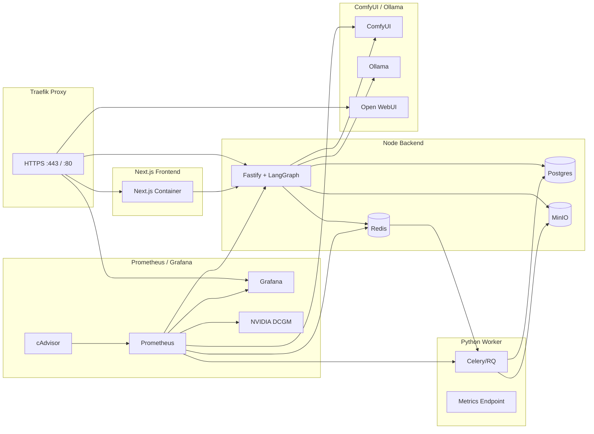
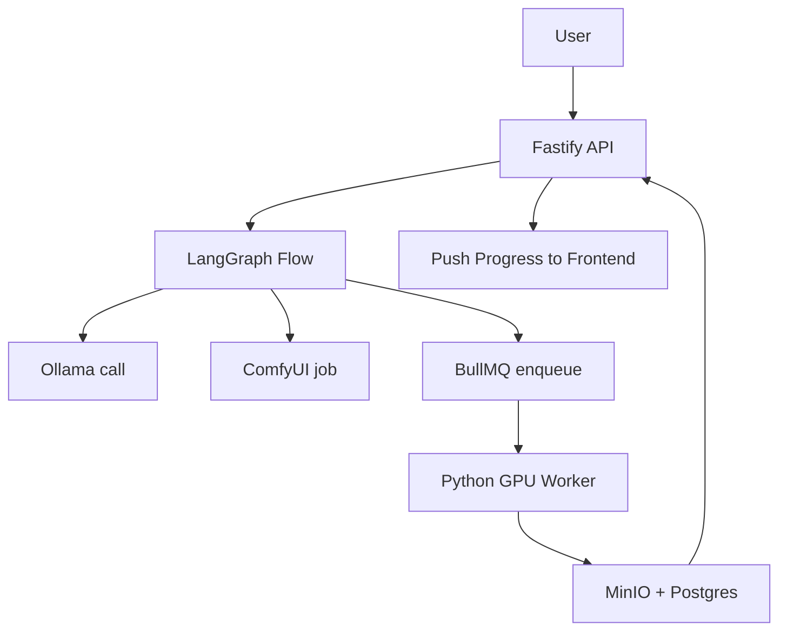

# Modular Breakdown & Technical Analysis

This section explains the internal composition of the MySpinBot, detailing each subsystem, its responsibilities, interfaces, data exchange patterns, and extensibility points. It also includes deployment topology notes to clarify how services interconnect within Docker Compose.

## 1️⃣ Overview: Modular Composition

| Module | Primary Language | Responsibility | Key Interfaces |
|:--------|:-----------------|:---------------|:----------------|
| **Frontend (Next.js)** | TypeScript | User-facing UI for profile creation, media upload, and video generation control | REST (HTTPS, JSON), WebSocket for real-time progress updates |
| **Backend (Node.js)** | TypeScript | Central orchestrator that routes API calls, manages queue jobs, runs LangGraph pipelines, and exposes metrics | REST, Redis Pub/Sub, LangChain.js API, HTTP calls to ComfyUI and Ollama |
| **GPU Worker (Python)** | Python 3.11 | Executes GPU-bound training and generation jobs: LoRA, TTS, lip-sync; emits Prometheus metrics | Redis Queue, FastAPI `/metrics` endpoint, MinIO client, ComfyUI API |
| **ComfyUI Service** | Python | Visual workflow runner for text-to-image, image-to-video, and post-processing nodes | REST JSON API on port 8188, local file exchange via mounted `/data` |
| **Ollama + Open WebUI** | C++ daemon + Node/Python UI | LLM model host (Ollama) and management/chat UI (Open WebUI) | Ollama REST API (11434), Open WebUI web interface (port 8080) |
| **Storage Layer (Postgres, Redis, MinIO)** | Mixed | Persistent data, job queues, object storage | SQL, Redis protocol, S3-compatible API |
| **Monitoring Stack (Prometheus, Grafana, cAdvisor, DCGM Exporter)** | Go | Metrics collection and visualization for all services | HTTP `/metrics`, PromQL queries |
| **Ingress (Traefik)** | Go | Central entrypoint and router with HTTPS termination | TCP/HTTP, ACME or local TLS certificates |

---

## 2️⃣ Deployment Topology

**Docker Compose Topology**

**Topology Notes:**
- **Network:** All containers share a common `internal-network` bridge. Traefik attaches to the same network and routes based on labels.
- **Volumes:** `/data` mounted between Node, Worker, and ComfyUI for exchanging intermediate images/videos.
- **GPU Access:** Worker and ComfyUI containers include `--gpus all` flags; Ollama optionally can use GPU acceleration.
- **Ports:**
  - 443 → Traefik entrypoint
  - 3000 → Node API
  - 5173 → Next.js (dev) / 3000 (prod)
  - 8188 → ComfyUI
  - 11434 → Ollama
  - 8080 → Open WebUI
  - 9090 / 3002 → Prometheus / Grafana

## 3️⃣ Module-by-Module Technical Analysis

### **Frontend (Next.js + Tailwind + shadcn/ui)**
- Uses server components for upload APIs and WebSocket for progress streaming.
- Integrates with backend endpoints: `/train/lora`, `/train/voice`, `/generate`.
- Internal state via Zustand store: `useJobStore()` tracks active jobs, statuses, and ETA.
- Auth planned via cookie sessions (optional Keycloak integration).
- Build system uses `pnpm` + Vite for local development.

### **Backend (Node.js Fastify + LangGraph.js)**
- Core orchestrator controlling workflow between LLM → ComfyUI → Worker.
- Provides REST endpoints and WebSocket updates via Fastify plugins.
- Exposes metrics at `/metrics` using `prom-client`.
- LangGraph graph defines deterministic flow: prompt → LLM → generation request → monitor completion → publish event.
- BullMQ manages queue scheduling, failure retries, and rate-limiting.
- Connects to ComfyUI REST for running JSON-defined workflows, and to Ollama for text generation.

### **Python GPU Worker**
- Subscribes to Redis queues (`train_lora`, `train_voice`, `render_video`).
- Each task runs in isolated subprocess to control GPU memory.
- Metrics via `prometheus_client`: job count, duration, VRAM usage.
- LoRA training uses kohya scripts; TTS uses F5-TTS or GPT-SoVITS; generation merges outputs with ComfyUI results.
- Writes all outputs to MinIO under `/videos`, `/loras`, `/voices` prefixes.
- Recovery mechanism: on crash, unfinished jobs rescheduled (idempotent paths).

### **ComfyUI Workflow Engine**
- Runs with headless API mode enabled (`--listen 0.0.0.0 --port 8188`).
- Node graph templates stored in `/workflows/*.json`; API accepts payload specifying node IDs and parameters.
- Exposes WebSocket events for progress; Node backend polls results.
- Uses preloaded models for SD1.5, ESRGAN, SVD, and SadTalker.
- Custom serversTransport (skipVerify) in Traefik bypasses SSL warnings when self-signed.

### **Ollama + Open WebUI**
- Ollama: lightweight REST model server running small to medium LLMs (OLMo-7B-Instruct, Mistral 7B, Phi-3 Mini).
- Exposes `/api/generate`, `/api/tags` for model listing and generation.
- Open WebUI: front-end companion enabling chat, prompt testing, and model downloads.
- Backend Node service calls Ollama directly (bypassing WebUI) via LangChain.js LLM wrapper.
- Shared models directory volume: `/root/.ollama` mounted for persistence.

### **Data Layer (Postgres / Redis / MinIO)**
- **Postgres** stores structured metadata: users, jobs, artifacts, metrics snapshots.
- **Redis** serves as both cache and message broker (BullMQ + Celery/RQ).
- **MinIO** acts as S3-compatible blob store for uploaded and generated media.
- Data exchange pattern: API writes job entries → Worker updates status → Prometheus scrapes metrics.

### **Monitoring & Observability**
- Prometheus scrapes `/metrics` from backend, worker, Redis exporter, DCGM exporter.
- Grafana dashboards visualize GPU utilization, queue sizes, API latency.
- cAdvisor auto-discovers containers; DCGM provides GPU telemetry.
- Alerts can be configured via Grafana Alerting → Discord or email webhooks.

### **Ingress (Traefik)**
- Routes based on labels; provides HTTPS termination using self-signed or ACME certificates.
- Example router rules:
  - `api.nas.local` → Node API
  - `ui.nas.local` → Next.js frontend
  - `openwebui.nas.local` → Open WebUI
  - `grafana.nas.local` → Grafana
- Middleware: BasicAuth for dashboards, TLS redirect from HTTP to HTTPS.

## 4️⃣ Data Flow Summary

1. **Profile Creation:** User uploads → Node API validates → stores metadata → enqueues training jobs.
2. **Training:** Python Worker runs LoRA and TTS → artifacts to MinIO → DB updated.
3. **Generation:** Node orchestrates LLM prompt → ComfyUI image/video → Worker handles TTS + lip-sync → final MP4 to MinIO.
4. **Progress Tracking:** Redis Pub/Sub → WebSocket updates frontend.
5. **Monitoring:** Prometheus scrapes metrics → Grafana visualizes.

## 5️⃣ Extensibility Guidelines
- **Add new job type:** define schema in Node + handler in Worker; register new queue.
- **Swap diffusion model:** update ComfyUI workflow JSON and environment variable in Docker Compose.
- **Integrate alternative LLM host:** update LangChain.js LLM class configuration (API URL + model name).
- **Add metrics:** expose `/metrics` in any new container; Prometheus auto-scrapes if added to `prometheus.yml`.
- **Scale workers:** increase replica count; BullMQ and Celery handle distribution automatically.

**Outcome:** The architecture forms a self-contained, observable, and modular ecosystem: Node.js governs logic, Python performs computation, and monitoring ensures transparency. Every part can evolve independently yet remains interoperable through open standards (HTTP, Redis, S3, Prometheus).

