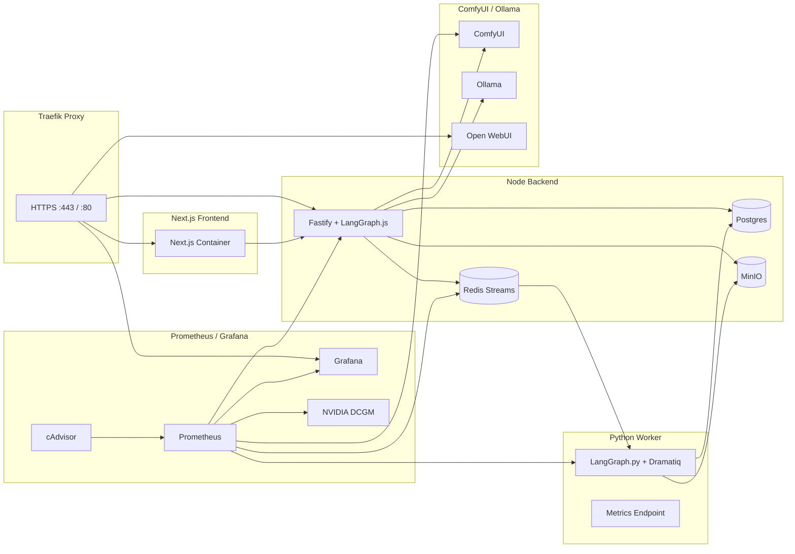
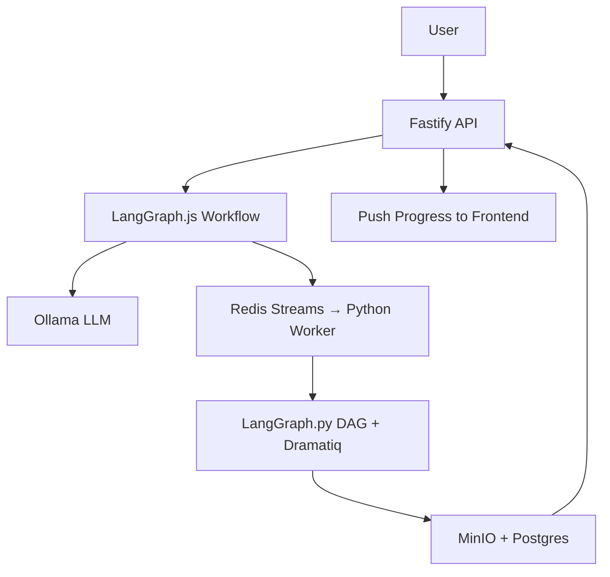

# Modular Breakdown & Technical Analysis

This section explains the internal composition of the MySpinBot system, detailing each subsystem, its responsibilities, interfaces, data exchange patterns, and extensibility points. It also includes deployment topology notes to clarify how services interconnect within Docker Compose.

## 1️⃣ Overview: Modular Composition

| Module                                                              | Primary Language            | Responsibility                                                                                                                     | Key Interfaces                                                                    |
| :------------------------------------------------------------------ | :-------------------------- | :--------------------------------------------------------------------------------------------------------------------------------- | :-------------------------------------------------------------------------------- |
| **Frontend (Next.js)**                                              | TypeScript                  | User-facing UI for profile creation, media upload, and video generation control                                                    | REST (HTTPS, JSON), WebSocket for real-time progress updates                      |
| **Backend (Node.js)**                                               | TypeScript                  | Central orchestrator that routes API calls, manages LangGraph workflows, coordinates LLM and generation tasks, and exposes metrics | REST, Redis Streams & Pub/Sub, LangChain.js API, HTTP calls to ComfyUI and Ollama |
| **GPU Worker (Python)**                                             | Python 3.12                 | Executes GPU-bound training and generation jobs: LoRA, TTS, lip-sync, diffusion; managed by LangGraph + Dramatiq                   | Redis Streams, FastAPI `/metrics`, MinIO client, ComfyUI API                      |
| **ComfyUI Service**                                                 | Python                      | Visual workflow runner for text-to-image, image-to-video, and post-processing nodes                                                | REST JSON API on port 8188, local file exchange via mounted `/data`               |
| **Ollama + Open WebUI**                                             | C++ daemon + Node/Python UI | LLM model host (Ollama) and management/chat UI (Open WebUI)                                                                        | Ollama REST API (11434), Open WebUI web interface (port 8080)                     |
| **Storage Layer (Postgres, Redis, MinIO)**                          | Mixed                       | Persistent data, cross-plane communication, and artifact storage                                                                   | SQL, Redis protocol, S3-compatible API                                            |
| **Monitoring Stack (Prometheus, Grafana, cAdvisor, DCGM Exporter)** | Go                          | Metrics collection and visualization for all services                                                                              | HTTP `/metrics`, PromQL queries                                                   |
| **Ingress (Traefik)**                                               | Go                          | Central entrypoint and router with HTTPS termination                                                                               | TCP/HTTP, ACME or local TLS certificates                                          |

---

## 2️⃣ Deployment Topology

**Docker Compose Topology**

**Topology Notes:**

- **Network:** All containers share a common `internal-network` bridge; Traefik attaches to the same network and routes based on labels.
- **Volumes:** `/data` mounted between Node, Worker, and ComfyUI for exchanging intermediate images/videos.
- **GPU Access:** Worker and ComfyUI containers include `--gpus all` flags; Ollama optionally uses GPU acceleration.
- **Ports:**

  - 443 → Traefik entrypoint
  - 3000 → Node API
  - 5173 → Next.js (dev) / 3000 (prod)
  - 8188 → ComfyUI
  - 11434 → Ollama
  - 8080 → Open WebUI
  - 9090 / 3002 → Prometheus / Grafana

## 3️⃣ Module-by-Module Technical Analysis

### **Frontend (Next.js + Tailwind + shadcn/ui)**

- Uses server components for upload APIs and WebSocket for progress streaming.
- Integrates with backend endpoints: `/train/lora`, `/train/voice`, `/generate`.
- Zustand store: `useJobStore()` tracks active jobs, statuses, and ETA.
- Optional auth via Keycloak.
- Build system uses `pnpm` + Vite.

### **Backend (Node.js Fastify + LangGraph.js)**

- Provides REST endpoints and WebSocket updates via Fastify plugins.
- Core orchestrator managing high-level workflows and user jobs.
- LangGraph defines job-level orchestration: e.g., `TrainProfile → Train LoRA + Train TTS → GenerateVideo`.
- Each Node LangGraph node emits job events to Redis Streams for the Python side.
- Progress, completion, and failure events returned via Redis Pub/Sub and WebSockets.
- Exposes metrics via `prom-client` at `/metrics`.
- Connects to ComfyUI and Ollama through REST APIs.

### **Python GPU Worker (LangGraph.py + Dramatiq)**

- Subscribes to Redis Streams from the backend.
- Python LangGraph defines task-level DAGs (e.g., `prepare → train_lora → eval → upload`).
- Dramatiq executes these tasks in parallel processes per GPU context.
- Each task reports progress through Redis Pub/Sub.
- Metrics exposed through FastAPI `/metrics` endpoint for Prometheus.
- Writes all outputs to MinIO under `/videos`, `/loras`, `/voices` prefixes.

### **ComfyUI Workflow Engine**

- Runs headless API mode (`--listen 0.0.0.0 --port 8188`).
- Node graphs stored in `/workflows/*.json`.
- Orchestrated by the **Python LangGraph** for image, video, and post-processing steps.
- Uses models for SD1.5, ESRGAN, SVD, SadTalker.

### **Ollama + Open WebUI**

- Ollama runs small/medium LLMs (OLMo, Mistral, Phi-3).
- Node LangGraph interacts with Ollama for script/narrative generation.
- Open WebUI allows local model management and experimentation.

### **Data Layer (Postgres / Redis / MinIO)**

- **Postgres:**  
  Stores structured metadata — users, job definitions, artifact registry, and workflow history.
- **Redis:**  
  Serves _two distinct roles_ across the architecture:
  1. **System Coordination (Shared)** — used by Node.js and Python LangGraphs for orchestration:
     - **Streams** handle job dispatch and status propagation between the backend and workers.
     - **Pub/Sub** delivers real-time progress and completion events back to the Node.js layer.
     - Lives in **Redis DB 0** or under the prefix `lg:*`.
  2. **Dramatiq Broker (Worker Internal)** — used exclusively by Python worker processes for task queueing and result tracking:
     - Provides persistent task scheduling, retries, and acknowledgment semantics.
     - Lives in **Redis DB 1** or under the prefix `dramatiq:*`.  
       This separation isolates control-plane orchestration from data-plane execution, ensuring Dramatiq internals never interfere with LangGraph message streams.
- **MinIO:**  
  S3-compatible object store for both input uploads and generated artifacts (`/videos`, `/loras`, `/voices`).  
  Supports presigned URLs for large uploads and integrates directly with the Python worker for artifact I/O.

### **Monitoring & Observability**

- Prometheus scrapes `/metrics` from Node, Python worker, Redis exporter, and DCGM.
- Grafana visualizes GPU utilization, workflow durations, API latency.
- cAdvisor monitors containers; DCGM provides GPU telemetry.

### **Ingress (Traefik)**

- Routes traffic by hostname, handles HTTPS via mkcert or ACME.
- Example routes:

  - `api.myspinbot.local` → Node API
  - `ui.myspinbot.local` → Frontend
  - `openwebui.myspinbot.local` → Open WebUI
  - `grafana.myspinbot.local` → Grafana

- BasicAuth middleware for dashboards.

## 4️⃣ Data Flow Summary

1. **Profile Creation:** User uploads → Node API validates → stores metadata → triggers LangGraph.js job.
2. **Training:** Node emits Redis events → Python LangGraph executes LoRA and TTS DAGs → artifacts to MinIO → DB updated.
3. **Generation:** Node LangGraph calls LLM → triggers Python LangGraph to orchestrate ComfyUI, SVD, TTS → final MP4 to MinIO.
4. **Progress Tracking:** Redis Pub/Sub → Fastify WebSocket → frontend updates.
5. **Monitoring:** Prometheus scrapes metrics → Grafana displays.

## 5️⃣ Extensibility Guidelines

- **Add new job type:** define schema in Node LangGraph and Python LangGraph; register new stream.
- **Swap diffusion model:** update ComfyUI workflow JSON and environment variable.
- **Integrate new LLM host:** update LangChain.js LLM configuration.
- **Add metrics:** expose `/metrics` in any new container.
- **Scale workers:** increase worker replicas; Dramatiq automatically distributes tasks.

**Outcome:** The architecture is now driven by **dual LangGraph orchestration**, with Node managing user workflows and Python coordinating GPU DAGs. Redis Streams and Pub/Sub bridge the two, while Dramatiq ensures robust GPU execution. The result is a modular, observable, and scalable local AI media platform.
