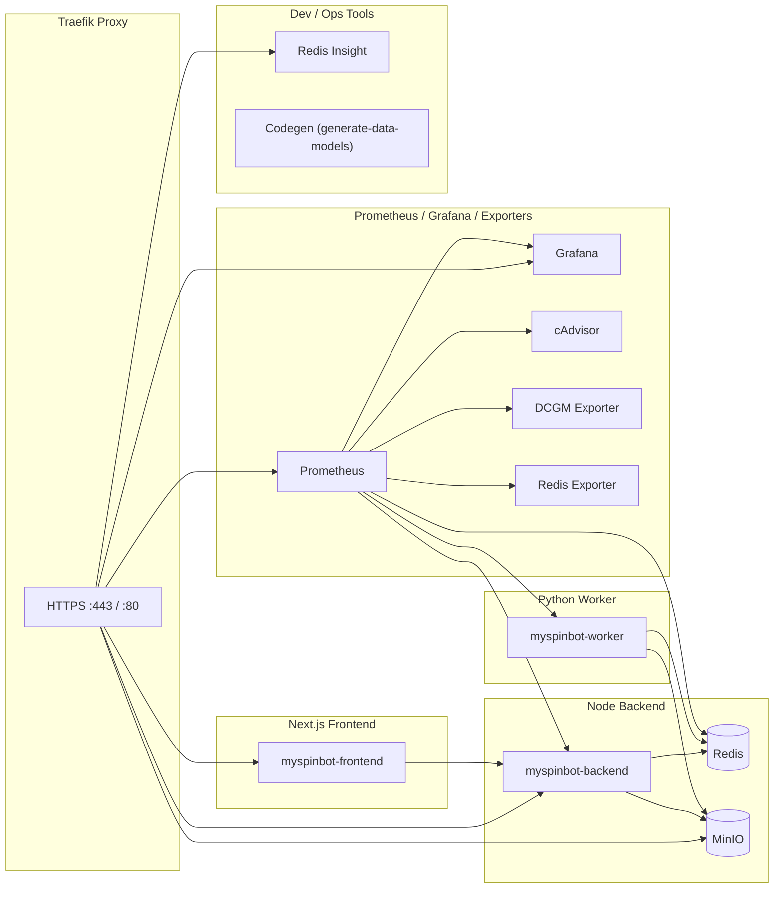

# Modular Breakdown & Technical Analysis

This section explains the internal composition of the MySpinBot system, detailing each subsystem, its responsibilities, interfaces, and extensibility points. It reflects the current implementation and its modular structure; for how the design evolved, see `06_history.md`.

## 1) Overview: Modular Composition

At a high level, the repository is organized around four primary code modules and supporting infrastructure:

| Module                  | Location        | Primary Language | Responsibility                                                                                              | Key Interfaces                                                             |
| :---------------------- | :------------- | :--------------- | :---------------------------------------------------------------------------------------------------------- | :-------------------------------------------------------------------------- |
| **Frontend (Next.js)**  | `frontend/`    | TypeScript       | User-facing UI for triggering training, monitoring job progress, and later inspecting artifacts.           | REST (HTTP, JSON), WebSocket for real-time job updates                     |
| **Backend (Control)**   | `backend/`     | JavaScript       | Fastify API + WebSocket hub, Planner, control-plane LangGraph executor, Redis bridge, metrics.            | REST, Redis Streams & Pub/Sub, LangGraph.js API                            |
| **Worker (Data Plane)** | `worker/`      | Python           | FastAPI service, Redis bridge, data-plane LangGraph executor, task registry, MinIO artifact handling.     | Redis Streams & Pub/Sub, FastAPI `/metrics`, MinIO/S3 client               |
| **Shared Schemas**      | `common/`      | JSON / Scripts   | Canonical JSON Schemas, baseline config, and codegen scripts for validators/models used by both planes.   | Filesystem (`common/config/**`), codegen scripts                            |
| **Infrastructure**      | `infra/` + root| YAML / Docker    | Traefik, Redis, MinIO, Prometheus, Grafana, Redis Insight, Dev Containers, and Docker Compose definitions.| Traefik HTTP/TLS, Prometheus `/metrics`, Docker networking and volumes     |

The sections below zoom into each module and highlight concrete implementation details.

## 2) Deployment Topology

This section describes how the modules above are deployed using Docker Compose in both production-like and development setups.

### 2.1 Docker Compose Topology (Production)

The primary deployment uses `docker-compose.yml` and runs:

- Core app services: `api` (backend), `ui` (frontend), `worker` (Python data plane).
- Infra services: Traefik, Redis, MinIO, Prometheus, Grafana, Redis Insight, exporters.
- Optional utility services enabled via profiles: Redis exporter, cAdvisor, DCGM exporter (`observability` profile), and `codegen` (`generate-data-models` profile).



**Topology notes (production):**

- **Network** – all services share the `internal-network` bridge; Traefik attaches to the same network and exposes selected HTTP endpoints via `*.myspinbot.local` hostnames.
- **Storage** – named volumes are used for Redis data (`redis-data`), MinIO buckets (`minio-data`), Redis Insight configuration (`redis-insight-data`), and worker model cache (`models-cache`).
- **GPU access** – the `worker` service reserves all NVIDIA devices (`gpus: all`) and is monitored by the DCGM exporter; other services are CPU-only.
- **Profiles** – observability-related services (Prometheus, Grafana, exporters) run under the `observability` profile; the `codegen` service runs on demand under the `generate-data-models` profile.

### 2.2 Development vs Production

Development uses `docker-compose.dev.yml` as an overlay on top of the base stack:

- **Dev app containers**
  - `api`, `ui`, and `worker` have `*-dev` images, open interactive shells, and mount local source directories for live editing.
  - Debug ports are exposed (`9229` for backend, `9230` for frontend, `5678` for worker) while still connecting to the same Redis and MinIO services defined in `docker-compose.yml`.
- **Sandbox container**
  - A `sandbox` service provides a generic development shell with the entire repository mounted at `/workspace` for ad-hoc scripts and experiments.
- **Shared infra**
  - Traefik, Redis, MinIO, and (optionally) observability services come from the base `docker-compose.yml` and are reused unchanged in development.


This arrangement keeps the **app layer mutable** (hot-reload, debugging, test runs) while the **infra layer** remains stable and close to the production topology.

## 3) Backend (Control Plane) — `backend/`

The backend is the **control plane**: it owns HTTP/WS APIs, builds LangGraph jobs, runs control-plane nodes, and mirrors worker progress into WebSocket updates.

### 2.1 Internal Structure

Typical layout (details may evolve, but these are the current conceptual modules):

```text
backend/
├─ src/
│  ├─ index.js                 # Fastify bootstrap, CORS, route registration
│  ├─ config.js                # Load + validate configuration, capabilities
│  ├─ api/
│  │  ├─ http/                 # HTTP route handlers (health, metrics, train, status, capabilities)
│  │  └─ ws/                   # WebSocket route wiring
│  ├─ core/
│  │  ├─ job-queue.js          # Redis Streams + Pub/Sub wrapper
│  │  ├─ planner.js            # LangGraph template builder + graph validation
│  │  └─ executor.js           # Control-plane LangGraph executor
│  ├─ services/                # Service registry (script, capabilities, artifacts, etc.)
│  ├─ infra/                   # Metrics registry, WebSocket hub
│  └─ validators/              # AJV validators (generated from common schemas)
└─ tests/                      # Vitest test suite
```

### 2.2 Responsibilities

- **Fastify API / WebSocket**
  - Routes: `/health`, `/metrics`, `/api/capabilities`, `/api/status/:jobId`, `/api/train`, `/ws`.
  - WebSocket hub supports `SUBSCRIBE` / `UNSUBSCRIBE` per `jobId`.
- **Configuration Layer**
  - `config.js` merges multiple JSON config files (including Redis bridge) and validates everything using generated AJV validators.
  - Exposes helpers like `getConfiguration()` and `getCapabilities()`.
- **JobQueue**
  - Wraps a single Redis instance using `ioredis`.
  - Owns Streams for control/data processing (`${streams.process}:control` / `:data`).
  - Persists job state in `job:<id>` keys (status, progress, last graph).
  - Subscribes to worker Pub/Sub channels and mirrors state into Redis keys and WebSocket metrics.
- **Planner**
  - Assembles default LangGraph templates for `/api/train` and internal flows.
  - Validates graph JSON using a generated `graph.schema-validator` from `common/`.
  - Ensures metadata consistency (e.g. `workflowId` matches `jobId`, valid `plane` values).
- **Control Executor**
  - Polls the control stream for pending graphs.
  - Executes all `plane: "node"` nodes via a service registry (`services/*.js`).
  - Updates node status/output, recomputes progress, and persists the updated graph.
  - Hands off to the data stream when python-plane nodes remain; otherwise finalizes and publishes status.
- **Services Registry**
  - Dynamically loads services such as:
    - `script.generateScript` — stubbed script generation.
    - `capabilities.getManifest` — merges control and worker capability manifests.
    - `artifacts.uploadArtifact` / `prepareAssets` — stubs for future MinIO integration.

## 4) Worker (Data Plane) — `worker/`

The worker is the **data plane**: it executes python-plane LangGraph nodes, simulates GPU work, writes artifacts to MinIO, and exposes metrics via FastAPI.

### 3.1 Internal Structure

```text
worker/
├─ src/worker/
│  ├─ main.py                 # FastAPI app, lifespan, /health, /metrics
│  ├─ config.py               # WorkerConfiguration (Pydantic), capabilities loader
│  ├─ core/
│  │  ├─ bridge.py            # Redis Streams + Pub/Sub bridge (data plane)
│  │  └─ executor.py          # Python-plane LangGraph executor
│  ├─ services/
│  │  └─ tasks.py             # Task registry (train_lora, train_voice, render_video, get_capabilities)
│  ├─ models/                 # Generated Pydantic models (LangGraph, jobs, capabilities, redis, storage)
│  └─ infra/
│     └─ metrics/             # Prometheus metrics helpers
└─ tests/                     # pytest test suite
```

### 3.2 Responsibilities

- **FastAPI App**
  - Provides `/health` and `/metrics` endpoints.
  - Startup lifespan connects to Redis and starts the executor loop.
- **Configuration**
  - `config.py` merges JSON config and environment variables into a `WorkerConfiguration` singleton (Pydantic).
  - Loads `config/capabilities.json` to advertise worker abilities (`train_lora`, `render_video`, etc.).
- **Redis Bridge**
  - Mirrors the behavior of the backend JobQueue on the data plane:
    - Consumes from `${streams.process}:data`.
    - Acknowledges entries and persists job payloads with TTL.
    - Can enqueue updated graphs back to the control stream.
    - Publishes `status:*`, `progress:*`, and `data:*` messages via Pub/Sub.
- **Python Executor**
  - Polls the bridge for pending jobs.
  - Validates graph payload using generated Pydantic models (e.g. `LangGraphGraph`).
  - Executes `plane: "python"` nodes in dependency order.
  - Each node handler receives typed params, input context, and callbacks for progress/data emission.
  - Records per-node and per-job metrics (e.g. `gpu_worker_jobs_total`, `gpu_worker_job_duration_seconds`).
- **Task Registry (`services/tasks.py`)**
  - Decorated with `@task` to register handlers:
    - `train_lora` — simulates LoRA training, uploads a dummy `.safetensors` artifact to MinIO.
    - `train_voice` — placeholder for voice training (stubbed).
    - `render_video` — simulates video render, uploads a dummy MP4 artifact.
    - `get_capabilities` — returns a JSON manifest string from configuration.
  - Includes helpers like `connect_minio`, `simulate_progress`, `upload_dummy_artifact`.

## 5) Shared Schemas & Codegen — `common/` + `codegen/`

The shared schema and code generation layer keeps the two planes aligned:

```text
common/
  └─ config/
      ├─ schemas/
      │   ├─ capabilities/
      │   ├─ jobs/
      │   ├─ langgraph/
      │   ├─ redis/
      │   └─ storage/
      ├─ redis.bridge.json
      └─ ...

codegen/
  ├─ gen-backend-validators.sh
  ├─ gen-worker-datamodel.sh
  └─ gen-all.sh
```

- Schemas describe graph structure, job lifecycle, capabilities, and configuration.
- Backend validators (AJV) and worker models (Pydantic v2) are generated from the same schemas.
- Both planes validate configuration and graph payloads against these canonical definitions to avoid drift.

## 6) Frontend — `frontend/`

The frontend is intentionally small and focused on **job lifecycle visualization** rather than full profile management or artifact browsing.

### 5.1 Structure

```text
frontend/
├─ app/
│  ├─ layout.tsx          # App shell, branding
│  └─ page.tsx            # Main page (upload + jobs)
├─ components/
│  ├─ UploadForm.tsx      # Image + prompt upload, calls /api/train
│  ├─ StatusCard.tsx      # Status pill + prompt + progress
│  └─ ProgressBar.tsx     # Visual progress indicator
├─ lib/
│  ├─ api.ts              # REST helpers (postTrain, status)
│  └─ ws.ts               # WebSocket hook for /ws
└─ tests/                 # Vitest + React Testing Library
```

### 5.2 Responsibilities

- Triggers training by POSTing to `/api/train`.
- Establishes a WebSocket connection to `/ws` and subscribes to specific job IDs.
- Renders a StatusCard per job with up-to-date progress and status.
- Unsubscribes once a job reaches a terminal state.

The UI is minimal but wired to the same job and progress semantics that future, richer UIs will use.

## 7) Infrastructure & Dev Workflow — `infra/` + Dev Containers

The infrastructure layer consolidates shared services and development tooling:

- **Infra stack** (`infra/` + `docker-compose*.yml`):
  - Traefik proxy, TLS, and routing.
  - Redis + Redis Insight.
  - MinIO for artifacts.
  - Prometheus + Grafana for metrics and dashboards.
  - cAdvisor + DCGM Exporter for container and GPU metrics.
- **Dev Containers**:
  - Each of `backend/`, `frontend/`, and `worker/` has its own `.devcontainer/` configuration.
  - Development happens inside these containers for parity with production images.
  - Tests (Vitest / pytest) run inside their respective Dev Containers.

From a modular standpoint, each subsystem is effectively a self-contained module with its own runtime environment, while sharing infra services via Compose.

## 8) Module Dependency Diagram


This diagram reflects how code modules are connected today — not just conceptually, but in actual imports and runtime flows.

## 9) Planned External AI Services (Module View)

Beyond the core modules, several AI services are planned as separate, optional modules:

| Module               | Responsibility                                                | Integration Point                       |
| :------------------- | :----------------------------------------------------------- | :-------------------------------------- |
| **ComfyUI Service**  | Visual workflows for text-to-image, image-to-video, etc.     | Called from worker tasks / LangGraph.   |
| **Ollama + Open WebUI** | LLM runtime and management/chat UI for script planning.    | Called from backend LangGraph nodes.    |
| **TTS / Voice Stack** (F5-TTS, GPT-SoVITS) | Text-to-speech and voice cloning.               | Implemented as worker tasks.            |
| **Lip-sync / Talking-Head** (Wav2Lip, SadTalker) | Lip-sync or talking-head animation.           | Implemented as worker tasks.            |

These remain modular add-ons: they are not required to run the current training flows but are part of the long-term architecture and can be integrated without changing the core module boundaries described above.
