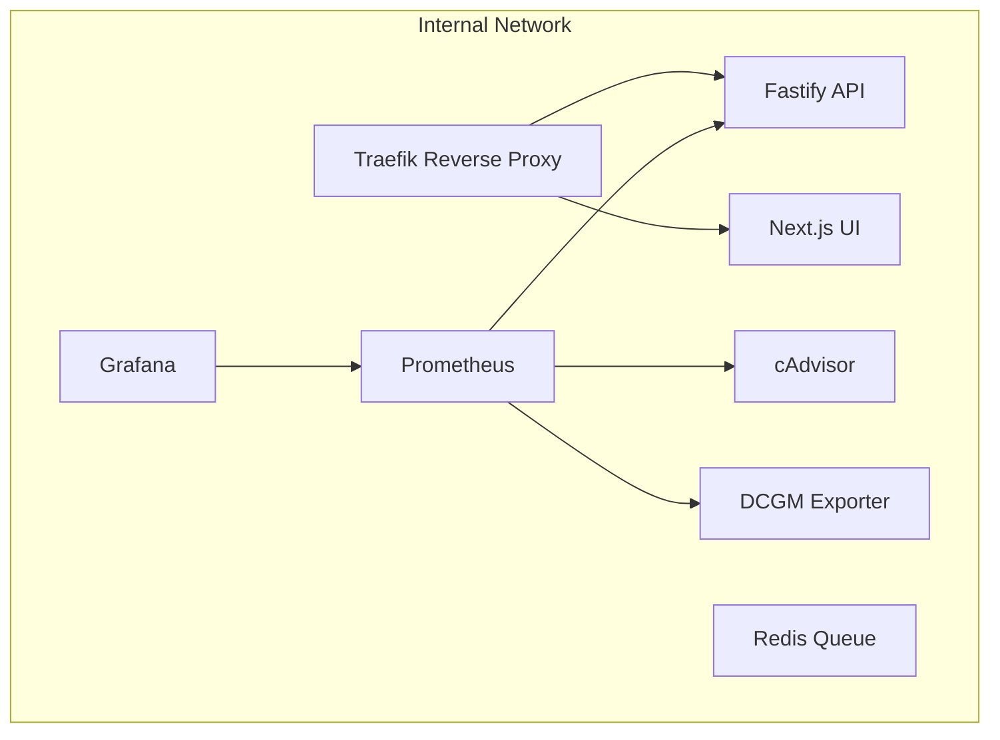

# 🕸️ Compose Layout

## 🎯 Objective

Define how the **API** and **UI** services integrate into the existing Phase 0 infrastructure via Docker Compose.  
This includes their build contexts, Traefik routing, Prometheus targets, and network topology.

Phase 0 provided the *lungs* (proxy + monitoring stack);  
Phase 1 plugs in the *heart and voice* — backend + frontend containers that make the system interactive.

## 🧱 Updated Stack Overview

| Service | Description | Exposed At | Network | Observability |
|----------|--------------|-------------|----------|----------------|
| **api** | Fastify backend providing `/health` & `/metrics`, future job orchestration | `https://api.myspinbot.local` | internal-network | Prometheus scrape |
| **ui** | Next.js frontend dashboard communicating with API | `https://ui.myspinbot.local` | internal-network | optional browser telemetry |
| **traefik** | Reverse proxy, TLS termination, dashboard | `https://proxy.myspinbot.local` | internal-network | built-in dashboard |
| **prometheus** | Metrics collection | `https://prometheus.myspinbot.local` | internal-network | scrapes `api:3000/metrics` |
| **grafana** | Visualization & dashboards | `https://grafana.myspinbot.local` | internal-network | main monitoring UI |
| **redis** | Queue backend for BullMQ | n/a | internal-network | metrics optional |
| **cadvisor / dcgm-exporter** | Node & GPU metrics exporters | n/a | internal-network | already integrated |

## 🐋 Compose Additions

The following section extends the existing `docker-compose.yml` from Phase 0.

```
services:
  api:
    build:
      context: ./backend
      dockerfile: Dockerfile
    container_name: myspinbot-api
    restart: unless-stopped
    environment:
      - NODE_ENV=production
    networks:
      - internal-network
    depends_on:
      - redis
    labels:
      - "traefik.enable=true"
      - "traefik.http.routers.api.rule=Host(`api.myspinbot.local`)"
      - "traefik.http.routers.api.entrypoints=websecure"
      - "traefik.http.routers.api.tls=true"
      - "traefik.http.services.api.loadbalancer.server.port=3000"

  ui:
    build:
      context: ./frontend
      dockerfile: Dockerfile
    container_name: myspinbot-ui
    restart: unless-stopped
    environment:
      - NEXT_PUBLIC_API_URL=https://api.myspinbot.local
    networks:
      - internal-network
    depends_on:
      - api
    labels:
      - "traefik.enable=true"
      - "traefik.http.routers.ui.rule=Host(`ui.myspinbot.local`)"
      - "traefik.http.routers.ui.entrypoints=websecure"
      - "traefik.http.routers.ui.tls=true"
      - "traefik.http.services.ui.loadbalancer.server.port=3001"
```

> 💡 **Note:**  
> The backend defines placeholders for BullMQ and a future Redis connection,  
> but Redis itself is **not included** in this phase.  
> It will be introduced in **Phase 2 (GPU Worker Integration)** when queueing and  
> background job execution are implemented.


## 🌐 Traefik Integration

Traefik dynamically routes requests based on hostnames.  
Each service defines its own router and TLS configuration:

| Service | Host | Router | Entrypoint | TLS | Target Port |
|----------|------|---------|-------------|-----|--------------|
| **API** | `api.myspinbot.local` | `api` | `websecure` | ✅ | `3000` |
| **UI** | `ui.myspinbot.local` | `ui` | `websecure` | ✅ | `3001` |

Traefik already trusts the internal certificate authority generated by `provision_secrets.sh` (Phase 0).  
If running locally, remember to import the generated CA into your browser or OS trust store.

### 📡 DNS & Local Domain Setup

Just like in Phase 0, make sure your development environment resolves the new subdomains:

- `api.myspinbot.local` → points to your Docker host  
- `ui.myspinbot.local` → points to your Docker host  

Depending on your setup, this can be achieved by:

- Editing `/etc/hosts` (Linux/macOS) or `C:\Windows\System32\drivers\etc\hosts` (Windows)  
- Using a local DNS resolver (e.g. **dnsmasq**, **AdGuard Home**, or **Pi-hole**)  
- Or integrating with your existing custom DNS service (e.g. on TrueNAS or router)

> 🧠 Obviously, your DNS or hosts entries must resolve these names to the correct host IP so that Traefik can handle the requests properly.


## 📊 Prometheus Scrape Configuration

To visualize backend metrics, add the following job to your Prometheus configuration:

```
scrape_configs:
  - job_name: "myspinbot-api"
    static_configs:
      - targets: ["api:3000"]
```

Grafana’s *Backend & Frontend Overview* dashboard (created in this phase) will display:
- API uptime (`up{job="myspinbot-api"}`)
- Request rate and error ratio (via Fastify metrics)
- Redis queue size (future metric)

## 🧩 Network Topology

All services share the existing `internal-network` bridge.



## 🧭 Verification Checklist

| Step | Command / URL | Expected Result |
|------|----------------|-----------------|
| 1 | `docker compose up -d --build api ui` | Both containers start successfully |
| 2 | `curl -k https://api.myspinbot.local/health` | `{ "status": "ok" }` |
| 3 | Visit `https://ui.myspinbot.local` | Frontend dashboard loads and shows API status |
| 4 | Visit `https://prometheus.myspinbot.local` → *Targets* | `myspinbot-api` listed and healthy |
| 5 | Visit `https://grafana.myspinbot.local` | Dashboard visible, API uptime displayed |

## 🧊 Closing Remark

With this Compose layout, MySpinBot officially becomes **bi-directional**:  
data flows in (API) ↔ visuals flow out (UI).  

The proxy routes, the metrics tick, and the system now has a pulse. 💓  
