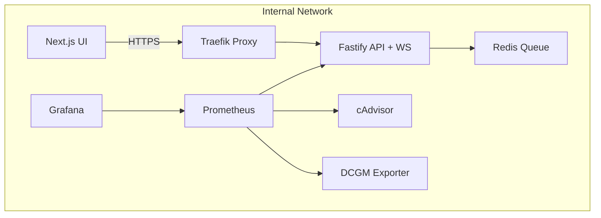

# 🕸️ Compose Layout

## 🎯 Objective

Define how the **API** and **UI** and **Redis** services integrate into the existing Phase 0 infrastructure via Docker Compose.  
This includes their build contexts, Traefik routing, Prometheus targets, job queueing, WebSocket connectivity and network topology.

Phase 0 provided the proxy + monitoring stack, Phase 1 plugs in the backend + frontend containers making the system interactive making it **circulatory** where requests, jobs and metrics continuously flow.

## 🧱 Updated Stack Overview

| Service                      | Description                                                                                         | Exposed At                           | Network          | Observability                          |
| ---------------------------- | --------------------------------------------------------------------------------------------------- | ------------------------------------ | ---------------- | -------------------------------------- |
| **api**                      | Fastify backend with `/health`, `/metrics`, `/api/train`, `/api/generate`, `/api/status`, and `/ws` | `https://api.myspinbot.local`        | internal-network | Prometheus scrape + WS metrics         |
| **ui**                       | Next.js 14 frontend dashboard (upload + job status + progress)                                      | `https://ui.myspinbot.local`         | internal-network | optional browser telemetry             |
| **redis**                    | Redis 7 instance powering BullMQ queues + pub/sub                                                   | `redis:6379`                         | internal-network | optional exporter (Phase 2)            |
| **traefik**                  | Reverse proxy, TLS termination, dashboard                                                           | `https://proxy.myspinbot.local`      | internal-network | built‑in dashboard                     |
| **prometheus**               | Metrics collector                                                                                   | `https://prometheus.myspinbot.local` | internal-network | scrapes `api:3000/metrics`             |
| **grafana**                  | Visualization UI                                                                                    | `https://grafana.myspinbot.local`    | internal-network | *Backend ↔ Frontend ↔ Redis* dashboard |
| **cadvisor / dcgm‑exporter** | Node & GPU metrics exporters                                                                        | n/a                                  | internal-network | already integrated                     |

## 🌐 Traefik Integration

Traefik dynamically routes based on hostnames:

| Service | Host                  | Router | Entrypoint  | TLS | Target Port |
| ------- | --------------------- | ------ | ----------- | --- | ----------- |
| **API** | `api.myspinbot.local` | `api`  | `websecure` | ✅   | 3000        |
| **UI**  | `ui.myspinbot.local`  | `ui`   | `websecure` | ✅   | 3001        |

> TLS certs are issued locally via the Phase 0 `provision_secrets.sh` script.
> Import the generated CA into your OS/browser trust store for smooth HTTPS testing.

### 📡 DNS & Local Domain Setup

Just like in Phase 0, make sure your development environment resolves the new subdomains:

- `api.myspinbot.local` → points to your Docker host  
- `ui.myspinbot.local` → points to your Docker host  

Depending on your setup, this can be achieved by:

- Editing `/etc/hosts` (Linux/macOS) or `C:\Windows\System32\drivers\etc\hosts` (Windows)  
- Using a local DNS resolver (e.g. **dnsmasq**, **AdGuard Home**, or **Pi-hole**)  
- Or integrating with your existing custom DNS service (e.g. on TrueNAS or router)

> 🧠 Obviously, your DNS or hosts entries must resolve these names to the correct host IP so that Traefik can handle the requests properly.


## 📊 Prometheus Scrape Configuration

Add this scrape job to Prometheus:

```
scrape_configs:
  - job_name: "myspinbot-api"
    static_configs:
      - targets: ["api:3000"]
```

The backend now exposes additional metrics:

* `bullmq_jobs_total` — queued, active, completed, failed counts
* `websocket_clients_connected` — live WS connections
* Standard Fastify request metrics (`http_requests_total`, etc.)

### Grafana Dashboard Highlights

* **Job Rate & Duration** — visualize queue throughput
* **WS Connections** — count of active clients
* **API Uptime & Error Ratio** — existing panels retained

## 🌐 Network Topology



## 🔍 Verification Checklist

| Step | Command / URL                                          | Expected Result                           |
| ---- | ------------------------------------------------------ | ----------------------------------------- |
| 1    | `docker compose up -d --build api ui redis`            | All containers start successfully         |
| 2    | `curl -k https://api.myspinbot.local/health`           | `{ "status": "ok" }`                      |
| 3    | `curl -k https://api.myspinbot.local/api/status/test`  | Returns mock job status                   |
| 4    | Visit `https://ui.myspinbot.local`                     | Frontend loads, upload + progress visible |
| 5    | Visit `https://prometheus.myspinbot.local` → *Targets* | `myspinbot-api` listed + healthy          |
| 6    | Visit `https://grafana.myspinbot.local`                | Dashboard shows job metrics + WS clients  |