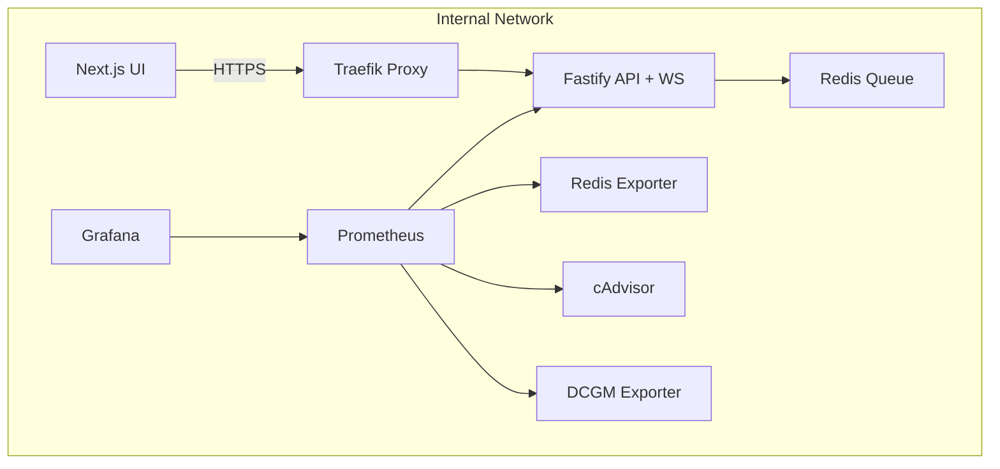

# 🕸️ Compose Layout

## 🎯 Objective

Define how the **API**, **UI**, and **Redis** services integrate into the existing Phase 0 infrastructure via Docker Compose.
This includes their build contexts, Traefik routing, Prometheus targets, job queueing, WebSocket connectivity and network topology.

Phase 0 provided the proxy + monitoring stack, Phase 1 plugs in the backend + frontend containers making the system interactive — making it **circulatory**, where requests, jobs and metrics continuously flow.

## 🧱 Updated Stack Overview

| Service                      | Description                                                                                         | Exposed At                           | Network          | Observability                          |
| ---------------------------- | --------------------------------------------------------------------------------------------------- | ------------------------------------ | ---------------- | -------------------------------------- |
| **api**                      | Fastify backend with `/health`, `/metrics`, `/api/train`, `/api/generate`, `/api/status`, and `/ws` | `https://api.myspinbot.local`        | internal-network | Prometheus scrape + WS metrics         |
| **ui**                       | Next.js 15 frontend dashboard (upload + job status + progress)                                      | `https://ui.myspinbot.local`         | internal-network | optional browser telemetry             |
| **redis**                    | Redis 8.2 instance powering BullMQ queues + pub/sub                                                 | `redis:6379`                         | internal-network | observed via Redis Exporter            |
| **redis-exporter**           | Prometheus exporter exposing Redis metrics                                                          | `redis-exporter:9121`                | internal-network | Prometheus scrape target               |
| **redis-insight**            | RedisInsight 2.70.1 UI for inspecting Redis data                                                    | `https://redis.myspinbot.local`      | internal-network | web UI                                 |
| **traefik**                  | Reverse proxy, TLS termination, dashboard                                                           | `https://proxy.myspinbot.local`      | internal-network | built-in dashboard                     |
| **prometheus**               | Metrics collector                                                                                   | `https://prometheus.myspinbot.local` | internal-network | scrapes `api:3000/metrics` and Redis   |
| **grafana**                  | Visualization UI                                                                                    | `https://grafana.myspinbot.local`    | internal-network | _Backend ↔ Frontend ↔ Redis_ dashboard |
| **cadvisor / dcgm-exporter** | Node & GPU metrics exporters                                                                        | n/a                                  | internal-network | already integrated                     |

## 🌐 Traefik Integration

Traefik dynamically routes based on hostnames:

| Service          | Host                    | Router  | Entrypoint  | TLS | Target Port |
| ---------------- | ----------------------- | ------- | ----------- | --- | ----------- |
| **API**          | `api.myspinbot.local`   | `api`   | `websecure` | ✅  | 3000        |
| **UI**           | `ui.myspinbot.local`    | `ui`    | `websecure` | ✅  | 3001        |
| **RedisInsight** | `redis.myspinbot.local` | `redis` | `websecure` | ✅  | 5540        |

> TLS certs are issued locally via the Phase 0 `provision_secrets.sh` script.
> Import the generated CA into your OS/browser trust store for smooth HTTPS testing.

### 📡 DNS & Local Domain Setup

Just like in Phase 0, make sure your development environment resolves the new subdomains:

- `api.myspinbot.local` → points to your Docker host
- `ui.myspinbot.local` → points to your Docker host

Depending on your setup, this can be achieved by:

- Editing `/etc/hosts` (Linux/macOS) or `C:\Windows\System32\drivers\etc\hosts` (Windows)
- Using a local DNS resolver (e.g. **dnsmasq**, **AdGuard Home**, or **Pi-hole**)
- Or integrating with your existing custom DNS service (e.g. on TrueNAS or router)

> 🧠 Obviously, your DNS or hosts entries must resolve these names to the correct host IP so that Traefik can handle the requests properly.

## 📊 Prometheus Scrape Configuration

Add these scrape jobs to Prometheus:

```
scrape_configs:
  - job_name: "myspinbot-api"
    static_configs:
      - targets: ["api:3000"]

  - job_name: "redis"
    static_configs:
      - targets: ["redis-exporter:9121"]
```

The backend now exposes additional metrics:

- `bullmq_jobs_total` — queued, active, completed, failed counts
- `websocket_clients_connected` — live WS connections
- Standard Fastify request metrics (`http_requests_total`, etc.)

And via Redis Exporter:

- `redis_up` — exporter health flag
- `redis_connected_clients` — current connections
- `redis_memory_used_bytes` — memory usage
- `redis_commands_processed_total` — total operations

### Grafana Dashboard Highlights

- **Job Rate & Duration** — visualize queue throughput
- **WS Connections** — count of active clients
- **Redis Metrics** — memory, ops/sec, connected clients
- **API Uptime & Error Ratio** — existing panels retained

## 🌐 Network Topology



## 🔍 Verification Checklist

| Step | Command / URL                                                            | Expected Result                                          |
| ---- | ------------------------------------------------------------------------ | -------------------------------------------------------- |
| 1    | `docker compose up -d --build redis redis-exporter redis-insight api ui` | All containers start successfully                        |
| 2    | `docker exec -it myspinbot-redis redis-cli ping`                         | `PONG`                                                   |
| 3    | `curl -k https://api.myspinbot.local/health`                             | `{ "status": "ok" }`                                     |
| 4    | `curl -k https://api.myspinbot.local/api/status/test`                    | Returns mock job status                                  |
| 5    | Visit `https://redis.myspinbot.local`                                    | RedisInsight UI loads                                    |
| 6    | Visit `https://ui.myspinbot.local`                                       | Frontend loads, upload + progress visible                |
| 7    | Visit `https://prometheus.myspinbot.local` → _Targets_                   | `myspinbot-api` and `redis` listed + healthy             |
| 8    | Visit `https://grafana.myspinbot.local`                                  | Dashboard shows job metrics + Redis metrics + WS clients |
