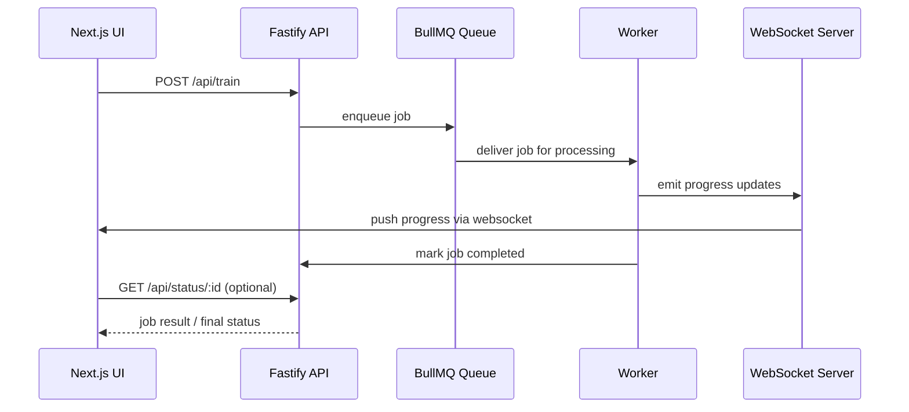

# ⚙️ MySpinBot — Job Queue & WebSocket Flow

## 🎯 Objective

Describe the architecture and logic that power **asynchronous job execution** and **real-time UI updates**.
This layer glues together:

* The **Fastify API** endpoints (`/train`, `/generate`, `/status`)
* **BullMQ queues** backed by Redis 8.2
* The **WebSocket gateway** that streams live progress back to the UI

---

## 🧱 System Components & Responsibilities

| Component            | Responsibility                                                    |
| -------------------- | ----------------------------------------------------------------- |
| **Fastify API**      | Accept job requests, validate payloads, enqueue them in BullMQ.   |
| **BullMQ Queues**    | Manage lifecycle of jobs (`waiting → active → completed/failed`). |
| **Redis**            | Persistent queue store and Pub/Sub backbone.                      |
| **Worker Processes** | Consume jobs, perform work (training, generation).                |
| **WebSocket Server** | Push job-state and progress events to connected clients.          |
| **Frontend Client**  | Upload inputs, subscribe to job progress, display results.        |

---

## 🔄 High-Level Flow



---

## 🧩 API Endpoints

| Method | Path              | Purpose                              | Response (Example)                                            |
| ------ | ----------------- | ------------------------------------ | ------------------------------------------------------------- |
| `POST` | `/api/train`      | Enqueue a training job               | `{ "jobId": "train-123", "status": "queued" }`                |
| `POST` | `/api/generate`   | Enqueue a video/audio generation job | `{ "jobId": "gen-456", "status": "queued" }`                  |
| `GET`  | `/api/status/:id` | Poll job status (optional)           | `{ "jobId": "gen-456", "state": "completed", "result": {…} }` |

Each POST call returns a `jobId` that the frontend uses to:
1️⃣ open a WebSocket channel (`/ws?jobId=gen-456`) and
2️⃣ display queued/active/completed state.

---

## 🧠 BullMQ Integration Summary

**Queues Defined**

| Queue           | Purpose                           | Worker Script         |
| --------------- | --------------------------------- | --------------------- |
| `trainQueue`    | LoRA/TTS training jobs            | `workers/train.js`    |
| `generateQueue` | Diffusion / video generation jobs | `workers/generate.js` |

**Connection Config**

```js
const connection = { connection: { url: process.env.REDIS_URL } };
export const trainQueue = new Queue('train', connection);
export const generateQueue = new Queue('generate', connection);
```

**Worker Template**

```js
import { Worker } from 'bullmq';
import { sendProgress } from '../ws.js';

const worker = new Worker('generate', async job => {
  sendProgress(job.id, 10, 'Initializing');
  // ... perform AI work ...
  sendProgress(job.id, 100, 'Completed');
  return { outputPath: '/videos/output.mp4' };
});
```

---

## 📡 WebSocket Gateway

* Implemented via **Fastify WebSocket Plugin** (`@fastify/websocket`)
* Endpoint: `/ws`
* Clients subscribe with query `?jobId=<id>`
* Messages are JSON payloads:

```json
{ "jobId": "gen-456", "progress": 42, "message": "Rendering frames" }
```

**Server Pattern**

```js
fastify.get('/ws', { websocket: true }, (connection, req) => {
  const { jobId } = req.query;
  wsRegistry.register(jobId, connection);
});
```

**Push API**

```js
function sendProgress(jobId, percent, msg) {
  wsRegistry.broadcast(jobId, JSON.stringify({ jobId, progress: percent, message: msg }));
}
```

---

## 📊 Metrics Integration

Prometheus metrics exposed by the backend:

| Metric                        | Description                                        |
| ----------------------------- | -------------------------------------------------- |
| `bullmq_jobs_total{state}`    | Count of jobs queued / active / completed / failed |
| `bullmq_job_duration_seconds` | Histogram of job processing times                  |
| `websocket_clients_connected` | Gauge of active WS connections                     |
| `websocket_messages_total`    | Counter of messages broadcast                      |

These appear automatically in the **Grafana dashboard named “Monitoring: Jobs”**, which visualizes queue throughput, job duration histograms, and WebSocket activity in real time.

---

## 🔍 Verification Checklist

| Step | Command / URL                                                            | Expected Result                  |
| ---- | ------------------------------------------------------------------------ | -------------------------------- |
| 1    | `curl -X POST https://api.myspinbot.local/api/train -d '{"sample":"x"}'` | Returns job ID                   |
| 2    | `curl https://api.myspinbot.local/api/status/<jobId>`                    | Shows `active` → `completed`     |
| 3    | Connect to `wss://api.myspinbot.local/ws?jobId=<id>`                     | Receives progress JSONs          |
| 4    | Grafana → *Monitoring: Jobs* dashboard                                   | Shows rising `bullmq_jobs_total` |
| 5    | Grafana → *Monitoring: Jobs* dashboard                                   | Shows live WebSocket connections |

---

## 🧊 Closing Remark

This layer turns MySpinBot from a simple web app into a **live orchestrator**:
users submit a job, Redis carries it, BullMQ manages it, and WebSockets make it *feel instant*.