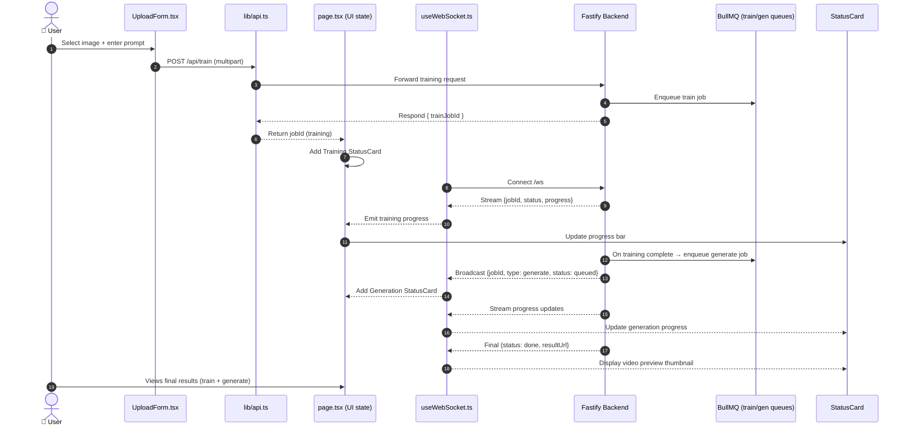

## 🧩 MySpinBot — UI Overview (Goal)

### 🎯 Objective

Build a small **Next.js 15 + Tailwind + WebSocket** interface that implements the **first foundational workflow** of MySpinBot:

> User uploads an image and a text prompt to **train a LoRA** and then **generate a video** from that trained model.

At this stage, both steps (train → generate) will be connected to the backend job queue system, but progress and job chaining can remain **mocked** through the WebSocket feed.

Later phases will introduce the second workflow — using **existing LoRAs** to generate videos directly — as well as model management and UI refinement.

## ⚙️ Architecture Overview

The frontend follows the **canonical Next.js 15 App Router layout**, matching modern best practices used in official templates.

```
frontend/
 ├── app/
 │   ├── global.css             ← global Tailwind + layout styles
 │   ├── layout.tsx             ← app-wide layout shell (with logo/header)
 │   └── page.tsx               ← main UI (upload form + status cards)
 ├── components/
 │   ├── UploadForm.tsx         ← file + prompt form component
 │   ├── StatusCard.tsx         ← job progress/status visualization
 │   └── ProgressBar.tsx        ← progress indicator bar
 ├── lib/
 │   └── api.ts                 ← REST/WebSocket helpers
 ├── public/
 │   └── logo.svg               ← simple MySpinBot logo/icon
 ├── tailwind.config.ts          ← Tailwind configuration (required)
 ├── .env.local                 ← environment configuration
 ├── Dockerfile                 ← frontend container build
 ├── package.json               ← dependencies and scripts
 ├── tsconfig.json              ← TypeScript configuration
 └── vitest.config.ts           ← test setup (unit/UI testing)
```

This layout reflects **current community conventions** for a standalone Next.js + Tailwind application.

## 🧠 Workflow Summary

### 🧭 Mermaid — Frontend ↔ Backend Interaction Flow



### 1️⃣ Upload & Training Phase

- User uploads an image and provides a text prompt.
- `UploadForm.tsx` sends `POST /api/train` with the image + prompt.
- Backend enqueues a **train job** and returns a `trainJobId`.
- The UI listens for training progress via `/ws` and updates a **training StatusCard**.

### 2️⃣ Generation Phase

- When training completes, backend (mock or real) triggers a **generate job**.
- UI receives a new job update `{ jobId: ..., type: 'generate', ... }` via WebSocket.
- UI adds a **generation StatusCard** and tracks its progress.

### 3️⃣ Completion Phase

- Once generation is complete, the UI displays a result preview (placeholder or thumbnail).
- Both cards (train + generate) remain visible with their final statuses.

## 🧩 Core Components

### **UploadForm.tsx**

- Handles file and text prompt submission.
- On submit → POST `/api/train` → create a new training job.
- Supports multiple image uploads (future extension).

### **StatusCard.tsx**

- Displays job metadata and status (queued, processing, done, failed).
- Uses Tailwind color coding by status.
- Supports linked jobs (train → generate).

### **ProgressBar.tsx**

- Simple, reusable progress bar showing job completion percentage.
- Can animate or pulse depending on state.

### **api.ts**

- Encapsulates REST endpoints (`/api/train`, `/api/generate`) and WebSocket handling.
- Provides helper functions for request submission and progress updates.

### **layout.tsx**

- Provides consistent app shell with the **MySpinBot logo**, title, and basic navigation (if needed).

## 💅 UI Wireframe (ASCII)

```
🌀 MySpinBot — Phase 1 UI
──────────────────────────
[ Choose file... ] [ Enter prompt...            ] [ Submit ]

──────────────────────────
Job #T12345  | training...
Prompt: "Bob portrait LoRA"
[███████░░░░░░░░░░░░░░░░░] 32%
──────────────────────────
Job #G98765  | generating video 🎬
Prompt: "Bob walking down a riverbed"
[███████████████████░░░░░░] 80%
──────────────────────────
```

## ✅ Deliverable for Phase 1 Completion

A running UI on `https://ui.myspinbot.local` that:

- Connects to backend `/api/train`, `/api/generate`, and `/ws` endpoints.
- Displays job chaining: **train → generate**.
- Shows mock status and progress from WebSocket updates.
- Includes upload form and branding logo in layout.
- Uses canonical Next.js 15 project structure and Tailwind configuration.
- Establishes a solid foundation for **Phase 2** (LoRA library selection, advanced job control, real video previews).
