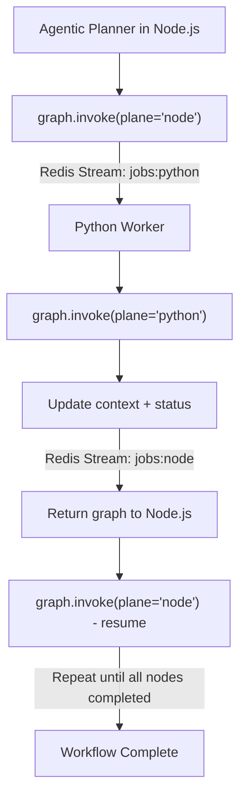

# 🕸️ Dual-Plane LangGraph Orchestration with Agentic Planning

## Overview

The **Dual-Plane LangGraph Orchestration** model defines how the MySpinBot infrastructure coordinates complex AI workflows between two execution environments—the **Node.js Control Plane** and the **Python Data Plane**. A single shared **LangGraph JSON** describes the full workflow and travels back and forth between these planes as execution progresses. Each side performs only the tasks assigned to its respective plane, ensuring modularity, transparency, and resilience.

Building upon this foundation, MySpinBot introduces an **Agentic Planning Layer** that lives in the Control Plane. This agent takes as input a **structure prompt** (a textual goal or high-level instruction) and a **capabilities manifest** (advertised by the Data Plane). It then **generates a hybrid LangGraph orchestration** aware of the two-plane separation, producing nodes that are automatically distributed between the Control and Data planes.

## 1. Architectural Concept

| Plane             | Runtime                          | Responsibilities                                                                                                                                                      |
| ----------------- | -------------------------------- | --------------------------------------------------------------------------------------------------------------------------------------------------------------------- |
| **Control Plane** | Node.js + LangGraph.js           | Defines and initializes graphs, executes API and LLM-related nodes, manages workflow state, produces hybrid graphs via the Agentic Planner, and coordinates handoffs. |
| **Data Plane**    | Python + LangGraph.py + Dramatiq | Executes GPU-intensive tasks such as LoRA training, TTS synthesis, rendering, or diffusion; publishes progress metrics and returns updated graph state.               |

Both planes operate on the same declarative LangGraph representation, which describes **what** should happen (the DAG structure and parameters) but not **how** each node is implemented. The actual implementation is bound dynamically at runtime by each plane using its local task registry.

## 2. Agentic Planning Layer

### Function

An **Agentic Planner** node in the Control Plane uses a language model to synthesize a workflow dynamically. It receives:

- **Structure prompt:** a natural-language goal (e.g., _"Generate a 30-second explainer video about solar panels"_).
- **Capabilities manifest:** a JSON object advertised by the Data Plane that enumerates all available task types, resources, and configuration limits.

### Output

The agent produces a **hybrid LangGraph JSON**, where:

- Each node is tagged with its corresponding `plane` ("node" or "python").
- Node dependencies are ordered logically based on available capabilities.
- The result is directly compatible with the dual-plane orchestration flow described below.

This enables true **dynamic graph synthesis** while respecting the runtime separation between Control and Data planes.

## 3. Core Execution Model

1. **Graph Definition (Agentic Planner in Node.js)**

   - The Control Plane's Agent constructs a LangGraph object based on a structure prompt and capabilities manifest.
   - Each node specifies a `task` name, assigned `plane`, and optional parameters inferred by the planner.
   - The graph is serialized to JSON and enqueued via Redis Streams.

2. **Execution (Plane-specific)**

   - Each runtime invokes its LangGraph with a call such as:

     ```python
     graph.invoke(context, plane="python")
     ```

     or

     ```ts
     await graph.invoke(context, { plane: "node" });
     ```

   - LangGraph automatically detects which nodes are ready (dependencies satisfied, plane matches current runtime, status not completed) and executes them.
   - Completed nodes update their `status` and append results into the shared `context` object.

3. **Handoff Cycle**

   - When no further nodes of the current plane remain executable, the runtime serializes the full updated graph (`graph.to_json()`) and publishes it to the Redis stream for the opposite plane.
   - Example:

     - Node.js after finishing local nodes: `XADD jobs:python ...`
     - Python worker after finishing GPU nodes: `XADD jobs:node ...`

4. **Resumption and Continuation**

   - The receiving plane deserializes the graph, re-binds its task functions, and calls `graph.invoke()` again.
   - Execution continues seamlessly until all nodes are marked `completed`.

## 4. Data Model Summary

Each serialized graph JSON includes:

```json
{
  "schema": "langgraph.v1",
  "workflow_id": "example_workflow_001",
  "context": { ... },
  "nodes": [
    { "id": "A", "task": "generate_script", "plane": "node", "status": "completed" },
    { "id": "B", "task": "render_video", "plane": "python", "status": "pending" }
  ],
  "edges": [ { "from": "A", "to": "B" } ]
}
```

### Node fields

| Field    | Description                                                    |
| -------- | -------------------------------------------------------------- |
| `id`     | Unique node identifier.                                        |
| `task`   | Symbolic task name looked up in local registry.                |
| `plane`  | Defines which runtime executes the node (`node` or `python`).  |
| `status` | Execution state (`pending`, `running`, `completed`, `failed`). |
| `params` | Optional task parameters.                                      |
| `output` | Optional output payload or artifact URI.                       |

## 5. Serialization Rules

- **Declarative only:** no executable code crosses boundaries; both planes share only data.
- **Bindings:** each runtime attaches its own `TASKS` registry mapping `task` identifiers to local functions or Dramatiq actors.
- **Outputs:** must be JSON-serializable or referenced via URIs (e.g., MinIO paths) for large artifacts.
- **Status updates:** each node updates its status and output fields before the next handoff.

## 6. Execution Flow (Mermaid Diagram)



Each transition between planes represents a handoff containing the full serialized graph state. These checkpoints ensure durability, recoverability, and synchronization between runtimes.

---

## 7. Example of Initial Planner Prompt Template

The planner agent requires structured context to generate a valid hybrid LangGraph. A **templated prompt** may look like this:

```json
{
  "goal": "Generate a 30-second educational video explaining how solar panels work.",
  "user_context": {
    "user_id": "u42",
    "preferred_voice": "female",
    "style": "scientific"
  },
  "capabilities_manifest": {
    "python": {
      "train_lora": { "gpu": true, "desc": "LoRA fine-tuning" },
      "render_video": { "gpu": true, "desc": "Video rendering via ComfyUI" },
      "synthesize_voice": { "gpu": false, "desc": "Text-to-speech synthesis" }
    },
    "node": {
      "generate_script": { "desc": "Scriptwriting via LLM" },
      "upload_artifact": { "desc": "Upload to storage bucket" }
    }
  },
  "constraints": {
    "max_duration": 30,
    "output_format": "mp4"
  }
}
```

The planner uses this data to compose a LangGraph JSON with the correct sequence of nodes, planes, and dependencies.

## 8. Advantages

- **Single Source of Truth:** one declarative graph describes the entire job lifecycle.
- **Dynamic Agentic Planning:** LLM-driven agent synthesizes hybrid workflows dynamically from structure prompts and worker capabilities.
- **Fault Tolerance:** each graph snapshot is self-contained and can be reloaded after crash or restart.
- **Language-Agnostic:** Node and Python share schema, not code.
- **Observability:** consistent progress tracking and Prometheus metrics across both planes.
- **Extensibility:** new task types can be added simply by registering handlers in either runtime.

## 9. Future Work

A future enhancement for the Agentic Planner is to evolve it from a **single-pass planner** into an **iterative planning agent**. In this design, the planner would generate **intermediate LangGraphs** as part of an optimization process. These intermediate graphs would primarily target execution within the Control Plane and serve purposes such as:

- Testing partial plans or subgraphs for feasibility.
- Evaluating cost, duration, or quality metrics before committing to full execution.
- Iteratively refining workflows using feedback from prior subgraph runs.

This opens the door for **self-optimizing orchestration**, where the planner incrementally converges on efficient hybrid workflows through controlled experimentation.

## 10. Summary

The enhanced Dual-Plane LangGraph Orchestration introduces an intelligent Control Plane agent capable of generating hybrid workflows from user goals and system capabilities. This agentic layer creates a context-aware LangGraph specification that spans both Node.js and Python runtimes. Once generated, the shared graph is executed through coordinated handoffs across planes, maintaining deterministic state progression while enabling adaptive, LLM-driven planning.

The future roadmap envisions the planner itself becoming iterative and self-evaluating—a step toward a truly autonomous orchestration system capable of reasoning, planning, and optimizing its own execution graphs dynamically.
