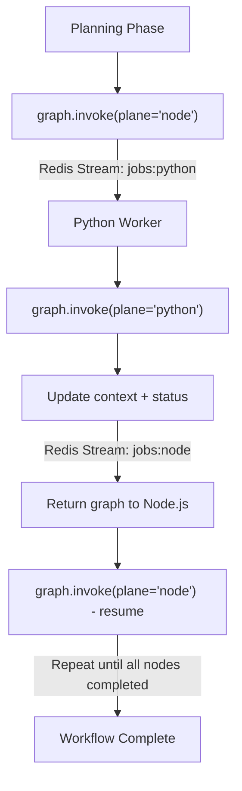

# 🕸️ Dual-Plane LangGraph Orchestration with Agentic Planning

## Overview

The **Dual-Plane LangGraph Orchestration** model defines how MySpinBot infrastructure coordinates complex AI workflows across execution environments—i.e. the **Node.js Control Plane** environment and the **Python Data Plane** environment. 

Each environment implements its own **executor** facility able to poll designated Redis Streams and process incoming jobs. Each job contains an end-to-end AI workflow defined as a DAG graph in a common **LangGraph JSON** format shared among the facilities of myspinbot monorepo (for more information read [shared shemas](./shared_schemas.md)). This workflow is typically a *hybrid execution graph* which contains two type of nodes, one for describing processing tasks that target the control plane and are meant to be handled by the plane's (Node.js control process) executor, and another that targets the data plane that is being handled by its corresponding (Python worker process) executor. 

At any given time a job can be active on either the control plane or the data plane, but not both. Hence, parallel execution of the same job is not supported across planes. 

> ❗ [NOTE]: This limitation will not apply during in-plane processing though, so **in-plane parallel execution of independent sub-tasks** is planned to be supported. Data plane executor will support this with the introduction of **Dramatiq**, while control plane one with **BullMQ**. In both cases horizontal scaling will be additionally introduced to enable multiple job processing in parallel (i.e. multiple instances of control plane backends and data plane workers will get in play).

During the distributed processing of a job, the graph is being communicated back and forth across the planes through the Redis Streams as execution progresses. Each side performs the ready-to-be-executed sub-tasks assigned to its respective plane, ensuring modularity, transparency, and resilience while at the same time respecting node inter-dependencies guaranteeing the execution order that the workflow imposes.

> 🚀 [Future Work] Building upon this foundation, myspinbot will introduce down the road an **Agentic Planning Layer** along with an **Evaluation Layer** to close the agentic loop. The agent will be bootstrapped by taking a **structure prompt** (a textual goal or high-level instruction) and will consume the **capabilities manifest** that is produced by the control and data planes in order to plan and execute. Essentially it will **generate a hybrid LangGraph orchestration workflow** (plan) and set it in motion (publish it to Redis Streams). The **evaluator** will score the outcome to trigger either a change of plan (in which case a new job will be produced out of it and will be placed in queue for execution) or will label the finished job as success and return the final outcome to the user.

## 1. Architectural Concept

| Plane             | Runtime                          | Responsibilities                                                                                                                                                      |
| ----------------- | -------------------------------- | --------------------------------------------------------------------------------------------------------------------------------------------------------------------- |
| **Control Plane** | Node.js + LangGraph.js           | Defines and initializes graphs, executes API and LLM-related nodes, manages workflow state, produces hybrid graphs via the Agentic Planner, and coordinates handoffs. |
| **Data Plane**    | Python + LangGraph.py + Dramatiq | Executes GPU-intensive tasks such as LoRA training, TTS synthesis, rendering, or diffusion; publishes progress metrics and returns updated graph state.               |

Both planes operate on the same declarative LangGraph representation, which describes **what** should happen (the DAG structure and parameters) but not **how** each node is implemented. The actual implementation is bound dynamically at runtime by each plane using its local task registry which is advertised in the **plane's capabilities manifest**.

## 2. Fixed Custom Workflows (Single Pass Planning)

>  ⚠️ **To be replaced by the Planning Layer**

TODO: Expand section

## 3. Core Execution Model (TO BE REVISED)

1. **Graph Definition (Agentic Planner in Node.js)**

   - The Control Plane's Agent constructs a LangGraph object based on a structure prompt and capabilities manifest.
   - Each node specifies a `task` name, assigned `plane`, and optional parameters inferred by the planner.
   - The graph is serialized to JSON and enqueued via Redis Streams.

2. **Execution (Plane-specific)**

   - Each runtime invokes its LangGraph with a call such as:

     ```python
     graph.invoke(context, plane="python")
     ```

     or

     ```ts
     await graph.invoke(context, { plane: "node" });
     ```

   - LangGraph automatically detects which nodes are ready (dependencies satisfied, plane matches current runtime, status not completed) and executes them.
   - Completed nodes update their `status` and append results into the shared `context` object.

3. **Handoff Cycle**

   - When no further nodes of the current plane remain executable, the runtime serializes the full updated graph (`graph.to_json()`) and publishes it to the Redis stream for the opposite plane.
   - Example:

     - Node.js after finishing local nodes: `XADD jobs:python ...`
     - Python worker after finishing GPU nodes: `XADD jobs:node ...`

4. **Resumption and Continuation**

   - The receiving plane deserializes the graph, re-binds its task functions, and calls `graph.invoke()` again.
   - Execution continues seamlessly until all nodes are marked `completed`.

## 4. Data Model Summary

Each serialized graph JSON includes:

```json
{
  "schema": "langgraph.v1",
  "workflow_id": "example_workflow_001",
  "context": { ... },
  "nodes": [
    { "id": "A", "task": "generate_script", "plane": "node", "status": "completed" },
    { "id": "B", "task": "render_video", "plane": "python", "status": "pending" }
  ],
  "edges": [ { "from": "A", "to": "B" } ]
}
```

### Node fields

| Field    | Description                                                    |
| -------- | -------------------------------------------------------------- |
| `id`     | Unique node identifier.                                        |
| `task`   | Symbolic task name looked up in local registry.                |
| `plane`  | Defines which runtime executes the node (`node` or `python`).  |
| `status` | Execution state (`pending`, `running`, `completed`, `failed`). |
| `params` | Optional task parameters.                                      |
| `output` | Optional output payload or artifact URI.                       |

## 5. Serialization Rules (TO BE REVISED)

- **Declarative only:** no executable code crosses boundaries; both planes share only data.
- **Bindings:** each runtime attaches its own `TASKS` registry mapping `task` identifiers to local functions or Dramatiq actors.
- **Outputs:** must be JSON-serializable or referenced via URIs (e.g., MinIO paths) for large artifacts.
- **Status updates:** each node updates its status and output fields before the next handoff.

## 6. Execution Flow (TO BE REVISED)



Each transition between planes represents a handoff containing the full serialized graph state. These checkpoints ensure durability, recoverability, and synchronization between runtimes.

---

## 7. Example of Initial Planner Prompt Template

The planner agent requires structured context to generate a valid hybrid LangGraph. A **templated prompt** may look like this:

```json
{
  "goal": "Generate a 30-second educational video explaining how solar panels work.",
  "user_context": {
    "user_id": "u42",
    "preferred_voice": "female",
    "style": "scientific"
  },
  "capabilities_manifest": {
    "python": {
      "train_lora": { "gpu": true, "desc": "LoRA fine-tuning" },
      "render_video": { "gpu": true, "desc": "Video rendering via ComfyUI" },
      "synthesize_voice": { "gpu": false, "desc": "Text-to-speech synthesis" }
    },
    "node": {
      "generate_script": { "desc": "Scriptwriting via LLM" },
      "upload_artifact": { "desc": "Upload to storage bucket" }
    }
  },
  "constraints": {
    "max_duration": 30,
    "output_format": "mp4"
  }
}
```

The planner uses this data to compose a LangGraph JSON with the correct sequence of nodes, planes, and dependencies.

## 8. Advantages

- **Single Source of Truth:** one declarative graph describes the entire job lifecycle.
- **Dynamic Agentic Planning:** LLM-driven agent synthesizes hybrid workflows dynamically from structure prompts and worker capabilities.
- **Fault Tolerance:** each graph snapshot is self-contained and can be reloaded after crash or restart.
- **Language-Agnostic:** Node and Python share schema, not code.
- **Observability:** consistent progress tracking and Prometheus metrics across both planes.
- **Extensibility:** new task types can be added simply by registering handlers in either runtime.

## 9. Future Work

A future enhancement for the Agentic Planner is to evolve it from a **single-pass planner** into an **iterative planning agent**. In this design, the planner would generate **intermediate LangGraphs** as part of an optimization process. These intermediate graphs would primarily target execution within the Control Plane and serve purposes such as:

- Testing partial plans or subgraphs for feasibility.
- Evaluating cost, duration, or quality metrics before committing to full execution.
- Iteratively refining workflows using feedback from prior subgraph runs.

This opens the door for **self-optimizing orchestration**, where the planner incrementally converges on efficient hybrid workflows through controlled experimentation.

## 10. Summary

The enhanced Dual-Plane LangGraph Orchestration introduces an intelligent Control Plane agent capable of generating hybrid workflows from user goals and system capabilities. This agentic layer creates a context-aware LangGraph specification that spans both Node.js and Python runtimes. Once generated, the shared graph is executed through coordinated handoffs across planes, maintaining deterministic state progression while enabling adaptive, LLM-driven planning.

The future roadmap envisions the planner itself becoming iterative and self-evaluating—a step toward a truly autonomous orchestration system capable of reasoning, planning, and optimizing its own execution graphs dynamically.
