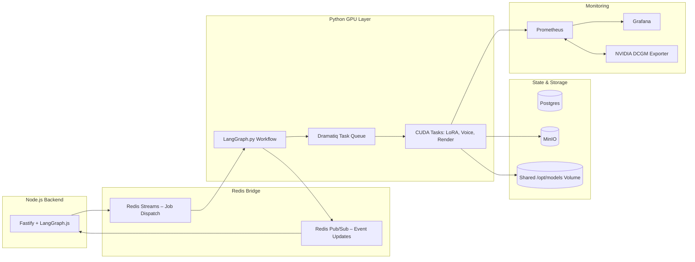

# 🧠 Phase 2 — GPU Worker Integration

## 📚 Docs Reference

| Document                                         | Purpose                                                                      |
| ------------------------------------------------ | ---------------------------------------------------------------------------- |
| [phase2_overview.md](./phase2_overview.md)       | **This document**, phase overview.                                           |
| [dual_orchestration.md](./dual_orchestration.md) | Definition and overview of the **Dual-Plane LangGraph Orchestration** model. |

## 🎯 Objective

Phase 2 breathes computational life into the system: our first GPU-powered backend service, the **Python GPU Worker**, becomes operational. This service now operates under the new **LangGraph.js ↔ LangGraph.py** architecture, connected through **Redis Streams** for job dispatch and **Pub/Sub** for real-time updates.

This phase also includes a cleanup and transition step: we will **remove BullMQ** and all related dependencies from the Node.js backend, replacing it with native LangGraph-based orchestration and Redis-driven communication. This ensures a unified and extensible workflow graph spanning both the Node and Python layers.

By the end of this phase, we will have a functioning GPU service that:

- Receives job definitions from Node LangGraph through Redis Streams.
- Executes them as **Dramatiq-managed GPU tasks** (`train_lora`, `train_voice`, `render_video`).
- Reports progress to Redis via Pub/Sub for live updates to clients.
- Exposes performance metrics to Prometheus.
- Stores artifacts in MinIO under well-defined prefixes.
- Shares models across containers via a common Docker volume.

## ⚙️ Core Goals

### 1. Establish the GPU Worker Service

- Implement a standalone **Python service (`gpu_worker`)** running with CUDA.
- Integrate **LangGraph.py** and **Dramatiq** for task orchestration and GPU job execution.
- Define modular task handlers:

  - `train_lora`: stub for LoRA fine-tuning.
  - `train_voice`: stub for voice cloning.
  - `render_video`: stub for ComfyUI-based render job.

- Allow **subprocess isolation** for GPU tasks (ensuring clean CUDA context management).

### 2. Remove BullMQ & Legacy Queue Logic

- Fully deprecate BullMQ from the backend.
- Remove redundant Redis queue definitions, workers, and job tracking logic.
- Replace with Redis Streams and Pub/Sub message flow.
- Adjust tests, endpoints, and progress-handling middleware to align with new orchestration model.

### 3. Metrics and Observability

- Expose **Prometheus metrics** via FastAPI endpoint `/metrics` using `prometheus_client`.
- Track higher-level **job metrics** distinct from DCGM hardware metrics:

  - `gpu_worker_jobs_total` — total processed jobs by type.
  - `gpu_worker_job_duration_seconds` — histogram of job durations.
  - `gpu_worker_job_errors_total` — failed or retried jobs.
  - `gpu_worker_progress_percent` — aggregated job progress (optional gauge).

- Integrate these metrics into Grafana under a new **GPU Job Metrics dashboard**, correlated with DCGM data.

### 4. Real-Time Progress Reporting

- Implement **progress updates** from Python LangGraph via Redis Pub/Sub.
- Backend subscribes to progress channels and forwards updates via WebSocket to connected clients.
- Each job emits structured progress events (JSON):

  ```json
  {
    "jobId": "abc123",
    "status": "running",
    "progress": 45.3,
    "message": "Epoch 3/5 — loss=0.34",
    "timestamp": "2025-11-03T12:00:00Z"
  }
  ```

### 5. Artifact and Model Sharing

- **Artifacts via MinIO:**

  - `/loras/<jobId>/...` → LoRA weights.
  - `/voices/<jobId>/...` → trained TTS voices.
  - `/videos/<jobId>/...` → rendered clips.
  - Handled through `boto3` or `minio` SDK.

- **Model Sharing via Volume Mount:**

  - GPU-related containers (GPU Worker, ComfyUI, Ollama, etc.) share `/opt/models`.
  - Host-mapped to `/mnt/tank/models` for persistence and reusability.

### 6. Integration and Validation

- Node.js LangGraph submits job definitions to Redis Streams.
- Python LangGraph consumes and executes them using Dramatiq.
- WebSocket clients receive updates through backend subscriptions.
- Prometheus and Grafana visualize job throughput and GPU activity.
- Old BullMQ-based code is fully removed and tests reflect the new pipeline.

## 🧩 Updated Architecture Snapshot



## 🧪 Deliverables

- ✅ CUDA-enabled Python GPU Worker container with **LangGraph.py + Dramatiq**.
- ✅ Artifact storage flow via **MinIO** for LoRA, voice, and video outputs.
- ✅ Shared **/opt/models** Docker volume across all GPU containers.
- ✅ Prometheus `/metrics` endpoint exposing **high-level job metrics**.
- ✅ Progress updates routed through **Redis Pub/Sub** to backend and WebSockets.
- ✅ Mock tasks (`train_lora`, `train_voice`, `render_video`) complete end-to-end.
- ✅ Grafana dashboard visualizing GPU worker activity.
- ✅ **BullMQ removed** and replaced with Redis Streams orchestration.

## 🔮 Extensibility & Future Integration

Looking ahead to Phase 3 and beyond, this phase lays the foundation for **dual LangGraph orchestration** across Node and Python. Future phases will build on this:

- **Full AI Workflow Integration:** ComfyUI, F5-TTS, and GPT-SoVITS workflows defined in Python LangGraph.
- **Unified Resource Metrics:** Shared Prometheus metrics for end-to-end GPU utilization.
- **Flexible Task Graphs:** Both Node and Python LangGraph layers dynamically compose multi-step workflows (e.g., image → video → voice → merge).
- **Security and Secrets:** Worker credentials for MinIO and Redis managed via Phase 0 provisioning.

## 🧊 Closing Remark

Phase 2 is the architectural turning point — transforming a static pipeline into a **bi-directional orchestration system**. The Node.js backend defines user workflows, Python executes GPU workloads, and Redis synchronizes them both. With BullMQ retired, the system becomes leaner, clearer, and ready for true AI orchestration in Phase 3.

## 🧭 Quick Navigation

⬅️ [Back to Phase 1 Overview](../phase1/phase1_overview.md)
