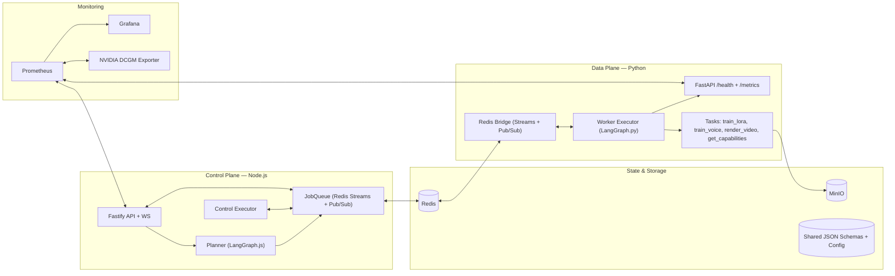

# 🧠 Phase 2 — Worker & Dual-plane Orchestration

## 📚 Docs Reference

| Document                                         | Purpose                                                                      |
| ------------------------------------------------ | ---------------------------------------------------------------------------- |
| [phase2_overview.md](./phase2_overview.md)       | **This document**, phase overview.                                           |
| [dual_orchestration.md](./dual_orchestration.md) | Definition and overview of the **Dual-Plane LangGraph Orchestration** model. |
| [development_workflow_revisited.md](./development_workflow_revisited.md) | Local development and integration testing workflows revisited. |
| [shared_schemas.md](./shared_schemas.md) | Overview of shared schema architecture, automated data model generation and Singeton configuration. |
| [codebase-analysis/code-overview.md](./codebase-analysis/code-overview.md) | Overview of codebase snapshot as of the end of phase 2 development. Useful for providing context to LLMs. |
| [codebase-analysis/code-issues.md](./codebase-analysis/code-issues.md) | Known issues and weak spots of current implementation, can be used as a repo for post-phase2 future todo tasks. |

## 🎯 Objective

Phase 2 makes the dual‑plane architecture real: the **Node.js backend** becomes the control plane for LangGraph jobs, and the **Python worker** becomes the data plane that executes GPU‑style tasks. The two planes exchange full LangGraph graphs over **Redis Streams**, while **Pub/Sub** carries progress and status events.

This phase also performs a deliberate cleanup: we **remove BullMQ** and its legacy queue logic from the backend and replace it with a **graph‑centric JobQueue** built on Redis Streams + Pub/Sub. That gives us a single, unified orchestration model spanning Node and Python.

By the end of this phase, the system:

- Runs a Python worker that listens for incoming LangGraph jobs via a Redis bridge, executes `plane: "python"` nodes (`train_lora`, `train_voice`, `render_video`) as **simulated GPU tasks**, emits progress/status, and uploads dummy artifacts to MinIO.
- Uses Redis‑backed JobQueue + WebSocket hub on the backend to persist job state and push live updates to clients.
- Exposes metrics from both planes to Prometheus, so Grafana can visualize job throughput, worker activity, and GPU telemetry.
- Shares a directory of **common JSON Schemas** (`common/`) across dev containers, with generated validators/models keeping control and data planes in sync.

## ⚙️ Core Goals

### 1. Implement the GPU Worker Service (`worker`)

- Implement a standalone **CUDA-capable `worker` container** managed by Docker Compose.
- Run a **FastAPI** app exposing `/health` and `/metrics`.
- Implement a **Redis bridge** that:
  - Consumes graphs from the data stream.
  - Publishes `status:*`, `progress:*`, and `data:*` events via Pub/Sub.
  - Can hand updated graphs back to the control stream.
- Integrate **LangGraph.py** as the data-plane executor:
  - Validate graphs using generated Pydantic models.
  - Execute `plane: "python"` nodes in dependency order.
  - Provide task handlers for:
    - `train_lora` (simulated LoRA training + dummy artifact upload).
    - `train_voice` (simulated/placeholder voice training).
    - `render_video` (simulated video render + dummy artifact upload).

### 2. Remove BullMQ & Legacy Queue Logic

- Fully deprecate BullMQ and legacy queue structures from the backend.
- Introduce a **JobQueue** abstraction that:
  - Uses Redis Streams for control/data processing (`${streams.process}:control` / `:data`).
  - Tracks job lifecycle in `job:<id>` keys (status, progress, last graph).
  - Subscribes to worker Pub/Sub channels and mirrors events into job state.
- Update planner, executor, WebSocket hub, and tests to operate on graph payloads and JobQueue semantics.

### 3. Shared Schemas and Cross-Plane Validation

- Establish `common/config/schemas/**` as the canonical source for:
  - LangGraph graph schema.
  - Job messaging and status.
  - Redis bridge configuration.
  - Capability manifests and storage artifacts.
- Add `codegen/` scripts to generate:
  - **AJV validators** for the backend into `backend/src/validators/**`.
  - **Pydantic models** for the worker into `worker/src/worker/models/**`.
- Require both planes to validate configuration and graphs at startup using these generated artifacts.

### 4. Job State, WebSockets & Progress

- Persist job state centrally in Redis:
  - `job:<id>` keys for status, progress, and last known graph.
  - Streams entries for control/data-plane handoff.
- Implement a WebSocket hub that:
  - Tracks subscriptions per `jobId`.
  - Polls JobQueue at a configurable interval.
  - Pushes consolidated job updates to clients as `{ type: "update", ... }`.
- Ensure worker progress/status events are mirrored via JobQueue so WebSocket clients always see up-to-date state.

### 5. Establish the Dual-Plane Execution Model

- Treat the Node.js backend as the **control plane** and the Python worker as the **data plane**.
- Represent jobs as **LangGraph graphs** that can contain both `plane: "node"` and `plane: "python"` nodes.
- Use **Redis Streams** as the control↔data dispatch fabric and **Pub/Sub** for status / progress events.

### 6. Metrics and Observability

- Expose **Prometheus metrics** from:
  - Backend (API, queue, WebSocket metrics via `prom-client`).
  - Worker (job-level metrics via `prometheus_client`).
- Integrate these metrics with the existing observability stack:
  - Prometheus scraping both planes.
  - Grafana dashboards combining worker/job metrics with DCGM and cAdvisor data.

### 7. Dev Workflow & Containers

- Provide Dev Container configurations for `backend/`, `frontend/`, and `worker/`.
- Use `docker-compose.dev.yml` to run dev images against the same Redis/MinIO/Traefik stack used in production.
- Support a `codegen` container or scripts to regenerate validators and models directly from the shared schemas.

## 🧩 Updated Architecture Snapshot

## 🧪 Deliverables

- ✅ CUDA-enabled Python GPU Worker container with **LangGraph.py** and a Redis Bridge.
- ✅ Backend JobQueue built on **Redis Streams + Pub/Sub**, with BullMQ fully removed.
- ✅ Stubbed GPU-style tasks (`train_lora`, `train_voice`, `render_video`) wired into the data-plane executor.
- ✅ Artifact storage flow via **MinIO** for LoRA, voice, and video dummy outputs.
- ✅ Shared JSON Schemas under `common/` plus codegen scripts and generated validators/models.
- ✅ Prometheus `/metrics` endpoints on backend and worker with initial job and service metrics.
- ✅ WebSocket-based job updates fed by JobQueue and worker Pub/Sub events.
- ✅ Grafana dashboards visualizing backend and worker activity, alongside DCGM / cAdvisor metrics.

## 🔮 Extensibility & Future Integration

Looking ahead to Phase 3 and beyond, this phase lays the foundation for **dual-plane LangGraph orchestration** across Node and Python. Future phases will build on this:

- **Full AI workflow integration:** ComfyUI, TTS, and lip-sync models invoked from worker tasks, using the same graph and Redis bridge.
- **Richer job graphs:** More complex, multi-step workflows (e.g., script → train_lora → render_video) synthesised from user intent and capabilities.
- **Unified metrics:** Additional application-level metrics for end-to-end job performance on top of existing GPU and container telemetry.
- **Security and secrets:** Refined handling of MinIO and Redis credentials and access patterns, building on Phase 0 provisioning.

## 🧊 Closing Remark

Phase 2 is the architectural turning point — transforming the system into a **bi-directional orchestration setup**. The Node.js backend defines and advances user workflows, the Python worker executes GPU-style tasks, and Redis keeps both planes in sync. With BullMQ retired and shared schemas in place, the platform is ready for the richer AI pipelines planned for Phase 3.

## 🧭 Quick Navigation

➡️ [Go to Phase 3 Overview](../phase3/phase3_overview.md)  
⬅️ [Back to Phase 1 Overview](../phase1/phase1_overview.md)
