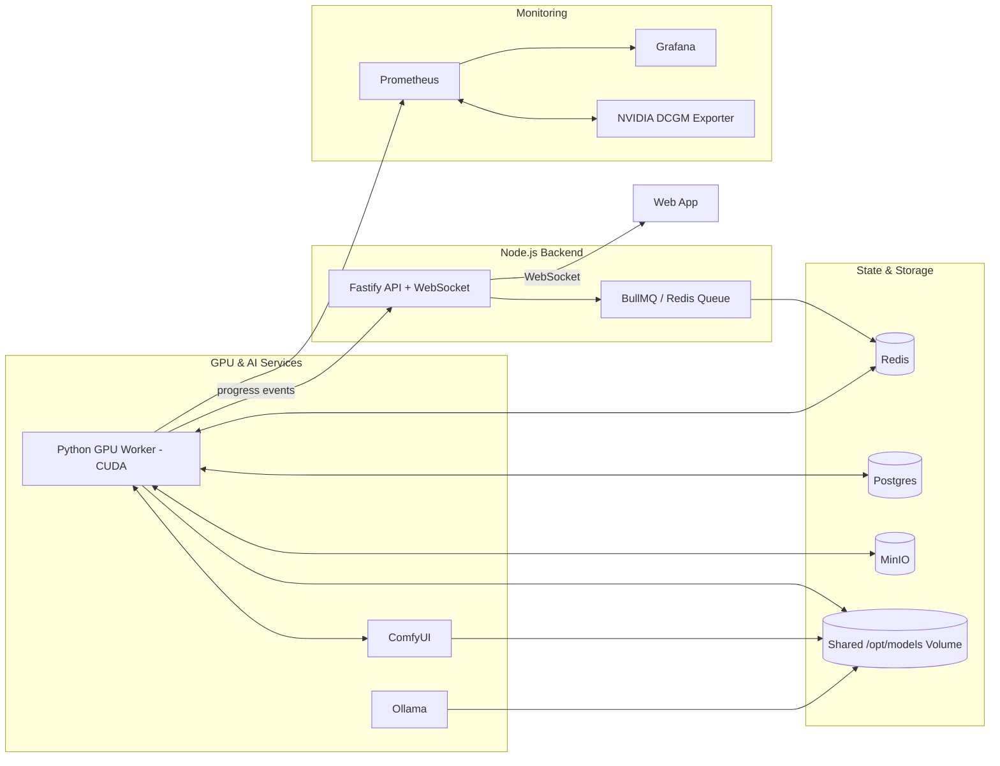

# 🧠 Phase 2 — GPU Worker Integration

## 🎯 Objective

Phase 2 breathes computational life into the system: our first GPU-powered backend service, the **Python GPU Worker**, becomes operational. This service will execute the core AI workflows (LoRA training, voice cloning, and video rendering) using GPU-accelerated libraries — all fully integrated into the existing infrastructure, which already includes Redis, Postgres, and MinIO.

The worker will run as a **CUDA-enabled Python container** equipped with all required dependencies (PyTorch, diffusers, kohya_ss scripts, F5-TTS, GPT-SoVITS, ComfyUI client API, etc.). It connects to the **existing Redis instance** as its job queue backend. For this phase, tasks will be mocked or minimally implemented to validate the end-to-end data flow, metrics, progress updates, artifact sharing, and fault tolerance.

By the end of this phase, we will have a functioning GPU service that:

- Pulls jobs from Redis (`train_lora`, `train_voice`, `render_video`).
- Executes them as isolated GPU subprocesses.
- Reports progress both to **Prometheus (metrics)** and **Fastify backend (status updates)**.
- Stores results in MinIO under well-defined prefixes.
- Shares model weights and caches across containers via a common Docker volume.

## ⚙️ Core Goals

### 1. Establish the GPU Worker Service

- Implement a standalone **Python service (`gpu_worker`)** running with CUDA.
- Integrate **Celery** (or **RQ**) with **existing Redis** as message broker.
- Define modular task handlers:

  - `train_lora`: stub for LoRA fine-tuning.
  - `train_voice`: stub for voice cloning.
  - `render_video`: stub for ComfyUI-based render job.

- Allow **subprocess isolation** for GPU tasks (ensuring clean CUDA context).

### 2. Metrics and Observability

- Expose **Prometheus metrics** via FastAPI endpoint `/metrics` using `prometheus_client`.
- Track higher-level **job metrics** distinct from DCGM hardware metrics:

  - `gpu_worker_jobs_total` — total processed jobs by type.
  - `gpu_worker_job_duration_seconds` — histogram of job durations.
  - `gpu_worker_job_errors_total` — failed or retried jobs.
  - `gpu_worker_progress_percent` — aggregated job progress (optional gauge).

- Integrate these metrics into Grafana under a new **GPU Job Metrics dashboard**, correlated with **DCGM Exporter** hardware data.

### 3. Real-Time Progress Reporting

- Implement **progress updates** from the GPU worker to the backend via Redis Pub/Sub or a dedicated queue channel (`progress:<jobId>`).
- The backend subscribes and forwards updates through **WebSocket** to connected clients.
- Each job emits structured progress events (JSON):

  ```json
  {
    "jobId": "abc123",
    "status": "running",
    "progress": 45.3,
    "message": "Epoch 3/5 — loss=0.34",
    "timestamp": "2025-11-03T12:00:00Z"
  }
  ```

- Backend merges this with its internal job tracking state for `/api/status/:jobId` responses.

### 4. Resource Safety and Recovery

- Spawn each GPU job in its own subprocess.
- Implement timeouts, retries, and clean GPU memory release.
- Auto-reschedule unfinished jobs (idempotent by job ID).

### 5. Artifact and Model Sharing

- **Artifacts via MinIO:**

  - `/loras/<jobId>/...` → LoRA weights.
  - `/voices/<jobId>/...` → trained TTS voices.
  - `/videos/<jobId>/...` → rendered clips.
  - Handled through `boto3` or `minio` SDK.
  - Deterministic output structure; safe overwrites on retry.

- **Model Sharing via Volume Mount:**

  - All GPU-related containers (GPU Worker, ComfyUI, Ollama, kohya, etc.) share a Docker volume (e.g. `/opt/models`).
  - Host-mapped path `/mnt/tank/models` ensures persistent and reusable cache of models.
  - Prevents redundant downloads and guarantees version consistency across components.

### 6. Integration and Validation

- Backend API (`/api/train`, `/api/status/:jobId`) reflects **live worker progress**.
- WebSocket clients receive incremental updates.
- Prometheus ingests **GPU job-level metrics**.
- Grafana correlates job activity with DCGM GPU telemetry.

## 🧩 Updated Architecture Snapshot



## 🧪 Deliverables

- ✅ CUDA-enabled Python GPU Worker container **connected to existing Redis instance**.
- ✅ Artifact storage flow via **MinIO** for LoRA, voice, and video outputs.
- ✅ Shared **/opt/models** Docker volume mounted across GPU-related containers.
- ✅ Prometheus `/metrics` endpoint exposing **high-level job metrics** (complementing DCGM hardware metrics).
- ✅ Progress updates sent to backend and forwarded to clients via WebSocket.
- ✅ Mock tasks (`train_lora`, `train_voice`, `render_video`) run to completion.
- ✅ Grafana dashboard visualizing job throughput and VRAM utilization.
- ✅ Verified retry, timeout, and subprocess handling.

## 🔮 Extensibility & Future Integration

Looking ahead to Phase 3 and beyond, the GPU Worker will evolve beyond static task execution into a **modular AI runtime** capable of orchestrating full media-generation pipelines:

- **LangChain / LangGraph Agents:** The GPU container (or a sibling) will later host Python agents coordinating ComfyUI, Ollama, and downstream tasks through graph-based workflows. These will dynamically plan and compose steps (e.g., _prompt → image → video → voice → merge_).
- **Unified GPU Resource Metrics:** The worker will expose `gpu_worker_gpu_busy` and related gauges so backend services can coordinate GPU scheduling with ComfyUI and Ollama.
- **Job Schema Definition:** A common JSON schema for all jobs will formalize contracts between backend and worker, supporting flexible task types and future extensions:

  ```json
  {
    "jobId": "uuid",
    "type": "train_lora",
    "params": { "datasetPath": "/data/ds1", "epochs": 10 },
    "artifacts": { "outputPrefix": "loras/jobId" }
  }
  ```

- **Shared Model Cache:** All AI services (Ollama, ComfyUI, kohya) will mount `/opt/models` as a unified model cache to prevent redundant downloads and simplify versioning.
- **Security and Secrets:** GPU Worker credentials (for MinIO, Postgres, etc.) will be provided via environment secrets, consistent with the Phase 0 provisioning model.

## 🧊 Closing Remark

Phase 2 marks the moment the project’s **engine starts turning** — GPU jobs become real, progress flows through Redis to the backend, and WebSocket clients witness live updates. Artifact storage and model sharing are now integrated, turning orchestration into a cohesive, GPU-powered ecosystem. The architecture is now alive and measurable — ready for the true AI workflow integration of Phase 3.

## 🧭 Quick Navigation

<!-- ➡️ [Go to Phase 3 Overview](phase3/phase3_overview.md)   -->

⬅️ [Back to Phase 1 Overview](../phase1/phase1_overview.md)
