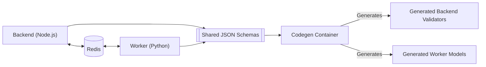
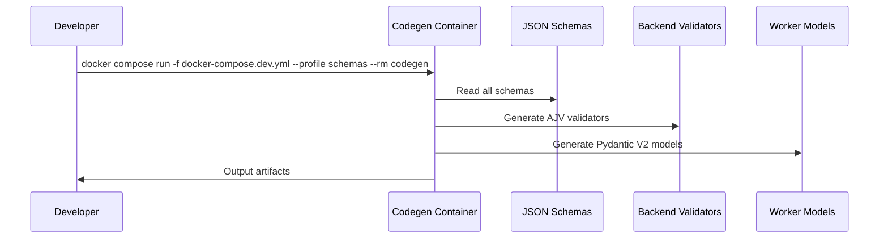
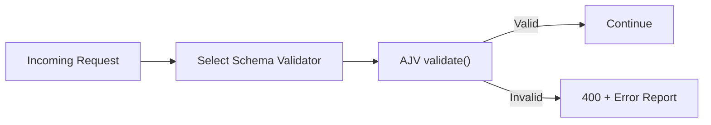
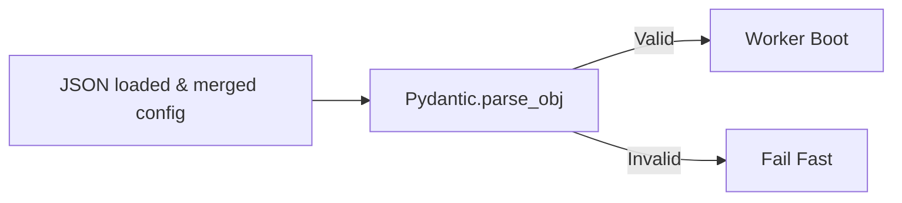
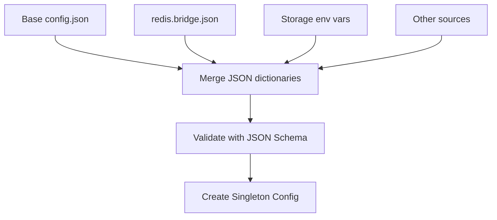
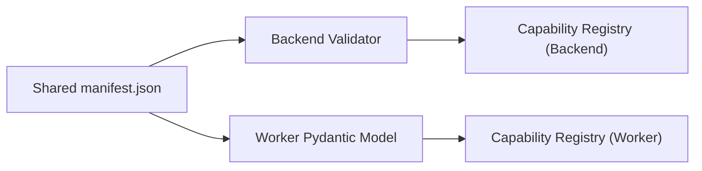

#  Shared Schema Architecture, Codegen Workflow & Config System

## 📖 Overview

This document explains the unified JSON Schema strategy used across **Control Plane** (Node.js backend) and **Data Plane** (Python worker), the automated **codegen workflow**, and the shared **configuration system**.

It is designed as a high‑level explanation suitable for onboarding new contributors or AI agents, without duplicating project code.

# 1. Motivation & Design Philosophy

Modern multi‑language ystems often duplicate data models, leading to:

* Drift between backend & worker definitions
* Hard‑to‑debug inconsistencies
* Repeated maintenance effort

**MySpinBot eliminates duplication** by defining shared JSON Schemas in:

```
/common/config/schemas
```

From these schemas:

* The **backend** generates **AJV validators** for runtime validation
* The **worker** generates **Pydantic models** for runtime parsing & validation

This ensures:

* A single source of truth
* Strong typing in both languages
* Easier extensibility for new capabilities, job structures, and config

# 2. High-Level System Architecture



Shared schemas unify the entire system — from capability manifests to job messaging.

# 3. Schema Layout (as of Phase 2)

```
/common/config/schemas/
  ├── capabilities/
  │     ├── capability.schema.json
  │     ├── plane-manifest.schema.json
  │     ├── defs.schema.json
  ├── job-messaging/
  │     └── job-messaging.schema.json
  └── config/
        └── configuration.schema.json
```

Each schema describes a clear domain object:

* Capabilities & manifests
* Job lifecycle messages
* Worker/backend configuration


# 4. Codegen Workflow (Backend + Worker)

The project includes a dedicated **codegen container** that turns schemas into language‑specific artifacts.



### Outputs

- Backend -> `backend/src/validators/...`
- Worker -> `worker/src/worker/models/...`

This workflow executes before starting backend or worker.


# 5. Backend: Using Generated Validators

Generated validators are ES‑module compatible and are imported directly inside backend route handlers.

## Validation Flow (Backend)



Backend never handwrites validation logic — all structure & allowed fields come from the schemas.

# 6. Worker: Using Generated Pydantic Models

The worker uses Pydantic V2 models generated from JSON schemas.

## Worker Validation Flow



Pydantic models enforce field types, enums, optional values and nested structures.

# 7. Runtime Configuration System (Backend + Worker)

Both backend & worker load configuration from:

* Static JSON files
* Environment variables
* Live schema‑validated merging logic

## Config Construction Flow



This produces a single configuration object validated at startup.

# 8. Capabilities System Overview

Capabilities describe available tasks the worker can execute.

A capability manifest contains:

* Metadata
* Input/output schemas
* Runtime behavior
* Handler binding

Backend and worker both consume the same manifest.

## Capability Loading Flow



This ensures that the worker’s advertised capabilities match what backend expects.

# 9. Quick Start Guide for Developers

## 9.1 Adding or Editing a JSON Schema

1. Open `/common/config/schemas/`
2. Add or update a `*.schema.json`
3. Run codegen:

   ```bash
   docker compose run -f docker-compose.dev.yml --profile schemas --rm codegen
   ```
4. Backend + Worker artifacts regenerate automatically.

## 9.2 Running Backend or Worker

Backend:

```bash
docker compose up backend
```

Worker:

```bash
docker compose up worker
```

Both depend on the generated models.

---

## 9.3 Adding a New Worker Capability

1. Define capability in `common/config/schemas/capabilities/...`
2. Add handler implementation in worker
3. Run codegen
4. Start worker → it loads validated manifest
5. Backend auto‑recognizes the new capability

---

## 9.4 Adding New Config Properties

1. Update the JSON schema in:
   `/common/config/schemas/config/configuration.schema.json`
2. Add the property to the relevant `.json` file(s)
3. Run codegen
4. Backend/worker will expose it in their singleton config

---

# 10. Summary

This architecture provides:

* **One source of truth** for schemas
* Automatic validator/model generation
* Strict runtime safety across backend & worker
* Simple extensibility
* Clean configuration merging & validation

This enables MySpinBot to scale safely without schema drift and is foundational to Phase 2 and future phases.
