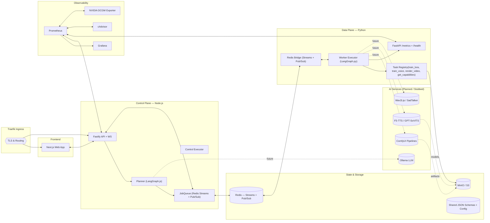
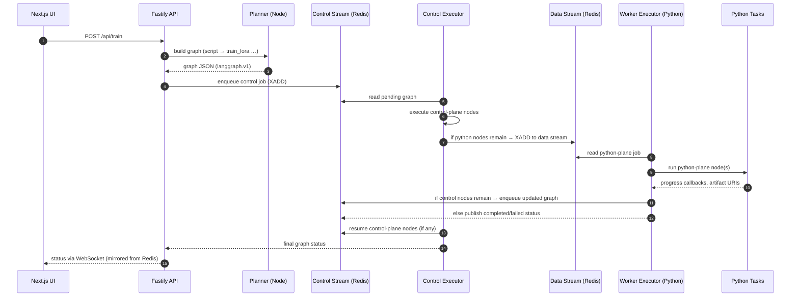
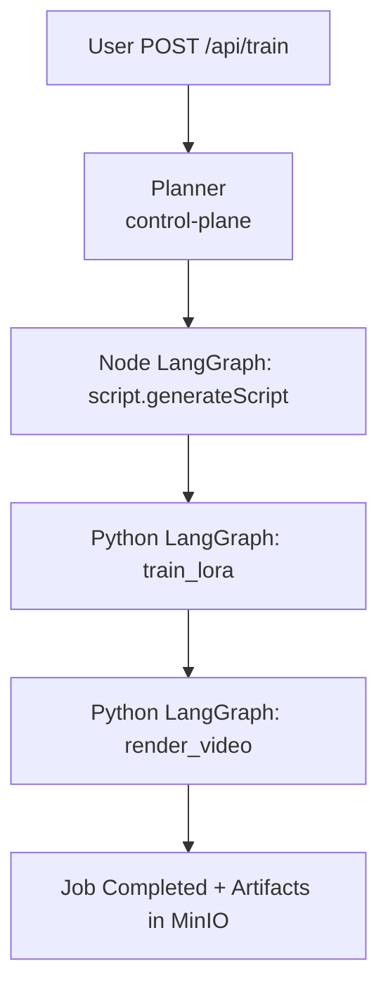
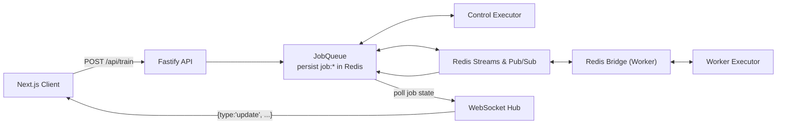

# 🧭 Phase 2 Architecture Overview

This document describes the **current architecture of MySpinBot as implemented in Phase 2**, and how it relates to the original end‑state design from the root `docs/` series. It focuses on the **dual‑plane LangGraph orchestration**, shared schema/config system, and the way the existing codebase actually behaves today.

---

## 1️⃣ High‑Level System Architecture (Phase 2 Snapshot)

At a high level the system is now a **three‑tier stack**:

- **Control Plane (backend/)** — Node.js + Fastify + LangGraph.js  
  Orchestrates workflows, exposes HTTP + WebSocket APIs, and persists job state in Redis.
- **Data Plane (worker/)** — Python + FastAPI + LangGraph.py  
  Executes python‑plane LangGraph nodes (GPU‑style tasks), uploads artifacts to MinIO, and publishes progress via Redis Pub/Sub.
- **Experience Layer (frontend/)** — Next.js UI for triggering training requests and monitoring job progress.
- **Infra Layer (infra/ + shared services)** — Redis, MinIO, Traefik, Prometheus/Grafana, cAdvisor/DCGM.

### System Map (Current + Planned Targets)

**Implementation status (Phase 2):**

- **Fully implemented:** Fastify API, WS gateway, Planner, control‑plane Executor, Redis JobQueue, Python Executor, task registry, MinIO artifact stubs, shared JSON schemas, codegen, metrics.
- **Partially implemented / stubbed:** Script generation (LLM), artifact management, GPU‑specific workloads (LoRA, video render) — all simulated but wired.
- **Planned (Phase 3+):** Real LLM via Ollama, ComfyUI workflows, TTS + lip‑sync models, richer agentic planner.

---

## 2️⃣ Dual‑Plane LangGraph Execution

Phase 2 implements a concrete version of the **Dual‑Plane LangGraph Orchestration** described in `dual_orchestration.md`:

- A **LangGraph graph JSON** represents the full job: both control‑plane and data‑plane nodes.
- The **Control Plane** executes `plane: "node"` nodes (e.g. script generation, manifest merging).
- The **Data Plane** executes `plane: "python"` nodes (e.g. `train_lora`, `train_voice`, `render_video`), then hands the updated graph back.

### Execution Loop (Control ↔ Data)

Key properties:

- **Graphs are the contract** — they carry node definitions, plane assignments, and outputs.
- **Redis Streams** form the **control/data bridge**; Pub/Sub carries status and progress.
- **Executors are idempotent** — they can resume a partially completed graph after restart.

---

## 3️⃣ Training & Capabilities Workflows (Current Behavior)

### A. Default Training Workflow

Today, the primary entrypoint is **`POST /api/train`**, which always creates a **default training graph** via the Planner:

- **Control‑plane nodes** (Node.js)
  - `script.generateScript` — stubbed script generator (future Ollama call).
  - `script.postProcess` (conceptual) — any post‑script transformations.
- **Data‑plane nodes** (Python)
  - `train_lora` — simulates LoRA training, uploads dummy artifact to MinIO.
  - `train_voice` (planned) — placeholder for TTS/voice fine‑tuning.
  - `render_video` — simulates video render, uploads dummy artifact.

Conceptually:

The **graph shape** is intentionally generic so the Agentic Planner described in `dual_orchestration.md` can later synthesize richer graphs from prompts and capability manifests.

### B. Capabilities Workflow

`GET /api/capabilities` is implemented as a **two‑node hybrid graph**:

1. Python node `get_capabilities` — returns worker capability manifest.
2. Node node `capabilities.getManifest` — merges worker manifest with control‑plane capabilities into a single JSON object.

This is the first concrete use of **dual‑plane graphs** wired end‑to‑end in code; future workflows will follow the same pattern.

---

## 4️⃣ Shared Schemas, Job State & WebSockets

Phase 2 establishes a **schema‑driven runtime**:

- Canonical JSON Schemas under `common/config/schemas/**` define:
  - LangGraph graph format
  - Job messaging and status
  - Redis bridge configuration
  - Capability manifests
- **Backend**: AJV validators (code‑generated) enforce graph and config correctness.
- **Worker**: Pydantic models (code‑generated) enforce the same contracts.

### Job State & WebSocket Flow

- The **JobQueue** mirrors worker Pub/Sub events into **job:\<id\>** keys.
- The WS hub polls the JobQueue at `configuration.websocket.updateInterval` and pushes consolidated state to subscribers.
- Clients subscribe/unsubscribe **per jobId** and stop listening when the job is completed.

---

## 5️⃣ How This Aligns with the Original Architecture

The original `docs/02_architecture_overview.md` describes a **future end‑state** that includes:

- Full LLM integration via **Ollama + Open WebUI**.
- Rich diffusion and video workflows via **ComfyUI + SVD + SadTalker + ESRGAN + Wav2Lip**.
- A complete observability story across all services.
- A more general **LangGraph‑driven orchestration** on both Node and Python sides.

Phase 2 brings parts of that picture into concrete code while leaving other parts as planned.

### What Now Exists in Code

- **Dual‑plane LangGraph orchestration** is real:
  - Graph JSON is validated on both planes.
  - Control and data executors coordinate via Redis Streams.
  - Capabilities and training use hybrid graphs.
- **Schema‑driven design** is implemented:
  - Shared schemas → AJV validators + Pydantic models.
  - Config and bridge definitions are validated at startup.
- **Job state & progress**:
  - Job lifecycle is fully tracked in Redis.
  - WebSocket updates are driven by mirrored worker Pub/Sub events.
- **Infra & observability**:
  - Prometheus/Grafana/cAdvisor/DCGM are wired in via `worker` and `backend` `/metrics`.

### What Is Still Planned / Stubbed

- **Real GPU workloads**:
  - `train_lora`, `train_voice`, and `render_video` currently simulate work and upload dummy artifacts.
  - ComfyUI, TTS, and lip‑sync models are not yet invoked from code.
- **Agentic Planner**:
  - The Planner currently builds a **static default graph** rather than a fully dynamic, LLM‑driven plan based on capability manifests.
- **End‑to‑end video pipeline**:
  - The sequence _“LLM → ComfyUI → video → TTS → lip‑sync”_ from the original architecture exists only as a conceptual target, not as a wired pipeline.

---

## 6️⃣ Drift from Initial Design (Architecture Perspective)

This section summarizes how the **current Phase 2 architecture** differs from the original conceptual design, and what remained intact.

### Major Changes vs Original Plan

- **BullMQ removed in favor of LangGraph + Redis Streams**
  - Phase 1 planned BullMQ queues for job orchestration; Phase 2 replaces them with explicit LangGraph graphs and custom Redis Streams consumers on both planes.
- **GPU worker promoted to a first‑class Data Plane**
  - The worker is no longer a generic “GPU worker” but a **LangGraph.py executor** with a task registry and metrics, matching the dual‑plane model.
- **Static Planner instead of full agentic planning**
  - The original agentic planning vision exists in `dual_orchestration.md`; the implementation currently uses a fixed template graph for `/api/train` and a small hybrid graph for `/api/capabilities`.
- **Code‑first shared schemas**
  - The initial docs mentioned a shared schema approach conceptually; Phase 2 solidifies this into a dedicated `common/` directory, codegen scripts, and validators/models used at runtime.

### Elements Intentionally Preserved

- **End‑goal topology**
  - The high‑level component map (Traefik, UI, API, Redis, MinIO, Prometheus/Grafana, GPU worker, future ComfyUI/LLM/TTS) matches the original architecture and remains the target.
- **Dual‑LangGraph architecture**
  - The idea that Node handles user‑facing workflows while Python runs GPU‑heavy DAGs is implemented and will continue to be extended, not replaced.
- **Observability as a first‑class concern**
  - `/metrics` endpoints, Prometheus scraping, and Grafana dashboards are already present and will be extended as AI pipelines are filled in.

In other words, **Phase 2 delivers the structural skeleton of the intended architecture**—graphs, bridges, schemas, and metrics—while leaving model‑heavy components and advanced planning logic for subsequent phases.
