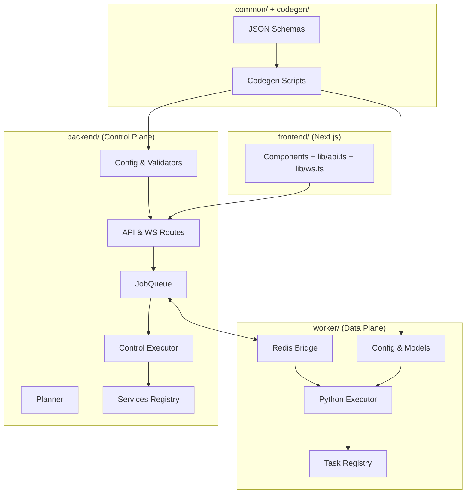

# 🧩 Phase 2 Modular Breakdown & Implementation State

This document describes how the **current codebase (Phase 2)** is organized into modules, how those modules interact, and how this structure relates to the original modular design in `docs/04_modular_breakdown.md`.

---

## 1️⃣ Module Map (Phase 2 Code Layout)

At this stage, the repository is organized around **four primary code modules** and supporting infrastructure:

| Module                  | Location        | Primary Language | Responsibility                                                                                              |
| ----------------------- | --------------- | ---------------- | ----------------------------------------------------------------------------------------------------------- |
| **Frontend (Next.js)**  | `frontend/`     | TypeScript       | User‑facing UI for triggering training, monitoring job progress, and later inspecting artifacts.           |
| **Backend (Control)**   | `backend/`      | TypeScript       | Fastify API + WebSocket hub, Planner, control‑plane LangGraph executor, Redis bridge, metrics.            |
| **Worker (Data Plane)** | `worker/`       | Python           | FastAPI service, Redis bridge, data‑plane LangGraph executor, task registry, MinIO artifact handling.     |
| **Shared Schemas**      | `common/`       | JSON / Scripts   | Canonical JSON Schemas, baseline config, and codegen scripts for validators/models used by both planes.   |
| **Infrastructure**      | `infra/` + root | YAML / Docker    | Traefik, Redis, MinIO, Prometheus, Grafana, Redis Insight, Dev Containers, and Docker Compose definitions. |

The sections below zoom into each module and highlight concrete implementation details.

---

## 2️⃣ Backend (Control Plane) — `backend/`

The backend is the **control plane**: it owns HTTP/WS APIs, builds LangGraph jobs, runs control‑plane nodes, and mirrors worker progress into WebSocket updates.

### 2.1 Internal Structure

Typical layout (details may evolve, but these are the current conceptual modules):

```text
backend/
├─ src/
│  ├─ index.js                 # Fastify bootstrap, CORS, route registration
│  ├─ config.js                # Load + validate configuration, capabilities
│  ├─ api/
│  │  ├─ http/                 # HTTP route handlers (health, metrics, train, status, capabilities)
│  │  └─ ws/                   # WebSocket route wiring
│  ├─ core/
│  │  ├─ job-queue.js          # Redis Streams + Pub/Sub wrapper
│  │  ├─ planner.js            # LangGraph template builder + graph validation
│  │  └─ executor.js           # Control-plane LangGraph executor
│  ├─ services/                # Service registry (script, capabilities, artifacts, etc.)
│  ├─ infra/                   # Metrics registry, WebSocket hub
│  └─ validators/              # AJV validators (generated from common schemas)
└─ tests/                      # Vitest test suite
```

### 2.2 Responsibilities

- **Fastify API / WS**
  - Routes: `/health`, `/metrics`, `/api/capabilities`, `/api/status/:jobId`, `/api/train`, `/ws`.
  - WebSocket hub supports `SUBSCRIBE` / `UNSUBSCRIBE` per `jobId`.
- **Configuration Layer**
  - `config.js` merges multiple JSON config files (including Redis bridge) and validates everything using generated AJV validators.
  - Exposes helpers like `getConfiguration()` and `getCapabilities()`.
- **JobQueue**
  - Wraps a single Redis instance using `ioredis`.
  - Owns **Streams** for control/data processing (`${streams.process}:control` / `:data`).
  - Persists job state in `job:<id>` keys (status, progress, last graph).
  - Subscribes to worker Pub/Sub channels and mirrors state into Redis keys and WS metrics.
- **Planner**
  - Assembles default or requested LangGraph templates for `/api/train` and internal flows.
  - Validates graph JSON using a generated `graph.schema-validator` from `common/`.
  - Ensures metadata consistency (e.g., `workflowId` matches `jobId`, `plane` fields valid).
- **Control Executor**
  - Polls the **control stream** for pending graphs.
  - Executes all `plane: "node"` nodes via a service registry (`services/*.js`).
  - Updates node status/output, recomputes progress, persists the updated graph.
  - Hands off to the data stream when python‑plane nodes remain; otherwise finalizes and publishes status.
- **Services Registry**
  - Dynamically loads services like:
    - `script.generateScript` — stub for script generation.
    - `capabilities.getManifest` — merges control and worker capability manifests.
    - `artifacts.uploadArtifact` / `prepareAssets` — stubs for future MinIO integration.

---

## 3️⃣ Worker (Data Plane) — `worker/`

The worker is the **data plane**: it executes python‑plane LangGraph nodes, simulates GPU work, writes artifacts to MinIO, and exposes metrics via FastAPI.

### 3.1 Internal Structure

```text
worker/
├─ src/worker/
│  ├─ main.py                 # FastAPI app, lifespan, /health, /metrics
│  ├─ config.py               # WorkerConfiguration (Pydantic), capabilities loader
│  ├─ core/
│  │  ├─ bridge.py            # Redis Streams + Pub/Sub bridge (data plane)
│  │  └─ executor.py          # Python-plane LangGraph executor
│  ├─ services/
│  │  └─ tasks.py             # @task registry (train_lora, train_voice, render_video, get_capabilities)
│  ├─ models/                 # Generated Pydantic models (LangGraph, jobs, capabilities, redis, storage)
│  └─ infra/
│     └─ metrics.py           # Prometheus metrics registry helpers
└─ tests/                     # pytest test suite
```

### 3.2 Responsibilities

- **FastAPI App**
  - Provides `/health` and `/metrics` endpoints.
  - Startup lifespan connects to Redis and starts the Executor loop.
- **Configuration**
  - `config.py` merges JSON config and environment variables into a `WorkerConfiguration` singleton (Pydantic).
  - Loads `capabilities.json` to advertise worker abilities (`train_lora`, `render_video`, etc.).
- **Redis Bridge**
  - Mirrors the behavior of the backend JobQueue on the data plane:
    - Consumes from `${streams.process}:data`.
    - Acknowledges entries and persists job payloads with TTL.
    - Can enqueue updated graphs back to the control stream.
    - Publishes `status:*`, `progress:*`, and `data:*` messages via Pub/Sub.
- **Python Executor**
  - Polls the bridge for pending jobs.
  - Validates graph payload using generated Pydantic models (e.g. `LangGraphGraph`).
  - Executes `plane: "python"` nodes in dependency order.
  - Each node handler receives typed params, input context, and callbacks for progress/data emission.
  - Records per‑node and per‑job metrics (`gpu_worker_jobs_total`, `gpu_worker_job_duration_seconds`, etc.).
- **Task Registry (`services/tasks.py`)**
  - Decorated with `@task` to register handlers:
    - `train_lora` — simulates LoRA training, uploads a dummy `.safetensors` artifact to MinIO.
    - `train_voice` — placeholder for voice training (stubbed).
    - `render_video` — simulates video render, uploads dummy MP4 artifact.
    - `get_capabilities` — returns a JSON manifest string from configuration.
  - Includes helpers like `connect_minio`, `simulate_progress`, `upload_dummy_artifact`.

---

## 4️⃣ Shared Schemas & Codegen — `common/` + `codegen/`

Phase 2 introduces a **first‑class shared schema and code generation layer**:

```text
common/
  └─ config/
      ├─ schemas/
      │   ├─ langgraph/
      │   ├─ job-messaging/
      │   ├─ capabilities/
      │   └─ config/
      ├─ redis.bridge.json
      └─ ...

codegen/
  ├─ gen-backend-validators.sh
  ├─ gen-worker-datamodel.sh
  └─ gen-all.sh
```

- **Schemas** describe graph structure, job lifecycle, capabilities, and configuration.
- **Backend validators** (AJV) and **worker models** (Pydantic v2) are generated from the same schemas.
- Both planes validate their configuration and graph payloads against the same canonical definitions.

This module did not exist in early design drafts but is now central to preventing drift between Node and Python.

---

## 5️⃣ Frontend — `frontend/`

The frontend remains intentionally small in Phase 2, focusing on **job lifecycle visualization** rather than full profile management or artifact browsing.

### 5.1 Structure

```text
frontend/
├─ app/
│  ├─ layout.tsx          # App shell, branding
│  └─ page.tsx            # Main page (upload + jobs)
├─ components/
│  ├─ UploadForm.tsx      # Image + prompt upload, calls /api/train
│  ├─ StatusCard.tsx      # Status pill + prompt + progress
│  └─ ProgressBar.tsx     # Visual progress indicator
├─ lib/
│  ├─ api.ts              # REST helpers (postTrain, status)
│  └─ ws.ts               # WebSocket hook for /ws
└─ tests/                 # Vitest + React Testing Library
```

### 5.2 Responsibilities

- Triggers training by POSTing to `/api/train`.
- Establishes a WebSocket connection to `/ws` and subscribes to specific job IDs.
- Renders a **StatusCard** per job with up‑to‑date progress and status.
- Unsubscribes once a job reaches `completed` (or terminal) state.

The UI is intentionally minimal but is wired to the same job and progress semantics that future, richer UIs will use.

---

## 6️⃣ Infrastructure & Dev Workflow — `infra/` + Dev Containers

Phase 2 consolidates infrastructure under `infra/` and introduces a **Dev Container‑based workflow**:

- **Infra stack** (`infra/` + `docker-compose*.yml`):
  - Traefik proxy, TLS, and routing.
  - Redis + Redis Insight.
  - MinIO for artifacts.
  - Prometheus + Grafana for metrics and dashboards.
  - cAdvisor + DCGM Exporter for container and GPU metrics.
- **Dev Containers**:
  - Each of `backend/`, `frontend/`, and `worker/` has its own `.devcontainer/` configuration.
  - Development happens inside these containers for parity with production images.
  - Tests (Vitest / pytest) run inside their respective Dev Containers.

From a modular standpoint, this means **each subsystem** is effectively a self‑contained module with its own runtime environment, while sharing infra services via Compose.

---

## 7️⃣ Module Dependency Diagram



This diagram reflects how code modules are connected today — not just conceptually, but in actual imports and runtime flows.

---

## 8️⃣ Drift from Initial Modular Design

The original `docs/04_modular_breakdown.md` described an idealized module set with:

- Backend and frontend as independent services.
- A generic “GPU Worker (Python)” module.
- ComfyUI, Ollama/Open WebUI, and a storage/monitoring stack as separate modules.

Phase 2 retains the spirit of that design but introduces notable differences.

### Major Differences

- **BullMQ module removed**
  - The original backend module used BullMQ for job queues; this is now completely replaced by:
    - `backend/src/core/job-queue.js` (Redis Streams + Pub/Sub)
    - LangGraph graphs as the primary job representation.
- **LangGraph modules are now central**
  - Both backend and worker now expose dedicated LangGraph executors, which were only conceptual in the original modular breakdown.
- **Shared schema / codegen module added**
  - `common/` and `codegen/` form a new, explicit module that did not exist in the earlier docs but now underpins config, job messaging, and capabilities.
- **Worker module significantly richer**
  - The worker is no longer just “GPU tasks”; it includes:
    - A Redis bridge.
    - A LangGraph executor.
    - A capability system.
    - A structured task registry and metrics.

### Elements Intentionally Preserved

- Frontend and backend remain separate deployable services, as originally planned.
- The worker continues to encapsulate all GPU‑style work, even if current tasks are simulated.
- The monitoring and ingress stack (Traefik + Prometheus + Grafana + cAdvisor + DCGM) remains the observability backbone for all modules.

From a modular perspective, **Phase 2 has converged toward the intended architecture**, but with stronger boundaries and a new shared‑schema layer that should make future evolution (Phase 3 AI pipelines, more capabilities, richer UI) less brittle.

