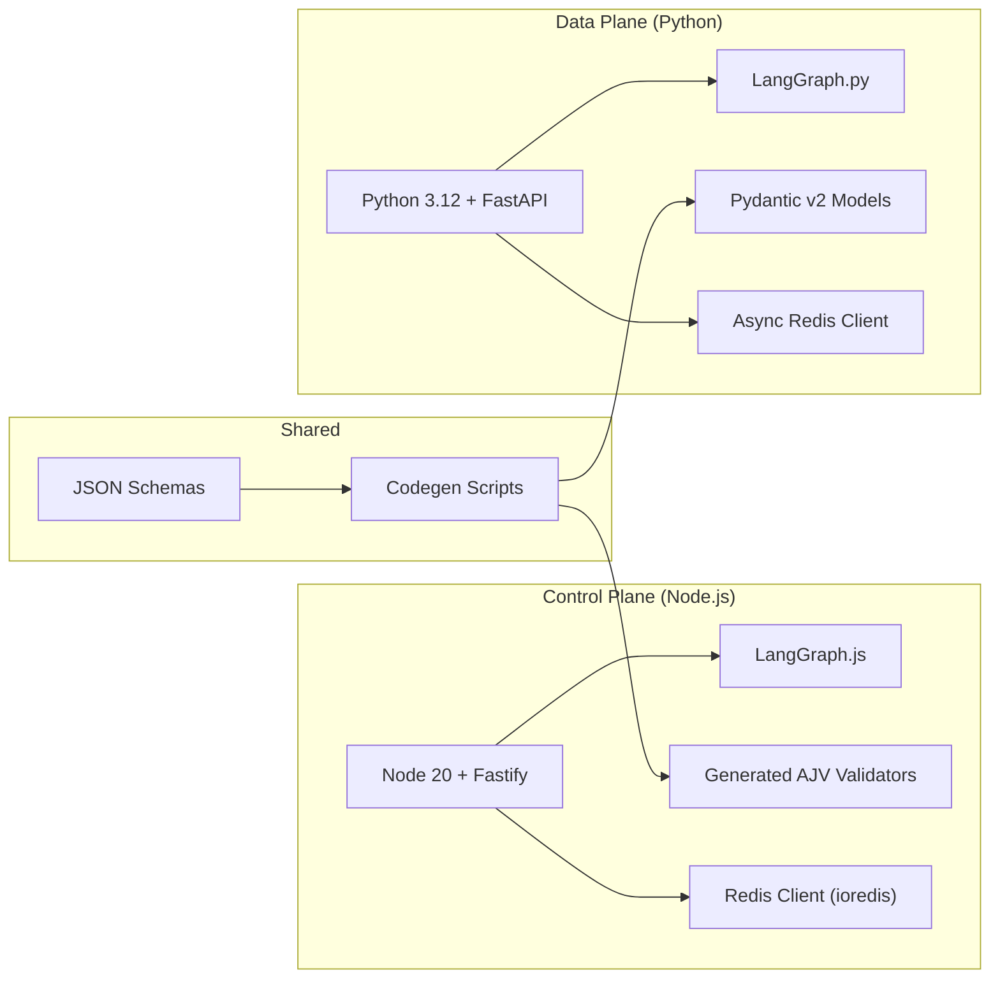

# 🧱 Phase 2 Tech Stack Overview

This document captures the **actual technology stack in use as of Phase 2**, and relates it to the original high‑level stack described in `docs/03_tech_stack.md`. It highlights what is fully implemented, what changed, and what remains planned.

---

## 1️⃣ Stack Snapshot (Phase 2)

### Core Components

| Layer                    | Component / Library                                  | Used In           | Phase 2 Role                                                                                     | Status vs Original Plan                          |
| ------------------------ | ---------------------------------------------------- | ----------------- | ------------------------------------------------------------------------------------------------- | ------------------------------------------------ |
| **Frontend**             | Next.js 15 + React + TypeScript                     | `frontend/`       | Single‑page UI for training requests and job progress visualization.                             | Matches plan                                     |
|                          | TailwindCSS + shadcn/ui                             | `frontend/`       | Styling, layout, and basic UI components.                                                        | Matches plan                                     |
| **Backend (Control)**    | Node.js 20 + Fastify                                | `backend/`        | HTTP API, WebSocket endpoint, health & metrics, LangGraph orchestration entrypoint.              | Matches plan                                     |
|                          | LangGraph.js                                        | `backend/`        | Graph creation and control‑plane execution for `plane: "node"` nodes.                            | Newly central vs original Phase 1 implementation |
|                          | `ioredis`                                           | `backend/`        | Redis Streams and Pub/Sub client for JobQueue.                                                   | Replaces BullMQ                                  |
|                          | AJV (via generated validators)                      | `backend/`        | Validates config, LangGraph graphs, and job messages against shared JSON Schemas.                | Concrete realization of earlier schema idea      |
|                          | Prometheus client (`prom-client`)                   | `backend/`        | Exposes `/metrics` endpoint for API, queue, and WS metrics.                                      | Matches plan                                     |
| **Worker (Data Plane)**  | Python 3.12 + FastAPI                               | `worker/`         | Lightweight API for `/health` and `/metrics`, worker lifecycle, and executor bootstrap.          | Matches plan (FastAPI now explicit)              |
|                          | LangGraph.py                                        | `worker/`         | Executes `plane: "python"` nodes in LangGraph graphs.                                            | Matches dual‑plane design                        |
|                          | Redis client (async)                                | `worker/`         | Implements Redis Streams bridge and Pub/Sub progress channels.                                   | Replaces any Celery‑style queues                 |
|                          | Pydantic v2                                         | `worker/`         | Generated data models for LangGraph graphs, job messages, and configuration.                     | Matches plan (schema‑driven)                     |
|                          | `prometheus_client`                                 | `worker/`         | Exposes `/metrics` with high‑level worker and job metrics.                                       | Matches plan                                     |
|                          | MinIO Python SDK / S3 client                        | `worker/`         | Uploads dummy artifacts (LoRA weights, videos) to MinIO.                                         | Matches plan; real GPU work still stubbed        |
| **Shared / Tooling**     | JSON Schema                                         | `common/`         | Canonical definitions for graphs, jobs, capabilities, and configuration.                         | Matches plan (made explicit)                     |
|                          | Codegen scripts (`codegen/`)                        | `codegen/`        | Generate AJV validators and Pydantic models from shared schemas.                                 | New in Phase 2                                   |
| **Infra & Observability**| Docker Compose                                      | root + `infra/`   | Orchestrates infra, backend, frontend, and worker services (prod + dev variants).                | Matches plan                                     |
|                          | Traefik 2                                           | `infra/`          | TLS termination, routing to API/UI/Redis Insight/Prometheus/Grafana.                             | Matches plan                                     |
|                          | Redis + Redis Insight                               | `infra/`          | Streams + Pub/Sub backbone and visualization.                                                    | Matches plan                                     |
|                          | MinIO                                               | `infra/`          | Local S3‑compatible storage for artifacts and (later) shared models.                             | Matches plan                                     |
|                          | Prometheus + Grafana + cAdvisor + DCGM Exporter     | `infra/`          | Metrics pipeline for containers, GPU devices, backend, and worker.                               | Matches plan                                     |
| **Dev Experience**       | VS Code Dev Containers                              | `backend/` etc.   | Per‑subsystem development environments (backend, frontend, worker) with tests and debugging.     | New workflow vs early docs                       |
|                          | Vitest + React Testing Library                      | `backend/`, `frontend/` | Unit and integration testing for backend and frontend.                                     | Matches plan                                     |
|                          | pytest                                              | `worker/`         | Worker unit and integration testing.                                                             | Matches plan                                     |

### Planned AI Components (Not Yet Wired to Code)

The original tech stack included several AI components that are still **planned** but not fully integrated in Phase 2:

| Component                           | Planned Role                                                | Current Status                        |
| ----------------------------------- | ----------------------------------------------------------- | ------------------------------------- |
| ComfyUI + Stable Video Diffusion    | Image → video generation, upscaling, and post‑processing.   | Not yet called from worker tasks.     |
| F5‑TTS / GPT‑SoVITS                  | Text‑to‑speech and voice cloning.                           | Not yet integrated; voice job stubbed |
| Wav2Lip / SadTalker                 | Lip‑sync / talking‑head animation.                          | Not yet integrated; `render_video` stubbed |
| Ollama + Open WebUI                | Local LLM runtime + management UI for script planning.      | Not yet wired; `generateScript` stubbed |

These components are reflected in the overall architecture diagrams and remain part of the end goal.

---

## 2️⃣ Control vs Data Plane Technology Choices

Phase 2 leans heavily into a **control‑plane / data‑plane split**:

Key decisions:

- **Graphs as the primary abstraction**, not queue messages or ad‑hoc JSON blobs.
- **Redis Streams + Pub/Sub** as the only coordination fabric; no Celery/BullMQ or external brokers.
- **Generated validators/models** to minimize schema drift between planes.

---

## 3️⃣ Notable Changes from the Original Tech Stack

Comparing Phase 2 code to the earlier `docs/03_tech_stack.md` plan:

### 3.1 Queueing & Orchestration

- **Originally:** BullMQ + Redis for backend queues; Celery‑style workers were considered earlier in the roadmap.
- **Now:** BullMQ is fully removed.
  - All orchestration is expressed as **LangGraph graphs**.
  - Redis Streams carry serialized graphs between Node and Python.
  - Each plane has its own Executor that understands `plane`‑tagged nodes.

**Impact:** The stack is now **graph‑centric** rather than queue‑centric. This better matches the dual‑plane, schema‑driven architecture and simplifies reasoning about jobs.

### 3.2 Shared Schemas & Codegen

- **Originally:** Shared schemas and codegen were mentioned conceptually.
- **Now:** They form an explicit, required part of the stack:
  - `common/config/schemas/**` and `common/config/*.json` provide the single source of truth.
  - `codegen/gen-backend-validators.sh` and `codegen/gen-worker-datamodel.sh` are invoked to regenerate artifacts.

**Impact:** Backend and worker are now tightly aligned on formats for graphs, jobs, and configuration, which reduces runtime mismatch risks.

### 3.3 Dev Workflow

- **Originally:** Development was described primarily as **host‑native Node/Python** with optional Compose for integration testing.
- **Now:** Phase 2 standardizes on **VS Code Dev Containers** per subsystem:
  - Each of `backend/`, `frontend/`, and `worker/` has its own container, Dockerfile, and tooling setup.
  - Tests and debugging run inside containers that closely mirror production images.

**Impact:** The tech stack now explicitly includes Dev Containers as a core part of the developer experience.

---

## 4️⃣ Elements Intentionally Preserved

Despite the above changes, several core ideas from the original tech stack document remain intact:

- **All‑open‑source, local‑first stack** — no proprietary model APIs or hosted services are required.
- **Single‑GPU target** — the design still assumes a single consumer‑grade GPU, with GPU‑heavy workloads planned for the worker.
- **Infra choices** — Traefik, Redis, MinIO, Prometheus, Grafana, cAdvisor, and DCGM remain the foundation of routing and observability.
- **Composability** — planned AI components (ComfyUI, Ollama, TTS, lip‑sync) are still decoupled services that the worker will call via HTTP/gRPC or local file exchange.

---

## 5️⃣ Drift Summary (Tech Stack Perspective)

To make the evolution easy to track:

- **Removed / De‑emphasized**
  - BullMQ (backend) — replaced by LangGraph + Redis Streams.
  - Any Celery‑centric assumptions for the worker.
- **Added / Emphasized**
  - LangGraph.js and LangGraph.py as core orchestration tools.
  - Shared JSON Schemas + codegen pipeline for validators/models.
  - VS Code Dev Containers as the default development environment.
- **Still Planned**
  - Full integration of ComfyUI, TTS, lip‑sync, and Ollama.
  - More advanced agentic planner leveraging worker capability manifests to construct dynamic graphs.

This document, together with `docs/phase2/02_architecture_overview.md` and `docs/phase2/03_modular_breakdown.md`, should give contributors an accurate view of **what is actually in the code today**, while keeping the project’s original long‑term architecture and tech choices clearly in sight.

