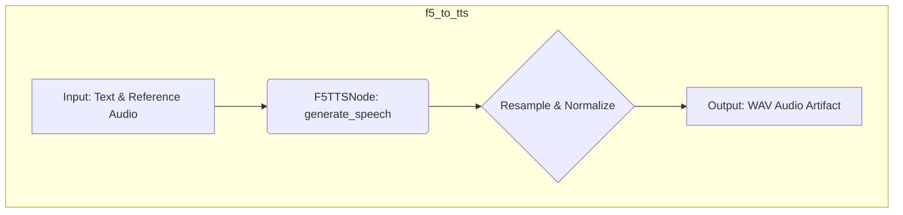
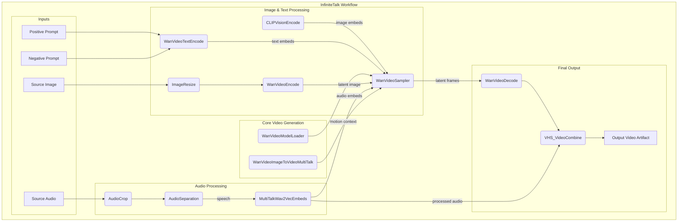
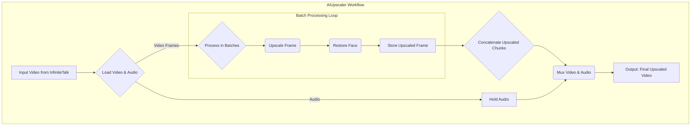

# ⚙️ InfiniteTalk Pipeline Deep Dive

This document provides a detailed breakdown of the `f5tts_infinitetalk` pipeline, one of the core AI video generation workflows in MySpinBot. The pipeline transforms a user prompt into a complete, high-resolution talking-head video by chaining together several AI models for script generation, text-to-speech, video synthesis, and upscaling.

## High-Level Architecture & LangGraph Structure

The `f5tts_infinitetalk` pipeline is defined as a directed acyclic graph (DAG) in `backend/config/pipelines.json` and executed by the LangGraph framework. The graph consists of four sequential nodes, where the execution begins on the Node.js backend (control plane) and then transitions to the Python worker (data plane) for GPU-intensive tasks.

### LangGraph Definition

The pipeline is orchestrated by a series of nodes and edges, each representing a distinct processing step.

```json
"f5tts_infinitetalk": {
  "nodes": [
    { "id": "script", "task": "script.generateScript", "plane": "node" },
    { "id": "f5_to_tts", "task": "f5_to_tts", "plane": "python" },
    { "id": "infinite_talk", "task": "infinite_talk", "plane": "python" },
    { "id": "upscale_video", "task": "upscale_video", "plane": "python" }
  ],
  "edges": [
    { "from": "script", "to": "f5_to_tts" },
    { "from": "f5_to_tts", "to": "infinite_talk" },
    { "from": "infinite_talk", "to": "upscale_video" }
  ]
}
```

## Graph Execution Flow

The execution is managed by the backend, which distinguishes between `node` and `python` plane tasks.

1.  **Initiation**: A user request triggers the pipeline. The backend's Planner constructs the LangGraph instance based on the JSON definition.
2.  **Control Plane (Node.js)**: The first node, `script`, is executed directly on the Node.js backend. It calls an external Ollama LLM to generate the narrative script for the video. The output (text) is passed to the next node.
3.  **Handoff to Data Plane (Python)**: The subsequent nodes (`f5_to_tts`, `infinite_talk`, `upscale_video`) are marked as `plane: "python"`. For each of these, the backend enqueues a job in Redis.
4.  **Data Plane (Python Worker)**: The Python worker, listening to the Redis queue, picks up the jobs. It uses the task name (e.g., `f5_to_tts`) to look up and execute the corresponding Python function in `worker/src/worker/services/tasks.py`. These tasks perform the heavy lifting of AI model inference, using the GPU and ComfyUI workflows.
5.  **Artifacts & State**: Throughout the process, inputs (e.g., source images) and outputs (e.g., generated audio, final video) are stored in MinIO object storage. The state and progress are continuously updated in Redis and persisted in PostgreSQL.

## Workflow & Task Details

Each node in the graph corresponds to a specific task. Here we detail the purpose, low-level operations, and parameters for each.

---

### Task 1: `script.generateScript`

-   **Plane**: `node`
-   **Description**: This initial step generates the spoken text for the video. It calls a local LLM (hosted via Ollama) with a prompt, asking it to produce a script. This provides the narrative content that will be converted to speech and then animated. If the LLM call fails, it falls back to a default, deterministic text.

---

### Task 2: `f5_to_tts`

-   **Plane**: `python`
-   **Description**: This task converts the generated script text into a realistic speech audio file. It uses the F5-TTS model, a text-to-speech system that can clone a voice from a short reference audio clip. The resulting audio is saved as a WAV file to MinIO, ready for the video synthesis step.

#### Low-Level Workflow (ComfyUI)

The task is a wrapper around the `F5TTSNode` from a ComfyUI custom node suite.



#### Parameters (`TextToSpeechParams`)

| Parameter | Type | Default Value | Description |
| :--- | :--- | :--- | :--- |
| `model` | string | `F5TTS_v1_Base` | TextToSpeech model name. |
| `device` | string | `cuda` | Device to run the pipeline (e.g., "cuda", "cpu"). |
| `temperature`| float | `0.8` | Sampling temperature. Lower values are more stable, higher values increase expressiveness. |
| `speed` | int | `1` | Speech playback speed factor. |
| `target_rms` | float | `0.1` | Target Root Mean Square (RMS) for audio volume normalization. |
| `cross_fade_duration` | float | `0.15` | Cross-fade overlap duration (seconds) between audio chunks. |
| `nfe_step` | int | `32` | Number of Function Evaluations (denoising steps) for the diffusion model. |
| `cfg_strength` | float | `2` | Classifier-Free Guidance strength. Controls adherence to the text/reference. |
| `narrator_voice` | string | (from params) | Path to the reference audio file used to clone the voice. |
| `ref_text` | string | (from params) | The exact transcript of the `narrator_voice` audio clip. |
| `seed` | int | `290381` | Random seed for reproducibility. |

---

### Task 3: `infinite_talk`

-   **Plane**: `python`
-   **Description**: This is the core video generation step. It takes a source image and the audio file from the previous step and creates an animated talking-head video. It uses the InfiniteTalk model via the `ComfyUI-WanVideoWrapper`, which is a powerful image-to-video synthesis pipeline capable of generating long, coherent videos with realistic lip sync.

#### Low-Level Workflow (ComfyUI)

This task orchestrates a complex graph of over 20 ComfyUI nodes. The diagram below shows a simplified data flow of the key components.



#### Parameters (`InfiniteTalkParams`)

This task has a vast number of parameters controlling everything from model loading and performance tuning to the creative aspects of the video generation.

**Model Loading**
| Parameter | Type | Default Value | Description |
| :--- | :--- | :--- | :--- |
| `infinitetalk_model` | string | `wanvideo/infinite_talk/...` | Path to the InfiniteTalk model. |
| `vae_model` | string | `wanvideo/Wan2_1_VAE_bf16.safetensors` | Path to the WanVideo VAE model. |
| `t5_text_encoder_model` | string | `umt5/umt5-xxl-enc-bf16.safetensors`| Path to the T5 text encoder model. |
| `wav2vec_model` | string | `TencentGameMate/chinese-wav2vec2-base`| Wav2Vec model for audio embedding extraction. |
| `lora_model`| string | `wanvideo/lightx2v_I2V...` | Path to the LoRA adapter file for WanVideo. |
| `clip_vision_model`| string | `wanvideo/clip_vision_h.safetensors`| Path to the CLIP Vision model for image encoding. |
| `wan_video_model`| string | `wanvideo/wan2.1_i2v_720p_14B_bf16.safetensors` | Path to the main WanVideo diffusion model. |

**Sampling & Generation**
| Parameter | Type | Default Value | Description |
| :--- | :--- | :--- | :--- |
| `fps` | int | `25` | Frames per second for the output video. |
| `positive_prompt` | string | "a man is talking..." | Text describing the desired visual output. |
| `negative_prompt` | string | "blurry, distorted..." | Text describing what to avoid in the output. |
| `sampling_steps`| int | `6` | Number of denoising steps. Fewer steps are faster but may reduce quality. |
| `sampling_cfg`| float | `1.0` | Classifier-Free Guidance scale. Controls prompt adherence. |
| `sampling_scheduler`| string | `dpm++_sde` | Sampler scheduler algorithm (e.g., `dpm++_sde`, `euler`). |
| `frame_window_size`| int | `81` | Size of the sliding window for generating long videos. |
| `motion_frame`| int | `25` | Number of frames used for motion context within the window. |

**Audio Processing**
| Parameter | Type | Default Value | Description |
| :--- | :--- | :--- | :--- |
| `normalize_loudness`| bool | `True` | Whether to normalize the audio volume before processing. |
| `audio_scale` | float | `1.6` | Scaling factor for how much the audio influences lip/facial motion. |
| `audio_cfg_scale`| float | `1` | CFG scale for audio embeddings, guiding the model on audio adherence. |

---

### Task 4: `upscale_video`

-   **Plane**: `python`
-   **Description**: The final step enhances the generated video. It processes the video in batches of frames, using a primary AI upscaler (like RealESRGAN) to increase resolution and a secondary model (CodeFormer) to specifically restore and enhance facial details. After processing all chunks, it reassembles the high-resolution video and muxes it with the original audio.

#### Low-Level Workflow



#### Parameters (`AIUpscalerParams`)

| Parameter | Type | Default Value | Description |
| :--- | :--- | :--- | :--- |
| `model_name_0`| string | `RealESRGAN_x2.pth` | The primary AI model for general-purpose upscaling. |
| `model_name_1`| string | `codeformer.pth` | The secondary model for face restoration. |
| `batch_size` | int | `50` | Number of frames to process in a single batch to manage memory usage. |
| `facedetection`| string | `retinaface_resnet50`| The face detection algorithm used to locate faces for restoration. |
| `codeformer_fidelity`| float | `1` | Balances fidelity (realism) vs. quality (artifact removal) for CodeFormer. |
| `frame_load_cap`| int | `0` | Maximum number of frames to load (0 for all). |

